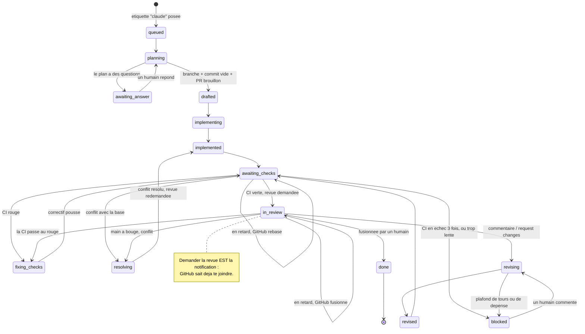

# forgeron

Un pilote qui écoute les issues GitHub étiquetées, ouvre une **pull request en brouillon avant
d'écrire une ligne**, code la solution en suivant les [craft-skills](../README.md), **attend
l'intégration continue**, demande la revue, et boucle sur tes commentaires jusqu'à ce que tu fusionnes.
Puis il clôt la session.

Preuve de concept locale. Zéro infrastructure : `gh`, `git`, `claude`, Python 3, rien d'autre.

## En une image



Trois choses qu'il ne fait jamais : pousser sur `main`, fusionner, et `push --force` — la seule
réécriture autorisée est un `--force-with-lease` sur sa propre branche, après un rebase, et seulement
quand le pilote a vérifié qu'il ne reste aucun fichier en conflit.

## Installer

Il faut `git`, `python3` (3.10+), `gh` et `claude`. Rien d'autre : pas de dépendance à installer, pas
de jeton à copier. Docker et Kubernetes sont **optionnels** et ne débloquent que le parallélisme sur
plusieurs machines.

Si l'un des quatre manque, ou si tu veux la partie Docker / Kubernetes expliquée depuis zéro :
**[docs/INSTALLATION.md](docs/INSTALLATION.md)** — écrit et vérifié pour Ubuntu 26.04 sous WSL2, y
compris la façon d'authentifier `claude` **sur ton abonnement** plutôt qu'avec une clé d'API facturée
en plus.

```bash
cd forgeron
./tests/run.sh                  # la porte complete : suite + sondes de mutation, hors ligne
python3 -m forgeron doctor      # verifie gh, git, claude, les portees du jeton
python3 -m forgeron config --init
```

Puis éditer `~/.forgeron/config.json` : au minimum le `slug` du dépôt, le `path` de son clone local,
et `reviewers` (toi). Le dépôt doit être dans cette **liste blanche** : un jeton peut atteindre tous
tes dépôts, et « sur lesquels un bot a le droit d'ouvrir une pull request » n'est pas une question
qu'un jeton sait trancher.

## Lancer

```bash
python3 -m forgeron once                    # une passe, SANS ecrire : dit ce qu'il ferait
python3 -m forgeron once --write            # une passe, pour de vrai
python3 -m forgeron run --write --interval 60   # la boucle
python3 -m forgeron status                  # ou en est chaque issue
```

Sans `--write`, les lectures sont réelles et les écritures sont refusées et journalisées. Ce n'est
pas une simulation à moitié : une simulation qui truquerait aussi les lectures exercerait le faux,
alors que la panne intéressante est une vraie issue dont l'état réel mène quelque part d'inattendu.

Le reste des options : `python3 -m forgeron --help`. Elles ne sont pas recopiées ici, parce qu'une
liste d'options dans un README finit toujours par mentir — c'est ce que dit le skill
[`doc-derivee`](../skills/doc-derivee/SKILL.md).

## Comment tu t'en sers, côté humain

1. tu ouvres une issue et tu lui mets l'étiquette `claude` ;
2. quelques secondes plus tard une **pull request en brouillon** apparaît, avec le plan et des
   critères d'acceptation cochables. Si le cadrage a buté sur une ambiguïté, tu reçois **des
   questions sur l'issue et aucune branche** : rien n'est construit avant réponse ;
3. le brouillon devient prêt quand la CI est verte, et tu es ajouté comme relecteur ;
4. tu relis **normalement** : commentaires en ligne, *request changes*, *approve*. Chaque retour
   déclenche un tour, avec **un seul commentaire** en réponse : une ligne par remarque, puis le
   tableau critère / tenu / preuve ;
4b. si quelqu'un fusionne autre chose sur `main` pendant ce temps, la branche se met à jour toute
   seule : **rebase tant que personne ne l'a relue, fusion dès qu'un relecteur est passé** — rebaser
   sous ses yeux effacerait le « ce qui a changé depuis ta dernière relecture » qu'il utilise. En cas
   de conflit, l'agent le résout en lisant les deux intentions, puis **la revue est redemandée même si
   la PR était approuvée** : une résolution n'a été relue par personne ;
5. tu fusionnes. Toujours toi : `approve` ne fusionne pas ;
6. il poste un résumé, supprime son worktree, et ferme la session.

Pour reprendre la main sans rien casser : étiquette `claude:hold`. Pour tout arrêter : ferme l'issue.

## Ce qui est vérifié, et ce qui ne l'est pas

Vérifié hors ligne, à chaque `./tests/run.sh` : **82 tests** dont le trajet complet issue → fusion
avec un build rouge et un tour de revue au milieu, plus **13 sondes de mutation** qui cassent une
règle chacune et vérifient que la suite s'en aperçoit. Une suite verte au premier coup ne prouve
rien ; c'est la sonde qui prouve qu'elle *pouvait* échouer.

Vérifié contre un vrai `git` : le worktree par issue, le renommage de branche avant premier push, le
fait que **le checkout de l'humain reste propre**, la reprise d'une branche déjà poussée, `is_synced`
qui distingue « poussé » de « commité seulement », et **un vrai conflit** — vrais marqueurs, rebase
laissé en cours pour que l'agent le voie, `--force-with-lease` requis là où un push ordinaire est
refusé, et `abort` qui repose la branche exactement où elle était. Un dépôt bare local joue `origin`,
donc aucun réseau.

Vérifié contre le vrai GitHub, en lecture seule : identité, liste d'issues, recherche de pull
request, agrégat de checks, et **récupération des journaux d'un job en échec**.

Vérifié contre le vrai `claude` : la sortie structurée (`--json-schema` → champ `structured_output`)
et la **reprise de conversation d'un processus à l'autre** (`--session-id` puis `--resume`).

**Pas encore vérifié de bout en bout**, et c'est dit à chaque fois dans les fichiers concernés :
le chemin d'**écriture** sur la forge (créer le brouillon, le passer prêt, commenter), qui demande un
dépôt bac à sable — voir [docs/GITHUB.md](docs/GITHUB.md) ; et tout ce qui touche à **Docker et
Kubernetes** ([docker/](docker/), [k8s/](k8s/)), puisqu'aucun des deux n'est installé sur la machine
où ce code a été écrit. Ce qui **est** vérifié de ce côté-là : 11 tests relisent le `ConfigMap` avec
le vrai chargeur de configuration, comparent les chemins montés à ceux que la configuration nomme, et
refusent qu'un secret soit cuit dans l'image.

## Lire la suite

- [docs/INSTALLATION.md](docs/INSTALLATION.md) — installer et configurer les quatre outils
  obligatoires, puis Docker et Kubernetes en local si tu veux les apprendre ; l'authentification de
  `claude` sur abonnement, et les pièges propres à WSL2 ;
- [docs/ARCHITECTURE.md](docs/ARCHITECTURE.md) — les coutures, la machine à états, et les faits
  mesurés sur `claude -p` et `gh` qui ont décidé de la forme du code ;
- [docs/GITHUB.md](docs/GITHUB.md) — jeton, GitHub App, webhooks : ce qui est nécessaire quand, et
  les commandes exactes ;
- [docs/CLUSTER.md](docs/CLUSTER.md) — ce qui change en Kubernetes, et pourquoi la réponse n'est pas
  un volume partagé.
