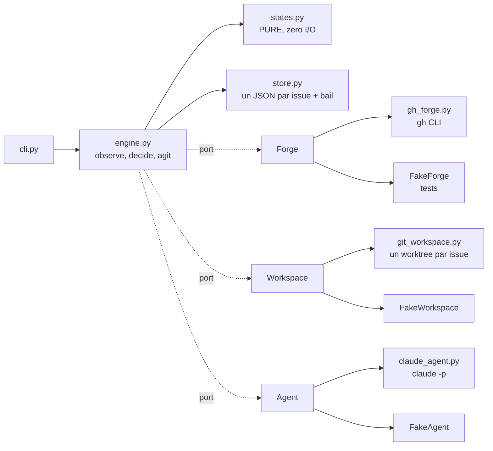

# Architecture

## L'idée qui décide de tout le reste : c'est un réconciliateur, pas un script

Un script d'automatisation garde l'état du travail dans sa propre progression : il crée la branche,
puis code, puis ouvre la PR. Tué au milieu, il ne sait plus où il en était, et relancé il refait ce
qui était déjà fait.

`forgeron` ne garde rien en mémoire d'une passe à l'autre. À chaque passe il **regarde** — l'état de
l'issue, l'état de la pull request, ce que la CI dit, ce qu'un humain a écrit depuis la dernière fois
— et il en déduit **une seule action**. Trois conséquences, et ce sont elles qui rendent le reste
possible :

- tué n'importe où, il reprend en regardant, jamais en rejouant ;
- la même boucle tourne en démon local (`run`), en une passe (`once`) ou en un pod par issue ;
- une passe est une **fonction pure** de ce qu'il a vu, donc chaque comportement bizarre devient une
  donnée de test, pas une discussion.

C'est aussi la seule idée de Kubernetes qui traverse vraiment : pas les conteneurs, la boucle qui
compare l'état réel à l'état déclaré.

## Les coutures

Tout ce qui a un effet de bord est déclaré dans [`ports.py`](../forgeron/ports.py) et nulle part
ailleurs. Trois ports, séparés **par ce qui échoue et comment** :

Les replier en un seul client rendrait un test de la boucle de revue dépendant du réseau, et c'est
exactement comme ça qu'une boucle de revue cesse d'être testée. Les fakes satisfont les **vrais**
`Protocol` (`isinstance` le vérifie dans les tests) : un fake qui dérive de sa couture est le
classique test qui mentait.

`states.py` est le seul module qui porte de la politique, et il ne fait aucune entrée-sortie. Sa
fonction `decide(record, observation, limits)` rend une action et une raison. L'**ordre** des règles
*est* la politique, et les cas qui comptent sont ceux où deux règles s'appliquent :

| deux règles applicables | qui gagne | pourquoi |
|---|---|---|
| issue fermée / PR fusionnée | fusionnée | GitHub ferme l'issue quand la PR dit « closes #N » : lire fermé-et-fusionné comme un abandon ferait échouer **tous** les succès |
| issue fermée / CI rouge | fermée | un humain qui ferme est le signal le plus fort qui existe |
| plafond de dépense / étiquette de pause | plafond | une issue en pause doit quand même dire pourquoi elle s'est arrêtée |
| humain a parlé / CI rouge | humain | il dit peut-être que la branche entière est à jeter, ce qu'aucun vert ne réparerait |

## Le cycle d'une issue

Quatre phases d'agent, chacune un processus `claude` distinct sur **la même conversation**, lancé en
`--agent artisan` : l'agent apporte la méthode et ses deux hooks, le contrat du pilote reste dans
`--append-system-prompt`, et les outils de chaque phase restent bornés par `--tools`. Un agent qui
déclarerait lui-même ses outils l'emporterait sur `--tools` et ferait disparaître la sortie
structurée : c'est mesuré dans `tests/probes/probe_claude_agent.sh`, et c'est pourquoi il n'en déclare
aucun.

1. **Cadrer** — outils en lecture seule, et c'est un fait plutôt qu'une consigne : « ne modifie rien »
   est une demande, retirer `Edit` est une garantie. Rend un plan, des critères d'acceptation
   falsifiables, et une liste de **questions**. Si elle n'est pas vide : les questions sont postées
   sur l'issue, **aucune branche n'est poussée**, et on attend. Construire contre une ambiguïté non
   levée est la panne chère.
2. **Implémenter** — la pull request en brouillon existe déjà, avec le plan dedans, donc un humain
   peut lire et arrêter pendant que ça tourne. La PR est ouverte sur un **commit vide** : c'est ce
   qui permet à un brouillon d'exister avant la première ligne de code, sans rien inventer dans le
   dépôt.
3. **Réviser** — une remarque à la fois, dans l'ordre reçu, et **un seul commentaire** en retour.
   Deux commentaires par tour doubleraient les notifications en faisant lire la moitié de l'histoire
   deux fois.
4. **Clôturer** — lecture seule. Résume et repère les suites, sans ouvrir d'issue tout seul.

Plus une phase 3b, **la CI est rouge** : les journaux du job en échec sont récupérés et donnés au
modèle, avec la consigne de `trouver-la-cause` et trois pièges nommés — un échec d'environnement
n'est pas son code, un échec non reproductible se dit plutôt que se corrige à l'aveugle, et
désactiver un test qui échoue n'est pas un correctif.

## Ce que le verdict ne décide pas

Chaque run rend du **JSON validé par un schéma**, jamais de la prose : lire un verdict dans un
paragraphe est un analyseur que personne ne garde correct, et un bot qui se trompe sur son propre
succès demande une revue sur une branche vide.

Mais le verdict reste la **parole** de l'agent. Deux choses sont donc vérifiées contre le monde :

- `pushed: true` est confronté à `git rev-parse HEAD` contre `origin/<branche>`. En cas de
  désaccord, le pilote pousse lui-même et journalise `verdict_overstated`. Une branche qui n'a
  jamais quitté la machine a l'air terminée vue de l'intérieur du prompt ;
- un exit 0 **sans** `structured_output` (budget épuisé, refus) est un **échec**, pas un succès.

## Les faits mesurés qui ont décidé du code

Chacun a été vérifié ici, pas supposé. Les sondes sont dans
[`tests/probes/`](../tests/probes/).

Ce que fait `--agent`, là où la documentation se tait (mesuré le 2026-09-23 avec Claude Code 2.1.259,
sonde [`probe_claude_agent.sh`](../tests/probes/probe_claude_agent.sh)) :

- **un nom d'agent inconnu échoue bruyamment** : code 1, « `--agent 'x' not found. Available agents:
  ...` ». forgeron ne peut donc pas partir sans son agent sans que ça se voie ;
- **le champ `skills:` d'un agent n'a aucun effet** en session principale sous `-p` : sans aucun outil,
  l'agent n'a pas le texte du skill. D'où le chargement de `cycle-de-dev` par l'outil `Skill`, imposé
  par un hook ;
- **le corps de l'agent s'ajoute au prompt système** de Claude Code au lieu de le remplacer, et
  `--append-system-prompt` passe toujours. Le contrat reste donc dans `--append-system-prompt` ;
- ⚠ **un `tools:` déclaré dans l'agent l'emporte sur `--tools`** (`Read` dans l'agent et
  `--tools Read Grep Bash` en ligne de commande donnent `Read` seul), et il fait disparaître l'outil
  derrière `--json-schema` : `structured_output` revient vide. L'agent ne déclare donc aucun outil ;
- ⚠ **les hooks d'un agent posé dans le `.claude/agents/` d'un projet ne se déclenchent pas**, ni en
  session principale ni en sous-agent. **Au niveau utilisateur (`~/.claude/agents/`), ils se
  déclenchent**, et leur entrée porte `agent_type`. D'où l'installation au niveau utilisateur ;
- des hooks passés par `--settings` se déclenchent aussi, en plus de ceux de l'agent.

- ⚠ **`--tools`, `--allowedTools` et `--add-dir` sont variadiques.** Un prompt passé en argument
  positionnel après l'un d'eux est avalé comme une valeur de plus, et `claude` sort sur « Input must
  be provided ». **Le prompt part toujours sur stdin.**
- **`--session-id <uuid>` laisse l'appelant frapper l'identifiant**, et `--resume <uuid>` reprend la
  conversation dans un nouveau processus. C'est ce qui rend un tour de revue bon marché : le tour 4
  se souvient du tour 1. Vérifié : la reprise a bien restitué une valeur du run précédent.
- ⚠ **Le fichier de session vit dans `~/.claude/projects/<slug-du-cwd>/<uuid>.jsonl`** : le
  répertoire de travail fait partie de l'identité de la session. Déplacer un worktree casse la
  reprise. D'où deux décisions : le worktree est indexé par **numéro d'issue** et jamais par nom de
  branche (renommer une branche est gratuit, déplacer un dossier perd la conversation), et la
  réponse en cluster est `continuity="rebuild"`, pas un volume partagé.
- ⚠ **`gh pr checks --json` n'existe pas en gh 2.46.** L'agrégat se lit par
  `gh pr view --json statusCheckRollup`, en gérant les **deux** types de nœuds : `CheckRun` pour
  Actions, `StatusContext` pour une *commit status* postée par autre chose — sinon un dépôt câblé à
  une CI externe serait rapporté « sans check » tout en étant rouge.
- ⚠ **`gh run view --job <id> --log-failed` a rendu ZÉRO octet sur un vrai job en échec, et `--log`
  aussi**, alors que `gh api repos/<repo>/actions/jobs/<id>/logs` a rendu le journal complet
  (86 651 octets). D'où les deux sources, dans cet ordre : la pratique d'abord parce qu'elle est
  pré-filtrée aux étapes en échec et donc bien plus courte, l'API en repli **précisément parce
  qu'elle marche quand la pratique renvoie silencieusement rien**.
- **Un rollup vide veut dire deux choses opposées** : « ce dépôt n'a pas de CI » et « GitHub n'a pas
  encore créé les check runs ». Elles demandent des réponses inverses — demander la revue, ou
  attendre. Un délai de grâce (`checks_grace_seconds`, 150 s par défaut) les sépare, et c'est une
  question d'horloge, donc elle ne peut pas vivre dans l'adaptateur de forge.
- **`SKIPPED` et `NEUTRAL` ne sont pas des échecs** : un job qui a choisi de ne pas tourner n'est
  pas un job qui dit non. Les traiter comme rouges bloquerait sur chaque workflow conditionnel.

## Les garde-fous, et lequel protège de quoi

| garde-fou | contre quoi |
|---|---|
| liste blanche de dépôts | un bot qui ouvre une PR là où personne ne l'attend |
| un worktree par issue | des modifications non commitées dans le checkout où tu travailles |
| `max_rounds`, `max_spend_usd`, `--max-budget-usd` par run | la panne qui n'est pas un crash : dépenser sans finir, ce qui de l'extérieur ressemble à du progrès |
| `max_check_fixes` | boucler sur une CI rouge pour une raison d'environnement |
| `checks_timeout_minutes` | attendre pour toujours une CI qui ne démarrera jamais |
| jeton **sans** portée `workflow` | un agent qui modifie `.github/workflows` — le push est refusé par GitHub, pas seulement par le prompt |
| bail par issue, à expiration | deux pilotes sur la même issue. À expiration et pas par PID : en cluster le détenteur précédent est un pod qui n'existe plus, et « ce PID vit-il » répond sur la mauvaise machine |
| écriture atomique du dossier (fichier temporaire + `rename`) | le seul état dont un réconciliateur ne se relève pas : un enregistrement tronqué, parce qu'il **s'analyse** |
| fusion toujours humaine | tout le reste |

## Quand la base bouge sous la branche

Une issue n'est jamais seule : pendant qu'elle est en cours, quelqu'un fusionne autre chose. Deux
états, deux réponses, et elles ne coûtent pas du tout la même chose.

**En retard, sans conflit** — c'est le cas courant. GitHub sait rebaser ou fusionner **côté serveur**
(`updatePullRequestBranch`, `updateMethod: REBASE | MERGE`, introspecté dans le schéma le 2026-08-28),
donc le pilote n'a besoin **ni de copie de travail, ni de poussée, ni d'un seul jeton d'agent** : un
appel d'API. `expectedHeadOid` est une concurrence optimiste — si la tête a bougé depuis l'observation,
GitHub refuse au lieu d'écraser ce qui l'a bougée.

**En conflit** — là il faut le dépôt et l'agent. Le pilote lance le rebase ou la fusion, **laisse
l'opération en cours** (les marqueurs sont toute la matière), et donne à l'agent trois choses : les
fichiers en conflit, **ce qui a atterri sur la base** (`compare/<head>...<base>`, une ligne par commit),
et la règle qui compte — un conflit se résout en lisant les deux intentions, pas en choisissant un côté.

### La règle qui décide entre rebase et fusion, et ce n'est pas une préférence

> **Rebase tant que la branche est encore à nous, fusionne dès qu'elle est à eux.**

Un rebase réécrit l'historique, donc GitHub perd la base sur laquelle il calculait « ce qui a changé
depuis ta dernière relecture » : un relecteur qui a laissé dix commentaires hier revient sur une pull
request qui a oublié ce qu'il avait lu. Ce coût-là est payé par un humain, donc il l'emporte. Avant
qu'une revue existe, il n'y a rien à perdre et le rebase garde l'historique linéaire.

`sync_method()` tient cette règle en quatre lignes, et `Limits.rebase_before_review` permet à un dépôt
de refuser tout rebase.

### Trois choses vérifiées plutôt que crues

- ⚠ **`mergeable` répond `UNKNOWN` la première fois, et ça ne veut pas dire « rien à faire ».** GitHub
  calcule la fusionnabilité **paresseusement** : c'est en redemandant qu'elle se fixe. La tentation est
  de boucler avec un `sleep` ; c'est le mauvais remède ici, parce que **le pilote repasse déjà à chaque
  intervalle — la scrutation EST la reprise**. Dormir dans une passe paierait une attente que la boucle
  fait gratuitement, sur chaque issue suivie, pour toujours ;
- ⚠ **une résolution annoncée est vérifiée** : `git diff --diff-filter=U` doit être vide **avant** toute
  poussée. Un agent qui édite les fichiers sans les indexer laisse des marqueurs dans un arbre qui a
  l'air fini, et un rebase à moitié poussé avec un bail est une branche sur laquelle plus personne ne
  peut raisonner. Si ça reste en conflit : `abort`, rien n'est poussé, et la pull request le dit ;
- ⚠ **une résolution invalide l'approbation.** Fusionner deux changements produit du code qui n'existait
  ni d'un côté ni de l'autre, et que personne n'a lu. Le pilote repasse donc par la porte de CI **et**
  redemande la revue, même sur une pull request déjà approuvée. C'est une des quatre mutations testées :
  faire revenir la résolution directement en `in_review` fait échouer la suite.

### Ce qu'il ne fait pas, délibérément

**Il ne met à jour que SES branches.** Pas les tiennes, pas celles d'un tiers, pas celles d'une autre
session. Un rebaseur central résoudrait des conflits **à la place de gens qui ont écrit le code** :
il choisirait, sans le savoir, laquelle de deux intentions survit — une décision de conception déguisée
en opération de plomberie. Ce qui se partage entre les propriétaires, c'est la convention, pas l'outil.
