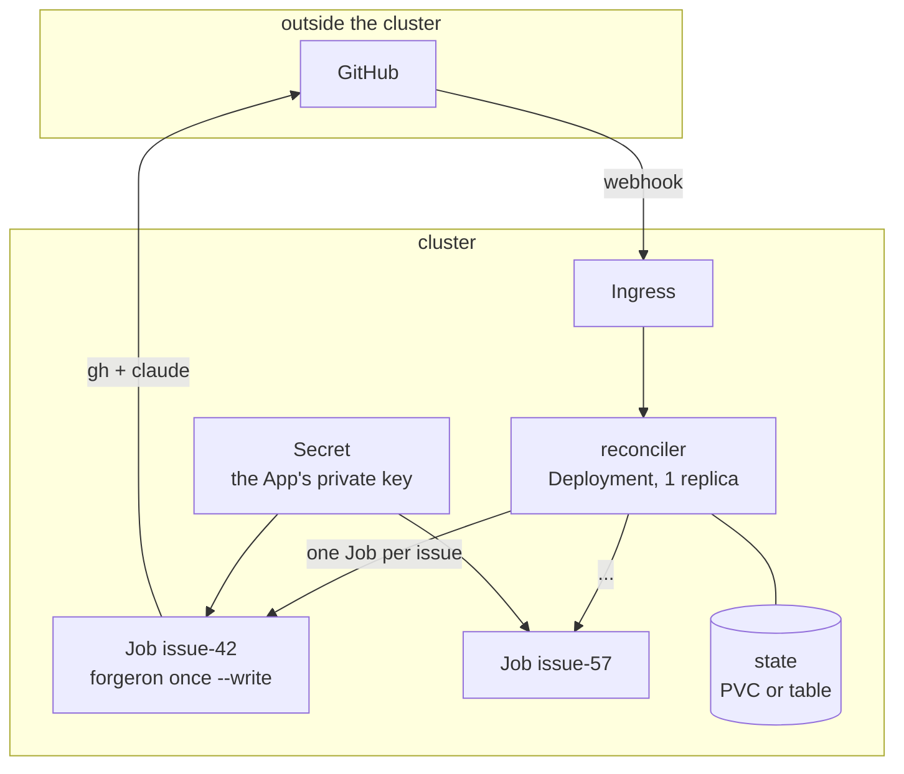

# En cluster : ce qui change, et ce qui ne change pas

⚠ **Ce document est une conception, pas un résultat.** Il n'y a ni `docker` ni `kubectl` sur cette
machine : rien de ce qui suit n'a été lancé. Les manifestes sont des esquisses, à traiter comme
telles.

## Ce qui ne change pas

La boucle. `pass_once()` est déjà un réconciliateur : il ne garde rien d'une passe à l'autre, il
regarde et il déduit une action. Un pod qui exécute une passe et meurt est le mode de
fonctionnement normal, pas un incident. C'est pour ça que `once` existe à côté de `run`.

## La vraie question : où vit l'état d'une session

Trois choses composent une session, et elles n'ont pas du tout le même besoin de durer :

| morceau | où il vit en local | ce qu'il faut en cluster |
|---|---|---|
| le **travail** | le worktree | **rien**. La branche EST l'instantané : `git fetch` + `checkout` le reconstruit n'importe où. C'est la bonne réponse à l'idée de « snapshot » ou de `.patch` — GitHub la garde déjà |
| l'**état de la boucle** | un JSON par issue | un `ConfigMap`, un PVC, ou une table. C'est petit et écrit atomiquement |
| la **conversation** | `~/.claude/projects/<slug-du-cwd>/<uuid>.jsonl` | c'est là qu'est le piège |

⚠ **Le piège, mesuré** : le fichier de session est rangé sous un *slug du répertoire de travail*.
Un pod qui recrée le worktree sous `/work/issue-42` ne peut pas reprendre une session créée sous
`/home/toi/.forgeron/worktrees/.../issue-42`. Un volume partagé ne suffirait donc pas : il faudrait
en plus que **le chemin absolu soit identique partout**, ce qui est un couplage entre un pod et une
machine de développement.

D'où `continuity` dans la configuration, et les deux réponses sont légitimes :

- **`"resume"`** (défaut, local) : `--resume <uuid>`, le tour 4 se souvient du tour 1. Le moins cher
  en jetons, grâce au cache de prompt ;
- **`"rebuild"`** (cluster) : chaque tour est un `claude -p` neuf, et le contexte est **reconstruit
  depuis la forge** — le corps de l'issue, le plan (dans la PR), le diff, les commentaires de revue.
  On paie en jetons ce qu'un volume partagé coûterait en couplage. Et c'est plus honnête : ce qui
  compte est écrit sur la pull request, là où un humain peut le lire, plutôt que dans un `.jsonl`
  sur un disque.

`rebuild` est déjà implémenté côté pilote (`Engine._resume`). Ce qui reste à écrire pour un vrai
mode cluster, c'est de **charger le contexte dans le prompt** : aujourd'hui `rebuild` repart d'une
conversation vide et compte sur ce que le prompt de phase contient déjà.

## La forme, si un jour il y a un cluster



Le découpage qui compte : le **réconciliateur décide**, un **Job exécute une action**. Un Job par
action et non par issue, parce qu'une action est bornée (un run d'agent) alors qu'une issue vit des
jours. Le bail par expiration de `store.py` est déjà ce qu'il faut : en cluster le détenteur
précédent est un pod qui n'existe plus, et demander « ce PID vit-il » répondrait sur la mauvaise
machine.

Esquisse de Job — **non testée** :

```yaml
apiVersion: batch/v1
kind: Job
metadata:
  name: forgeron-issue-42
spec:
  backoffLimit: 1          # une action idempotente peut etre reprise, pas rejouee six fois
  ttlSecondsAfterFinished: 3600
  template:
    spec:
      restartPolicy: Never
      containers:
        - name: forgeron
          image: forgeron:0.1.0        # python3 + gh + git + claude
          args: ["once", "--write", "--config", "/etc/forgeron/config.json"]
          env:
            - name: ANTHROPIC_API_KEY
              valueFrom: { secretKeyRef: { name: forgeron, key: anthropic } }
            - name: GH_TOKEN
              valueFrom: { secretKeyRef: { name: forgeron, key: installation-token } }
          resources:
            requests: { cpu: "500m", memory: 1Gi }
            limits:   { cpu: "2",    memory: 4Gi }
          volumeMounts:
            - { name: state,  mountPath: /var/lib/forgeron }
            - { name: config, mountPath: /etc/forgeron }
      volumes:
        - { name: state,  persistentVolumeClaim: { claimName: forgeron-state } }
        - { name: config, configMap: { name: forgeron-config } }
```

⚠ Trois points à régler avant d'y croire, et ils n'ont rien d'anecdotique :

1. **l'authentification de `claude` en pod.** Ici il tourne sur une session OAuth interactive. En
   cluster il faut `ANTHROPIC_API_KEY`, ce qui change la facturation et le compte utilisé. `--bare`
   l'exige d'ailleurs explicitement ;
2. **`GH_TOKEN` plutôt que `gh auth login`.** `gh` lit `GH_TOKEN` de l'environnement, donc
   `gh_forge.py` fonctionne tel quel. Le jeton d'installation d'une App expire au bout d'une heure :
   c'est un travail de rafraîchissement, à faire par le réconciliateur, pas par le Job ;
3. **le clone de base.** `git_workspace.py` crée un worktree depuis un clone local. En pod il n'y en
   a pas : soit un `git clone --filter=blob:none` au démarrage, soit un PVC de cache partagé. C'est
   le seul endroit où le code suppose une machine de développement.

## Ce que je ferais avant d'écrire un seul manifeste

La PoC locale d'abord, sur le bac à sable de [GITHUB.md](GITHUB.md), jusqu'à ce qu'une issue aille
jusqu'à la fusion sans intervention. Le cluster ne résout aucun des problèmes intéressants — il ne
fait que payer plus cher les mêmes. Le seul problème qu'il résout vraiment est **le parallélisme**,
et `max_concurrent` sur une machine le résout déjà jusqu'à quelques issues.
