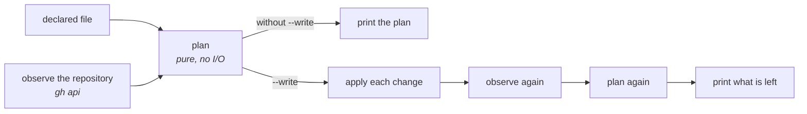

# `forgeron etabli` : poser la config déclarée d'un dépôt

Le verbe applique la première couche de `tenir-la-forge` (section 2) : la config déclarée dans un
fichier, appliquée par un outil qui montre son plan avant d'écrire. Il couvre les étiquettes, les
réglages du dépôt, sa sécurité et ses règles de branche.

```bash
cd forgeron
python3 -m forgeron etabli --file ~/.forgeron/etabli.json                 # le plan, rien n'est écrit
python3 -m forgeron etabli --file ~/.forgeron/etabli.json --repo OWNER/NAME --only labels
python3 -m forgeron etabli --file ~/.forgeron/etabli.json --write         # applique, puis relit
python3 -m forgeron --json etabli --file ~/.forgeron/etabli.json          # la sortie machine
```

Les options et les codes de sortie sont dans `python3 -m forgeron etabli --help`, et nulle part
ailleurs.

## Ce qu'il fait



- **le plan est une fonction pure** de la config et de l'état observé (`etabli.plan`), comme
  `states.decide` pour la boucle : chaque cas bizarre devient une donnée de test ;
- **sans `--write`, les lectures sont réelles et aucune écriture n'a lieu.** Le code de sortie dit s'il
  reste quelque chose à appliquer ;
- **avec `--write`, le verbe relit le dépôt après avoir écrit, et replanifie.** Un second plan qui
  propose encore quelque chose veut dire que l'outil et la forge ne sont pas d'accord sur l'état : le
  verbe le montre et sort en erreur, au lieu d'annoncer un succès sur la foi de ses propres écritures.

## Le fichier

Le format est celui de [`../etabli.example.json`](../etabli.example.json), qu'un test charge à chaque
passage de la suite : un exemple qui ne se charge plus casse la suite.

- `defaults` s'applique à chaque dépôt ; une entrée de `repos` y **ajoute** ses étiquettes, ses
  renommages, ses réglages et sa sécurité, et **remplace** la liste des rulesets si elle en déclare
  une ;
- `required_checks` ajoute la règle des checks requis à chaque ruleset de branche du dépôt : les
  noms de checks changent d'un dépôt à l'autre, pas la règle. Un nom seul accepte le check de
  n'importe quelle source ; `{"context", "integration_id"}` l'épingle à une application. Sans ruleset
  de branche, ou avec un ruleset qui déclare déjà ses checks, le fichier est refusé ;
- `renames` migre un vocabulaire sans perdre les items qui portent l'ancienne étiquette ;
- `unlisted_labels` vaut `report` (par défaut : les étiquettes non déclarées sont listées) ou
  `delete-unused` (celles qu'aucune issue ni PR ne porte sont supprimées, les autres jamais). Les
  discussions portent aussi des étiquettes, et l'API ne les compte pas : sur un dépôt où elles sont
  actives, rien n'est supprimé. Une étiquette nommée dans un fichier (un formulaire d'issue,
  `dependabot.yml`, un workflow) n'est pas comptée non plus : lire ces fichiers avant de choisir
  `delete-unused` ;
- `only` restreint un dépôt à certains domaines. C'est le cas d'un dépôt qui garde son propre
  vocabulaire d'étiquettes et reçoit seulement les réglages, la sécurité et les règles.

Le fichier est refusé en entier, avec le chemin exact de ce qui ne va pas, pour une clé inconnue, une
valeur du mauvais type, une couleur mal formée, une étiquette sans description, un renommage vers une
étiquette non déclarée, deux noms qui ne diffèrent que par la casse, un ruleset sans `bypass_actors` ou
sans les paramètres que la forge exige, ou une paire de messages de fusion invalide. Rien n'est à
moitié appliqué.

**Les messages de fusion vont par paire.** `merge_commit_title` et `merge_commit_message` se déclarent
ensemble, et la forge n'accepte que certaines combinaisons, listées dans le message d'erreur ; même
chose pour les deux clés du squash. Les réglages d'un dépôt partent en une seule écriture, pour que la
forge voie la paire entière.

## Les choix de l'exemple

- **fusion en squash seulement**, titre et message pris de la PR (`PR_TITLE`, `PR_BODY`) : avec des
  PR petites, une intention chacune, personne ne relit l'historique interne d'une branche après la
  fusion, et les tours de revue d'un bot y ajoutent du bruit (`tracer-le-travail`, section 9). Le
  titre de la PR devient donc le commit sur la branche principale, et il suit les commits
  conventionnels ;
- **un contournement admin permanent**, pour que le mainteneur puisse réécrire l'histoire. Il le
  dispense aussi de la PR, et un bot qui parle avec son jeton en hérite : choisi le 2026-09-30 en
  connaissant ce prix. Ajouter un contournement à un ruleset qui existe est un affaiblissement, que
  le verbe refuse ; on le pose donc une fois à la main, et le fichier le déclare ensuite ;
- **les étiquettes du pilote s'appellent `forgeron` et `forgeron:hold`** : une étiquette nomme
  l'outil du projet, pas le modèle qui tourne derrière.

## Ce qu'il refuse, et pourquoi

| Refus | Pourquoi |
|---|---|
| un dépôt que le fichier ne déclare pas | le jeton atteint tous tes dépôts ; la liste de ceux qu'on règle est une décision, pas une conséquence du jeton |
| supprimer une étiquette encore portée | supprimer l'efface de toutes les issues ; on renomme, ou on la reporte à la main |
| renommer vers une étiquette qui existe déjà | deux étiquettes à fusionner, c'est des items à reporter : l'outil le dit, il ne choisit pas |
| retirer une protection de sécurité | désactiver la protection au push ou les alertes se fait à la main, avec sa raison écrite (`garder-les-frontieres`) |
| supprimer un ruleset non déclaré | il est listé, jamais supprimé |
| lire un état de sécurité illisible comme « inactif » | un état qu'on ne lit pas ne prouve rien : le point est bloqué, pas corrigé |
| affaiblir un ruleset | baisser son application, lui retirer une règle, lui ajouter un contournement : même raison que pour la sécurité |
| perdre un paramètre que seule la forge porte | une mise à jour remplace le ruleset en entier : le plan nomme le paramètre, qu'il faut déclarer pour le garder ou retirer à la main |
| toucher un dépôt archivé | il est en lecture seule : tout est sauté, et la sortie dit que rien n'a été vérifié |

Les rulesets hérités d'une organisation ne sont ni lus ni modifiés : ils appartiennent à qui les a
posés.

## Les droits, et la trace

Le verbe passe par `gh`, donc par ta session : aucun jeton dans la config, rien à fuiter. Il lit
`permissions` sur le dépôt avant de planifier :

- sans droit d'écriture, les étiquettes sont sautées ;
- sans le rôle admin, les réglages, la sécurité et les rulesets sont sautés, et le plan le dit.

C'est le cas d'un dépôt dont on n'est que collaborateur : ses étiquettes se posent, le reste revient
à son propriétaire.

Chaque écriture, réussie, refusée ou restée sans réponse, laisse une ligne `etabli_applied` ou
`etabli_failed` dans le journal de forgeron (`journal.jsonl` sous son `home`), avec l'avant et l'après.
Pour un ruleset, l'avant est le ruleset entier tel que la forge l'a rendu, donc de quoi le reposer. C'est la réponse à « qui a changé ce réglage, et
quand » que la forge ne donne qu'à moitié.

## Ce qu'il ne fait pas, délibérément

- **le board.** La portée `project` manque au jeton tant qu'on ne l'a pas demandée
  (`gh auth refresh -s project`), et les workflows d'un projet n'ont pas d'API : ils se règlent sur un
  projet de référence, puis se copient (`tenir-la-forge`, `references/github.md`). C'est le prochain
  domaine ;
- **les fichiers du dépôt** (`CODEOWNERS`, gabarits, `SECURITY.md`) : ce sont des fichiers, ils passent
  par une PR relue comme le code, pas par l'API des réglages ;
- **reporter les items d'une étiquette sur une autre**, créer ou supprimer un dépôt.

## Les alternatives écartées

| Alternative | Pourquoi pas ici |
|---|---|
| l'application *Settings* (`.github/settings.yml`) | une application tierce avec les droits admin sur chaque dépôt, et un push de `settings.yml` sur la branche principale agit en admin ; elle ne couvre pas le board |
| le fournisseur Terraform `integrations/github` | aucune ressource Projects v2, et un fichier d'état à garder quelque part |
| `gh label clone` | copie les étiquettes d'un dépôt, sans renommer, sans dire ce qui diverge, et sans le reste |
| une Action avec un jeton classique | le jeton qui ouvre tous les dépôts, rangé en secret dans chacun (`tenir-la-forge`, section 7) |

## Les faits mesurés

Lus le 2026-09-30 sur six dépôts réels (cinq pour ce qui demande d'être admin), en lecture seule, avec la session `gh` d'un compte personnel
(portées `repo`, `read:org`, `gist`, `admin:public_key`, `read:packages`) :

- les nombres d'items par étiquette viennent d'une seule requête GraphQL paginée
  (`labels { issues { totalCount } pullRequests { totalCount } }`), au lieu d'une recherche par
  étiquette que la limite de l'API de recherche (30 par minute) rendrait lente ;
- `GET /repos/{o}/{r}/vulnerability-alerts` sort de `gh api` en code 1 avec
  `Vulnerability alerts are disabled. (HTTP 404)` quand les alertes sont inactives, et en code 0 sans
  corps quand elles sont actives. Un autre 404 ne dit rien de l'état ;
- `automated-security-fixes` et `private-vulnerability-reporting` répondent `{"enabled": false}` sur un
  dépôt où ils sont inactifs, et les deux champs de `security_and_analysis` sont lisibles par l'admin ;
- sur un dépôt dont on n'a que l'écriture, `permissions.admin` est faux et les étiquettes restent
  lisibles.

Le premier `--write`, sur le dépôt pilote `MasterLaplace/LplCraftSkills` le 2026-09-30, a fait
17 écritures sans échec, et la relecture n'a plus rien proposé. Il a appris un fait : **la forge ajoute
d'elle-même `require_extra_approval_for_unattributed_changes: true` à une règle `pull_request`
neuve.** Non déclaré, ce paramètre bloquerait la mise à jour suivante du ruleset, puisque la perdre
affaiblirait la règle : l'exemple le déclare donc.
