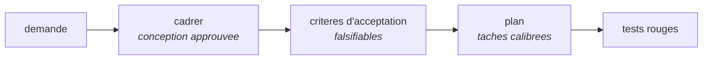

# Cadrer, puis planifier

*En une phrase : entre « on veut faire X » et le premier test, il y a deux portes, une conception
approuvee et un plan ecrit, et les sauter est ce qui coute le plus cher sur un travail non trivial.*

La methode est reprise de **superpowers** (`github.com/obra/superpowers`, skills `brainstorming` et
`writing-plans`), avec les ajouts signales.

**Quand ces deux portes ne s'appliquent pas.** Le critere n'est pas la taille du changement, c'est sa
**reversibilite** : une modification locale et annulable n'a pas besoin de conception ecrite ; une
modification qui touche une frontiere qu'on ne pourra plus changer (contrat public, donnees
persistees, format sur le fil) en merite trois phrases, meme si elle fait deux lignes. Se demander
*combien coute de se tromper ici*, pas *combien de lignes je touche*.

## Partie 1 : cadrer

### Explorer le contexte avant de poser la premiere question

Les fichiers, la documentation, les derniers commits. Une question dont la reponse est deja dans le
depot fait perdre du credit et du temps, et elle signale qu'on n'a pas regarde.

### Verifier le perimetre AVANT d'affiner les details

Si la demande couvre plusieurs sous-systemes independants, le dire **immediatement**. Affiner les
details d'un chantier qui doit d'abord etre decoupe est du travail jete.

Chaque sous-projet obtient ensuite son propre cycle conception, plan, implementation, et **chacun doit
produire un logiciel qui marche et se teste seul**. C'est le test de decoupage : si un morceau ne peut
pas etre livre sans son voisin, ce n'est pas un sous-projet, c'est une tranche horizontale.

### Poser les questions UNE A LA FOIS

C'est la pratique la plus contre-intuitive et la plus efficace de cette partie. **Un lot de questions
recoit des reponses en lot, donc superficielles**, et la troisieme question ne beneficie pas de la
reponse a la premiere. Une a la fois, chacune informee par la precedente.

Ce qu'il faut avoir compris avant d'arreter : **l'intention** (quel comportement observable change, et
qui le constate), les **contraintes** (ce qui ne doit pas bouger), et **ce a quoi ressemble « fini »**.

### Proposer deux ou trois approches, avec leurs compromis et une recommandation

Pas une seule (elle sera acceptee par defaut, sans que personne ait choisi), pas huit (personne
n'arbitre huit options). Chacune porte son cout et son risque, et **on recommande**, parce qu'un
avis argumente est ce qu'on attend de celui qui a explore.

### Presenter la conception par SECTIONS, avec un accord apres chaque section

Un mur de texte obtient un tampon, pas un accord. Des sections courtes, dimensionnees a leur
complexite, chacune validee avant la suivante : c'est le seul moyen d'attraper un malentendu **avant**
qu'il ne se propage dans tout le reste de la conception.

### Se relire avant de faire relire

Une passe rapide sur la spec ecrite, qui cherche quatre choses : des **trous** laisses en attente, des
**contradictions** entre deux sections, des **ambiguites** (une phrase qui autorise deux lectures), et
un **perimetre** qui a grossi pendant la redaction.

## Les criteres d'acceptation, produit de la phase de cadrage

*Ajout : c'est la charniere entre cadrer et planifier, et elle manquait aux deux sources.*

Les criteres d'acceptation ne s'ecrivent ni pendant le plan, ni pendant les tests : ils sont **le
livrable de la conception**, et ils sont ecrits **avant** le plan parce qu'ils en decident le
decoupage.

Un critere decrit ce qu'on pourra **constater de l'exterieur**, et sa seule propriete obligatoire est
d'etre **falsifiable** : on doit pouvoir dire ce qui, concretement, le rendrait faux. La forme, les
pieges (le critere qui decrit l'implementation, le critere sans cas negatif) et leur passage en tests
rouges sont dans `tests-first`.

Trois exigences qui appartiennent a cette phase :

- **chaque critere est rattachable a une tache du plan**, et une tache sans critere est un travail dont
  personne ne sait dire s'il est fini ;
- **les cas negatifs sont ecrits ici**, pas decouverts pendant l'implementation. Ce qui doit echouer
  est la moitie oubliee, et c'est celle qui contient les regles d'acces ;
- **ce qui n'est PAS couvert** est ecrit aussi. Un perimetre implicite est renegocie a la fin, au pire
  moment.

## Partie 2 : planifier

### Le critere du plan, et il est falsifiable

> **Le plan doit etre suivable par un developpeur competent et enthousiaste, mais sans contexte du
> projet, sans gout, sans jugement, et allergique aux tests.**

C'est plus utile qu'il n'y parait : chaque fois qu'une etape demande du gout ou du contexte, elle est
sous-specifiee. Le test se passe seul, sans relecteur, en relisant chaque etape et en se demandant si
elle laisse un choix a faire.

Ce que ca implique dans le document : les **chemins de fichiers exacts**, les **signatures** que la
tache consomme et produit, **comment tester**, et ce qu'il faut aller lire.

### Cartographier les fichiers AVANT de decouper les taches

C'est la ou les decisions de decoupage se figent. Avant de definir des taches, on liste ce qui sera
cree ou modifie et **de quoi chaque fichier est responsable**.

Trois regles qui viennent avec :

- **une responsabilite par fichier**, et des fichiers petits plutot que gros. On raisonne mieux sur ce
  qu'on peut tenir en entier sous les yeux ;
- **les fichiers qui changent ensemble vivent ensemble.** On decoupe par **responsabilite**, pas par
  couche technique. Un dossier par couche disperse chaque changement sur cinq endroits ;
- **en code existant, on suit les motifs etablis.** Si le projet utilise de gros fichiers, on ne
  restructure pas unilateralement. Si un fichier qu'on modifie est devenu ingerable, on inclut son
  decoupage dans le plan, comme une tache separee (voir le diff minimal dans
  `concevoir-avant-coder`).

### Calibrer une tache

> **Une tache est la plus petite unite qui porte son propre cycle de test et qui merite la porte d'un
> relecteur neuf.**

Le test de decoupage qui en decoule est excellent : **on separe deux taches la ou un relecteur
pourrait raisonnablement rejeter l'une en approuvant l'autre.** Tout le reste (mise en place,
configuration, echafaudage, documentation) se replie dans la tache dont le livrable en a besoin,
plutot que de devenir des taches sans livrable propre.

Chaque tache finit sur un **livrable testable independamment**.

A l'interieur d'une tache, les etapes sont des actions uniques de deux a cinq minutes, et sur un
travail teste elles ont toujours la meme forme : ecrire le test qui echoue, le lancer pour verifier
qu'il echoue, ecrire le minimum qui le fait passer, relancer, commiter.

### Les contraintes globales, recopiees verbatim

Une section en tete de plan porte les exigences valables partout : versions plancher, dependances
interdites, regles de nommage, contraintes de plateforme. Une ligne chacune, **avec les valeurs
exactes recopiees de la conception**, parce qu'une contrainte reformulee derive.

Les exigences de chaque tache incluent implicitement cette section. C'est ce qui evite qu'une
contrainte soit respectee dans trois taches sur cinq.

### Ce qu'un plan n'est pas

- **ce n'est pas un journal.** Il decrit ce qui va etre fait, pas ce qui a ete tente ; le compte rendu
  vit dans l'item de backlog (voir `tracer-le-travail`) ;
- **ce n'est pas de la prose d'intention.** « Ameliorer la gestion des erreurs » n'est pas une tache ;
- **ce n'est pas un contrat gele.** Quand l'implementation revele que le plan etait faux, on remonte
  et on corrige le plan. Ce qu'il ne faut pas faire est de continuer a suivre un plan qu'on sait faux
  parce qu'il est ecrit (voir `cycle-de-dev`).

## La porte de sortie

1. la conception a ete **approuvee section par section**, pas d'un bloc ;
2. les **criteres d'acceptation** sont ecrits, falsifiables, avec leurs cas negatifs et ce qui n'est
   pas couvert ;
3. la **carte des fichiers** existe, et chacun a une responsabilite nommable ;
4. chaque **tache** finit sur un livrable testable seul, et deux taches ne sont separees que si un
   relecteur pourrait rejeter l'une en approuvant l'autre ;
5. les **contraintes globales** sont recopiees verbatim ;
6. aucune etape du plan ne demande du **gout** ou du **contexte** que le plan ne fournit pas.
