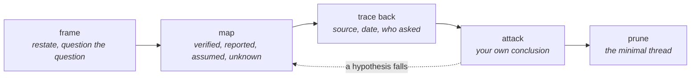

# Challenger le sujet

*En une phrase : on ne découvre pas en revue ce qu'on a oublié si on a posé soi-même, avant, les
questions que la revue posera, et ces questions ne viennent pas de l'inspiration : elles viennent de
grilles.*

L'esprit ne signale pas ce qui lui manque. Daniel Kahneman appelle ça *WYSIATI*, « ce que tu vois est
tout ce qui existe » : on construit l'histoire la plus cohérente possible avec les éléments disponibles,
et la cohérence de l'histoire donne la confiance, pas la quantité ni la qualité des éléments. Une
explication incomplète et cohérente est donc plus convaincante qu'une explication complète et
désordonnée, **et elle convainc d'abord son auteur.**

D'où la conséquence pratique, qui est tout le skill : **réfléchir plus fort ne marche pas.** Ce qui
marche, ce sont des structures extérieures, des grilles et des protocoles, qui posent les questions
qu'on n'aurait pas pensé à poser. Feynman le dit en une phrase : *le premier principe est de ne pas se
tromper soi-même, et on est la personne la plus facile à tromper.*

Le but n'est pas de douter de tout. Il est de **connaître le problème en entier**, parce qu'alors on
peut en extraire le fil qui mène à la solution la plus fine, et l'expliquer (voir
`se-faire-comprendre`).

Ce skill porte la méthode générale. Trois skills en appliquent une partie à un cas précis, et y
renvoient pour le reste : `concevoir-avant-coder` (le besoin avant la solution),
`cadrer-et-planifier` (les questions au demandeur, une à la fois) et `trouver-la-cause` (un bug).

Les deux premiers temps **élargissent**, les deux suivants **creusent**, le dernier **resserre**.
Sauter l'élargissement est l'erreur la plus fréquente : on creuse très bien le seul trou qu'on a vu.

## 1. Poser le sujet : reformuler, puis questionner la question

**Reformuler en une phrase**, par écrit. Si la phrase ne vient pas, le sujet n'est pas encore compris,
et tout le reste attendra. George Pólya ouvre *How to Solve It* (1945) par trois questions qui tiennent
toujours : **quelle est l'inconnue ? quelles sont les données ? quelle est la condition ?**

Puis **questionner la question elle-même**, parce qu'une question peut être mal posée :

- **est-ce le problème, ou une solution déjà choisie ?** C'est le « problème XY » : on demande de l'aide
  sur Y, une tentative, alors que le vrai sujet est X. « Comment augmenter le délai d'attente ? » cache
  souvent « pourquoi cet appel est-il lent ? » ;
- **pour qui est-ce un problème, et comment le constate-t-il ?** Un problème que personne ne constate
  de l'extérieur est une préférence ;
- **qu'est-ce qui serait différent si c'était résolu ?** C'est la question qui fait apparaître le
  critère de fin, et elle rejoint les critères falsifiables de `tests-first`.

### Quel genre de problème : la méthode en dépend

Le cadre Cynefin (Dave Snowden) sépare les problèmes par la relation entre cause et effet, et chaque
famille demande un geste différent :

| Famille | La relation cause-effet | Le geste |
|---|---|---|
| **clair** | évidente pour tous | appliquer la bonne pratique connue |
| **compliqué** | existe, mais demande de l'analyse ou un expert | analyser, puis décider |
| **complexe** | ne se voit qu'après coup | **sonder** par de petites expériences réversibles, observer, ajuster |
| **chaotique** | aucune, pour l'instant | agir d'abord pour stabiliser, comprendre ensuite |

L'erreur coûteuse est de se tromper de famille : analyser sans fin un problème complexe, dont la
réponse ne viendra que d'un essai, ou expérimenter au hasard sur un problème compliqué qu'une heure de
lecture aurait résolu. Et quand on ne sait pas dans quelle famille on est, c'est le signal qu'il faut
**découper** : un gros sujet mélange presque toujours des morceaux clairs, compliqués et complexes.

## 2. Cartographier : la toile, et ses zones d'ombre

### Chaque fait porte son statut

Sur la carte du sujet, un fait n'a pas la même valeur selon d'où il vient. Le noter pour chacun :

| Statut | Ce que ça veut dire | Exemple |
|---|---|---|
| **vérifié** | vu, mesuré ou lu dans la source, avec la commande ou le `fichier:ligne` | « la requête prend 800 ms, mesuré 10 fois ce matin » |
| **rapporté** | dit par quelqu'un, écrit dans une doc, un ticket, un commentaire | « le README dit que le cache est désactivé en dev » |
| **supposé** | inféré, jamais vérifié | « ça doit venir du réseau » |
| **inconnu** | une question dont on sait qu'on n'a pas la réponse | « on ne sait pas si d'autres services lisent cette table » |

Un rapport, une décision ou une PR qui mélange ces quatre statuts sans les distinguer présente des
suppositions avec l'autorité des mesures. **Ce n'est pas un défaut de style, c'est une information
fausse.**

### Les quatre cases, et la plus dangereuse

La formule de Donald Rumsfeld (2002) distingue les inconnues qu'on connaît de celles qu'on ne connaît
pas ; Slavoj Žižek y a ajouté la quatrième case, ce qu'on sait sans savoir qu'on le sait :

| | on en a conscience | on n'en a pas conscience |
|---|---|---|
| **on le sait** | ce qui est vérifié | **l'implicite** : une hypothèse si évidente qu'on ne la voit plus |
| **on l'ignore** | les inconnues listées | **les angles morts** : ce qu'on ignore ignorer |

Les inconnues listées sont gérables : elles sont écrites. Les deux autres cases ne se trouvent **que
par des grilles et par des yeux extérieurs**, jamais en se relisant. La fenêtre de Johari (Luft et
Ingham, 1955) dit pourquoi les yeux extérieurs marchent : une partie de ce qu'on ignore sur son propre
travail est connue des autres.

Et l'implicite est la pire case, parce qu'il se présente comme un fait : « bien sûr que les
identifiants sont uniques », « évidemment que ce service tourne sur une seule instance ». La parade est
une liste : **écrire chaque hypothèse sur laquelle la conclusion repose, pourquoi elle doit tenir, et
dans quelles conditions elle cesserait de tenir.** Les analystes du renseignement en ont fait une
procédure sous le nom de *Key Assumptions Check* (CIA, *A Tradecraft Primer*, 2009).

### Décomposer en arbre, et chercher la branche qui manque

Une zone d'ombre ne se voit pas dans un tas de faits ; elle se voit dans une **structure** où elle
laisse un trou. Décomposer le sujet en arbre dont les branches **ne se recouvrent pas et couvrent tout**
(le principe MECE de Barbara Minto : mutuellement exclusif, collectivement exhaustif), puis se demander
pour chaque nœud : *qu'est-ce qui n'est dans aucune branche ?* La branche qui manque est la question
qu'on n'avait pas posée.

### Balayer avec des grilles, pas avec l'inspiration

Une grille force la question qu'on n'aurait pas posée. Chacune balaie un axe différent ; les détails,
et leur traduction en logiciel, sont dans `references/grilles.md`.

| Grille | Ce qu'elle balaie | Quand la sortir |
|---|---|---|
| **QQOQCCP** (qui, quoi, où, quand, comment, combien, pourquoi) | le périmètre d'un sujet | toujours, en premier : c'est la moins chère |
| **6M d'Ishikawa** (méthode, matière, machine, main-d'œuvre, milieu, mesure) | les **familles de causes** d'un effet | une cause à chercher, un incident, un écart inexpliqué |
| **SFDIPOT** (structure, fonction, données, interfaces, plateforme, opérations, temps) | les **dimensions d'un système** | avant de tester, auditer ou modifier un produit |
| **mots-guides HAZOP** (pas, plus, moins, en plus, en partie, inverse, autre que, tôt, tard, avant, après) | les **déviations** d'un flux ou d'une étape | une entrée, un message, une séquence, une intégration |
| **ZOMBIES** (zéro, un, plusieurs, bornes, interface, exceptions, simple) | les **cas** d'un comportement | avant d'écrire les tests d'une fonction |
| **STRIDE** (usurpation, altération, répudiation, fuite, déni de service, élévation) | les **menaces** | toute frontière de confiance : entrée utilisateur, API, fichier reçu ; le reste du geste est dans `garder-les-frontieres` |

**Deux grilles minimum, d'axes différents.** Une grille ne trouve que ce que son axe peut
voir ; deux axes différents ont des angles morts différents. C'est la même raison qui fait croiser des
sources de mesure dont les angles morts ne se recouvrent pas.

### Le contexte à trois échelles

Le même fait n'a pas le même sens selon l'échelle à laquelle on le regarde. Passer les trois :

| Échelle | Les questions |
|---|---|
| **locale** | que garantit ce morceau, qui l'appelle, qu'est-ce qu'il suppose de ses entrées ? |
| **globale** | qui d'autre dépend de ce contrat, de cette table, de ce format ? Qu'est-ce qui est persisté, publié, promis ? |
| **environnementale** | sur quelle machine, quelle version, quelle configuration, quel fuseau, quelle charge ? Quelles autres équipes, quelles contraintes légales, quel calendrier ? |

L'environnement est l'échelle qu'on oublie, et c'est celle qui explique « ça marche chez moi ». La case
« milieu » des 6M existe pour elle.

## 3. Remonter à l'origine

### D'où vient ce fait ?

Chris Argyris décrit une **échelle d'inférence** : des données brutes, on sélectionne certaines, on les
interprète, on en tire des conclusions, puis des croyances qui décident de ce qu'on sélectionne la fois
suivante. Challenger un fait, c'est **redescendre l'échelle** : cette conclusion vient de quelle
interprétation, de quelles données, sélectionnées comment ?

Pour chaque fait qui porte une décision, trois questions :

1. **qui l'a établi, et comment ?** Une mesure, une lecture de code, une impression ;
2. **quand ?** Un fait vrai il y a un mois peut être faux aujourd'hui. Sur un projet réel, une phrase
   d'état réfutée depuis près de deux semaines a été recopiée de bonne foi dans un document de
   décision, et a servi à justifier une piste technique entière. La section qui la portait était
   datée ; personne n'avait lu la date ;
3. **est-ce encore vrai ?** Le vérifier coûte souvent une commande.

**La date d'apparition change le sens d'une absence.** Un artefact absent d'un fichier ancien ne dit
rien si l'artefact n'existait pas encore. L'archéologie qui le vérifie est dans `explorer-le-code`.

### Qui l'a demandé ?

Quand une règle, une contrainte ou un contrôle bloque, **chercher qui l'a demandé avant d'accuser
celui qui l'applique.** Sur un projet réel, un contrôle refusait un plan comme « ne vérifiant rien » ;
le plan avait été écrit ainsi parce qu'une autre consigne l'**ordonnait**. Deux consignes se
contredisaient, et personne ne l'avait vu, parce que chacune, lue seule, était raisonnable.

Et c'est la barrière de Chesterton appliquée aux idées : avant de retirer une règle dont on ne connaît
pas la raison, trouver la raison. Elle est parfois périmée, et alors on la retire en connaissance de
cause ; elle est souvent toujours valable.

### Quelqu'un l'a-t-il déjà fait ?

Avant de concevoir une réponse, chercher **le précédent** : un autre dépôt de l'organisation, une
équipe voisine, un projet public qui a eu le même problème. Sur un chantier réel, le correctif qu'on
s'apprêtait à concevoir existait déjà dans un autre dépôt de la même organisation, arrivé le mois
précédent, et il contredisait le choix qu'on défendait. C'est la vue extérieure (section 4)
appliquée à la solution plutôt qu'au pronostic.

### Les cinq pourquoi, et leur limite

Demander « pourquoi ? » cinq fois de suite, la méthode popularisée par Toyota, fait descendre du
symptôme vers la cause. Sa limite est connue et elle est sérieuse : **elle suit une seule chaîne**, et
chaque réponse est choisie parmi plusieurs possibles, donc elle s'arrête sur une cause commode plutôt
que sur la cause (critique argumentée par Alan Card, *BMJ Quality & Safety*, 2017).

Le correctif est simple : **à chaque « pourquoi ? », demander aussi « quoi d'autre ? »**. Les causes
forment un arbre, pas une chaîne, et c'est l'arbre que les 6M aident à dessiner.

## 4. Attaquer sa propre conclusion

C'est le temps qu'on saute, parce qu'une conclusion trouvée procure une satisfaction qu'on n'a pas envie
de risquer.

### Tenir plusieurs hypothèses en vie

T. C. Chamberlin l'écrivait en 1890 (*The Method of Multiple Working Hypotheses*) : dès qu'on n'a
qu'une explication, on s'y attache, et on se met à lire les faits pour elle. La parade est d'en tenir
**au moins deux** jusqu'à ce que l'une soit réfutée, puis de chercher **l'observation qui les
départage** (John Platt, *Strong Inference*, 1964). Une observation compatible avec les deux
hypothèses ne sert à rien, même si elle rassure.

La forme outillée est une matrice : les hypothèses en colonnes, les faits en lignes, et pour chaque
case, le fait **contredit-il** l'hypothèse ? On garde celle qui a le moins de contradictions, pas celle
qui a le plus de confirmations (Richards Heuer, *Psychology of Intelligence Analysis*, 1999, l'appelle
l'analyse des hypothèses concurrentes).

### Considérer le contraire

La question qui corrige le mieux un jugement est **« qu'est-ce que je verrais si j'avais tort ? »**
(Lord, Lepper et Preston, 1984, l'ont mesurée comme plus efficace que de demander aux gens d'être
impartiaux). C'est la falsifiabilité qui porte tout ce pack, appliquée à une conclusion plutôt qu'à un
test : si on ne peut pas dire ce qui la rendrait fausse, ce n'est pas une conclusion, c'est une
opinion.

### L'inversion et le pré-mortem

- **l'inversion** (le conseil de Jacobi, repris par Charlie Munger : « inverser, toujours inverser ») :
  au lieu de « comment réussir ? », demander « comment garantir l'échec ? », puis vérifier qu'aucun de
  ces ingrédients n'est présent ;
- **le pré-mortem** (Gary Klein, *Harvard Business Review*, 2007) : « nous sommes dans six mois, le projet
  a échoué ; écrivez pourquoi. » Imaginer l'échec comme **déjà arrivé** fait trouver environ 30 % de
  raisons en plus que la question « qu'est-ce qui pourrait mal tourner ? » (Mitchell, Russo et
  Pennington, 1989, qui ont mesuré le nombre de raisons, pas leur justesse). Le protocole tient en cinq
  étapes, dans `references/grilles.md`.

### Le relecteur hostile, avant le vrai

Lister les dix questions que le relecteur **le plus exigeant** posera, et y répondre avant lui : dans le
document, ou dans ses notes si la réponse n'intéresse pas le lecteur. C'est la pratique du *murder
board*, une répétition où des collègues jouent volontairement les contradicteurs les plus durs avant une
audition réelle.

Deux règles la rendent utile :

- **formuler l'objection sous sa forme la plus forte** avant de la rejeter (le *steelman*, contraire de
  l'homme de paille). Rejeter une objection faible ne prouve rien. Daniel Dennett en donne la version
  la plus exigeante, les règles de Rapoport : reformuler la position adverse si bien que son auteur
  réponde « merci, j'aurais aimé la dire comme ça », et seulement ensuite la critiquer ;
- **faire jouer le rôle par quelqu'un qui n'a pas écrit le document.** Pour un agent : un sous-agent
  sans le contexte de la conversation, avec la mission explicite de réfuter. Sur un rapport réel, une
  passe adversariale qui a rouvert chaque source citée a corrigé ou rejeté **37 faits sur 208**, soit
  près d'un sur cinq, dans un document que son auteur croyait vérifié.

### Vérifier par une deuxième route

Un chiffre obtenu d'une seule façon n'est pas vérifié, il est calculé. Le recalculer **par un autre
chemin** :

- **compter directement l'ensemble voulu**, au lieu de le déduire par soustraction. « 136 ont un nom, 66
  ont un lien, donc 70 ont autre chose » est faux dès que les deux ensembles se recouvrent ; le comptage
  direct rendait 76 ;
- **un ordre de grandeur** estimé autrement (une estimation de Fermi, un échantillon lu à la main). Un
  résultat qui s'en écarte d'un facteur dix signale une erreur, d'un côté ou de l'autre ;
- **une autre source, une autre méthode ou une autre personne**, dont les angles morts ne sont pas les
  mêmes. C'est la triangulation des sciences sociales (Norman Denzin, 1970), qui en distingue quatre
  sortes : par les données, par l'enquêteur, par la théorie et par la méthode.

**Et un zéro n'est pas une réponse tant qu'on n'a pas vérifié que l'outil regardait au bon endroit.**
Sur un projet réel, un lecteur annonçait « 2 règles jamais déclenchées » sur un dénominateur de 5,
alors que le système en déclarait 23 : le zéro ne disait rien des règles, il disait que le lecteur ne
les voyait pas. **« Zéro » et « je n'ai pas regardé » sont deux phrases différentes.**

### L'outillage peut avoir tort autant que le sujet

Quand une mesure ou une comparaison rend un écart, **vérifier le harnais avant d'accuser un des deux
côtés.** Une hypothèse sur l'environnement (« c'est la charge machine ») est aussi facile à poser à tort
qu'une hypothèse sur le produit ; sur un projet réel, elle a été crue, écrite, puis réfutée par une
re-mesure de quinze minutes.

### Et ensuite ?

La **pensée de second niveau** (Howard Marks, *The Most Important Thing*, 2011) : ne pas s'arrêter à la
première conséquence, demander celle d'après. Qui d'autre est touché ? Que se passe-t-il à dix fois
la charge, dans six mois, au prochain changement de version ? Et la **vue extérieure** de Kahneman :
comment ce genre de chantier se passe-t-il d'habitude, chez les autres, plutôt que comment on imagine
le sien ?

## 5. Challenger un retour : une revue, un audit, l'avis d'un autre

Les mêmes outils servent quand la conclusion vient de quelqu'un d'autre, mais le piège change : on
est tenté d'accepter en bloc (« d'accord, je corrige ») ou de rejeter en bloc (« il n'a pas le
contexte »). Les deux perdent de l'information. Sur une revue réelle de neuf points, trois reposaient
sur une prémisse fausse, un correctif proposé cassait une configuration qui marchait, et un point avait
trouvé une vraie erreur de l'auteur. Tout accepter aurait appliqué le correctif qui cassait ; tout
rejeter aurait laissé l'erreur.

### Découper chaque point en affirmations

Un point de revue mélange presque toujours **un fait, une conséquence, une gravité et un correctif**,
et chacun se juge séparément. Sur l'un des points de la revue ci-dessus, le fait était vrai, une des
trois causes citées était fausse, la gravité était surévaluée, et une des deux options de correctif
créait un autre problème. Un simple « d'accord » aurait perdu trois de ces quatre constats.

### Viser l'hypothèse porteuse, pas la conclusion

Chaque conclusion repose sur une ou deux hypothèses, et ce sont elles qu'il faut attaquer, **sous forme
de question**. Les questions qui ont le plus rapporté sur un chantier réel avaient toutes cette forme :

| La question | L'hypothèse visée | Ce qu'elle a cassé |
|---|---|---|
| « c'est une issue d'il y a 6 ans, ça a peut-être changé ? » | le comportement décrit il y a six ans vaut encore | un correctif de 45 fichiers est devenu une montée de version |
| « ce n'est pas l'outil de mise à jour automatique qui s'en occupe ? » | pas de PR ouverte veut dire rien de proposé | les clones locaux étaient périmés, la mise à jour était déjà faite |
| « c'est dans le README, mais est-ce que ça veut dire que c'est voulu ? » | documenter veut dire décider | une justification reposait sur un message de commit trompeur |
| « pourquoi 5 s ? c'est quoi le standard ? » | le chiffre calculé : une tentative toutes les 5 s, donc 720 par heure | une tentative dure 14 s de plus que l'attente : 190 par heure |

Sur une estimation de charge, l'hypothèse porteuse était « plusieurs millions de lignes », et personne
ne l'avait mesurée : à 200 000 lignes, le problème soulevé tombait de 17 minutes à 40 secondes.

### Reformuler la meilleure version, puis faire la preuve la moins chère

- **la version forte d'abord** : sur un point qui signalait une clé de cache vide, peu probable, la
  version forte était bien pire, deux environnements qui partagent la même clé et dont l'un ne fait
  plus jamais son travail de nuit. Attaquer la version faible aurait raté le vrai risque ;
- **pour chaque affirmation, quelle observation la tranche ?** Puis commencer par la moins chère **qui
  peut inverser la décision** : capturer la requête SQL réellement émise (une minute), lire les règles
  de protection du dépôt (un appel d'API), lancer deux instances en parallèle (deux minutes). Trois des
  neuf points sont tombés ainsi, sans débat.

### Lister les cas

Quand un correctif est proposé, énumérer les configurations possibles et regarder ce que chaque option
y fait. Sur la clé de cache ci-dessus :

| Configuration | clé = nom de la base (actuel) | clé = nom de l'environnement (proposé) |
|---|---|---|
| deux environnements sur la **même** base | juste | deux purges par nuit sur la même base |
| deux bases de noms **différents** | juste | juste |
| deux bases de **même nom** sur deux serveurs | **défaut** : un environnement ne purge jamais | juste |

Le défaut n'existe que dans une configuration, et le correctif proposé en casse une autre. La liste a
donné la clé juste dans les trois cas, **serveur plus base**, qu'aucune des deux options ne proposait.

### Regarder les points ensemble

Des points jugés un par un se contredisent parfois. Dans la même revue, une des options de correctif
d'un point (garder un verrou pendant tout le traitement) rendait vrai un autre point jugé faux (les
instances en attente finissaient en expiration). Avant de trancher, relire les correctifs retenus
**les uns contre les autres**.

### La grille de réponse, et les trois pièges

Pour chaque point : ce que dit le retour, sa meilleure version, ce qui a été vérifié, ce qui lui
manque, **ce qui ferait changer d'avis**, et la décision. La case « ce qui ferait changer d'avis » est
celle qui prouve qu'on teste une position au lieu de la défendre : si on ne sait pas la remplir, on
défend. La grille est dans `references/grilles.md`.

Trois pièges, qui ont chacun coûté sur le même chantier :

- **l'autorité** : le mainteneur d'une bibliothèque avait répondu « c'est voulu » en 2020, et le
  comportement avait changé depuis ;
- **le chiffre plausible** : 720 tentatives par heure, 91 tests, 15 dépôts lus. Les trois avaient le bon
  ordre de grandeur, et les trois étaient faux, le deuxième parce qu'il venait d'un binaire périmé ;
- **juger la source au lieu du point** : un retour écrit par un outil, un junior ou un concurrent se
  juge point par point comme les autres. Celui-là avait tort trois fois sur neuf, et raison là où
  l'auteur s'était trompé.

## 6. Savoir s'arrêter

Challenger n'est pas infini, et le doute sans fin est un échec aussi réel que la certitude précoce. Trois
critères d'arrêt :

1. **les questions restantes ne changent plus la solution.** C'est le test qui tranche : si la réponse,
   quelle qu'elle soit, mène au même geste, elle ne vaut pas le temps de la chercher maintenant ;
2. **le geste est réversible et peu cher** : alors l'essayer et observer apprend plus qu'analyser
   (c'est la case « complexe » de Cynefin) ;
3. **le temps borné est écoulé** : on écrit ce qu'on sait, ce qu'on ne sait pas, et on demande.

Deux règles de tenue :

- **noter ce qui a été réfuté.** Une hypothèse éliminée est un résultat, et sans trace quelqu'un la
  retestera (voir `trouver-la-cause`) ;
- **un sujet tranché reste clos.** On ne le rouvre pas parce qu'on y trouve encore des choses à mesurer,
  seulement si un fait nouveau change la solution. La question qui décide : *est-ce que ça change ce
  qu'on va faire ?*

## 7. Élaguer : le fil qui mène à la solution minimale

Une fois la carte complète, l'essentiel n'est pas un résumé de la carte. C'est **la chaîne causale** qui
va du besoin ou de la cause racine jusqu'au changement, et à la preuve qu'il marche. Tout le reste reste
dans les notes.

**Le test : la solution s'énonce en quatre phrases.** Le problème, sa cause, le changement, la preuve.
Si l'une des quatre ne vient pas, on ne sait pas encore tout.

Et la solution la plus fine se reconnaît à son **nombre de racines** : les modules qu'elle touche, les
concepts qu'elle introduit, les équipes qu'elle implique. Une solution qui plante des racines partout est
le signe qu'on traite plusieurs symptômes au lieu d'une cause, ou que le problème n'a pas été découpé.
Quatre repères :

- **le rasoir d'Occam** : entre deux explications qui rendent compte des faits, celle qui suppose le
  moins ;
- **le plus petit changement qui retire la cause**, pas celui qui fait disparaître le symptôme (voir
  le diff minimal de `concevoir-avant-coder` et les correctifs qui masquent de `trouver-la-cause`) ;
- **la loi de Gall** (John Gall, 1975) : un système complexe qui marche est toujours issu d'un système
  simple qui marchait. Commencer par la version simple qui marche ;
- **rendre le changement facile, puis faire le changement facile** (Kent Beck) : quand la solution
  minimale ne rentre pas proprement, un refactor sans changement de comportement d'abord, détaillé
  dans le diff minimal de `concevoir-avant-coder`.

Saint-Exupéry l'a dit pour les avions, et ça vaut pour une solution : *« il semble que la perfection
soit atteinte non quand il n'y a plus rien à ajouter, mais quand il n'y a plus rien à retrancher »*
(*Terre des hommes*, 1939).

Puis le fil se **filtre par lecteur** : l'auteur, un pair, un décideur ne retiennent pas le même
sous-ensemble de la carte. Ce tri est le sujet de `se-faire-comprendre`, et il n'est possible que parce
que la carte est complète : **on ne choisit bien l'essentiel que parmi tout.**

## Les anti-patterns, et leur signature

- **la première explication cohérente adoptée.** Signature : aucune hypothèse concurrente n'a jamais
  été écrite ;
- **la grille récitée.** Signature : les sept cases du QQOQCCP sont remplies, et aucune réponse n'a
  changé le plan. Une grille sert à trouver des questions, pas à remplir un formulaire ;
- **le fait recopié.** Signature : pas de date, pas de source, « il paraît que », « c'est connu » ;
- **le zéro accepté.** Signature : « aucun résultat », sans preuve que l'outil a regardé au bon endroit ;
- **l'accusation sans lecture.** Signature : le produit, la bibliothèque ou l'environnement mis en cause
  sans qu'on ait ouvert leur source ;
- **le challenge des autres, jamais de soi.** Signature : une revue impitoyable de la PR d'un collègue,
  et sa propre conclusion publiée sans une seule tentative de réfutation ;
- **le doute infini.** Signature : chaque nouvelle question est intéressante, et aucune ne change ce
  qu'on va faire.

## La porte de sortie

Avant de présenter, de coder ou de faire relire, ces sept réponses doivent exister :

1. le sujet est **reformulé en une phrase**, et la question elle-même a été questionnée : c'est le vrai
   problème, pas une solution déjà choisie ;
2. la carte distingue **vérifié, rapporté, supposé et inconnu**, et chaque fait qui porte la conclusion
   a sa **source** et sa **date** ;
3. **au moins deux grilles** d'axes différents ont été passées, dont une qui couvre l'environnement (la
   case « milieu » des 6M, ou le passage aux trois échelles), et les **questions ouvertes** sont
   écrites ;
4. **au moins deux hypothèses** ont été tenues, et celle qui reste a survécu à une **tentative de
   réfutation écrite** : le contraire, un pré-mortem ou un relecteur hostile. Chaque verdict dit **ce
   qui ferait changer d'avis** ; face à un retour, chaque point a été découpé en affirmations et jugé
   séparément ;
5. les chiffres qui comptent ont été obtenus par **une deuxième route**, ou leur limite est écrite ;
6. on sait **pourquoi on s'arrête** : les questions restantes ne changent pas la solution ;
7. la solution s'énonce en **quatre phrases** (problème, cause, changement, preuve), avec **le moins de
   racines possible**.

Si le point 4 manque, la conclusion n'a pas été challengée, seulement confirmée, et c'est ce que la
revue découvrira.
