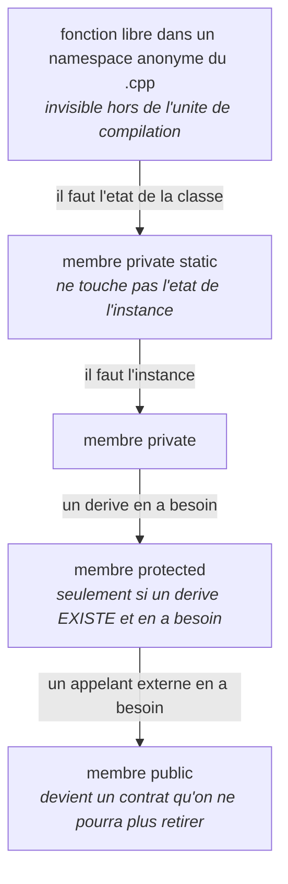
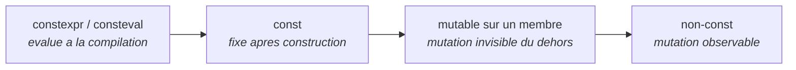

# Commencer fermé, relâcher sur preuve

*En une phrase : déclarer chaque chose avec le maximum de restrictions que le langage permet, puis
en retirer une seulement quand le résultat l'exige.*

**Jamais l'inverse.** Ce n'est pas du perfectionnisme, c'est une **asymétrie de coût** : élargir ne
casse personne, resserrer casse tout le monde.

| Sens | Ce que ça coûte |
|---|---|
| `private` vers `public`, `const` vers mutable, retirer `final` | rien. Personne ne dépendait de la restriction |
| `public` vers `private`, mutable vers `const`, ajouter `final` | **cassure** de tout appelant existant, y compris ceux qu'on ne voit pas |

D'où la conséquence qui fait tout l'intérêt de la discipline : **chaque relâchement devient un acte
volontaire, daté et justifiable en revue.** Un symbole `public` par défaut n'a jamais été décidé par
personne ; un symbole passé `public` en retirant `private` porte une raison.

## Les trois niveaux de vérification, le seul arbitrage qui compte

La règle « tout mettre puis retirer » est sûre quand le compilateur peut te contredire, et dangereuse
quand il ne peut pas. Mais ce n'est pas binaire : **il y a un niveau intermédiaire, et c'est celui
qui contient les cas intéressants.**

| Niveau | Ce que fait le compilateur | Qualifieurs | Le défaut maximal est-il sûr ? |
|---|---|---|---|
| **1. vérifié** | **refuse de compiler** si c'est faux | visibilité, `const` sur membre, `constexpr`, `override`, `explicit`, `final`, `readonly`, `sealed`, `[[nodiscard]]` | **oui.** Au pire ça ne compile pas : échec immédiat, local, gratuit |
| **2. diagnostiqué en partie** | **avertit sur le cas visible**, aveugle sur ce qui traverse un appel | `noexcept` (le `throw` direct), `[[noreturn]]` (le `return` visible) | **presque.** Sous `-Werror` le cas local devient une erreur dure, donc il se comporte comme le niveau 1. Le trou est ailleurs, voir ci-dessous |
| **3. non vérifié** | **te croit, en silence** | `restrict`, `__attribute__((pure))` et `((const))`, `unsafe impl Send`, un `const_cast` qui retire un `const` | **non.** Ça compile, et le mensonge se paie à l'exécution, loin de sa cause |

**Le niveau 2 est celui qu'on décrit mal.** Sur `[[noreturn]]`, Clang a `-Winvalid-noreturn` actif par
défaut et GCC diagnostique aussi une fonction `noreturn` qui revient ; sur un `throw` **direct** dans
une fonction `noexcept`, GCC a `-Wterminate` et Clang `-Wexceptions`, les deux par défaut. Donc sous
`-Werror`, poser ces deux attributs à tort **ne compile pas**. Ce n'est pas « le compilateur te
croit ».

**Le trou réel de `noexcept` est l'appel indirect**, et c'est le cas fréquent :

```cpp
void publish(std::vector<int>& sink, int value) noexcept {
    sink.push_back(value);   // peut lever std::bad_alloc.
}                            // Compile propre sous -Wall -Wextra -Werror.
                             // A l'execution : std::terminate. Pas de pile deroulee.
```

Aucun avertissement ici, parce que la promesse porte sur ce que fait un **appelé**, ce que le
compilateur ne remonte pas. C'est ça qui rend `noexcept` différent de `private` : on peut le poser
par défaut sans que rien ne proteste, et découvrir à l'exécution que la promesse était fausse.

**La formulation qui marche pour les niveaux 2 et 3** : ne pas se demander *« puis-je le mettre ? »*
mais **« le corps me l'interdit-il ? »**. Et quand le langage sait le calculer, le lui faire
calculer : `noexcept(noexcept(expr))` **dérive** la promesse au lieu de l'affirmer, ce qui est le
principe « dériver plutôt qu'écrire à la main » appliqué à une signature.

## Le paquet complet s'applique aussi au compilateur

C'est le prolongement direct du skill, un cran plus haut : **les diagnostics se déclarent au
maximum, et on en retire un par un, avec une raison.** Monter les avertissements fait **descendre du
niveau 2 vers le niveau 1** tout ce que le compilateur sait voir, donc ça agrandit la zone où « tout
mettre puis retirer » est sûr.

```bash
# C++ -- le paquet de depart
-Wall -Wextra -Wpedantic -Werror
-Wshadow -Wconversion -Wsign-conversion -Wold-style-cast -Wnon-virtual-dtor
-Winvalid-noreturn -Wnoexcept          # clang / gcc : les deux du niveau 2
# et a l'execution, ce que le compilateur ne peut pas prouver :
-fsanitize=address,undefined           # attrape une part du niveau 3
```

Équivalents : `TreatWarningsAsErrors` plus `<Nullable>enable</Nullable>` plus les analyseurs en .NET ;
`strict` complet plus `noUncheckedIndexedAccess` et `noImplicitOverride` en TypeScript ;
`#![deny(warnings)]` et Clippy en Rust.

**Une désactivation d'avertissement se justifie comme un relâchement de qualifieur** : ciblée sur un
fichier ou une ligne, nommée, avec sa raison écrite. Un `-Wno-...` global est l'équivalent de tout
passer `public`.

> **Vérifier sur TA chaîne plutôt que me croire** : les avertissements par défaut varient selon le
> compilateur et sa version. La sonde `references/sonde-qualifieurs.cpp` contient les trois cas
> (retour visible, `throw` direct, `throw` indirect) et se compile en une commande. Elle rend la
> réponse de ton outillage au lieu d'un tableau à croire.

## Les échelles, axe par axe

On descend d'un cran quand, et seulement quand, le cran actuel ne permet pas le résultat.

### Visibilité, en C++



Le cran le plus souvent sauté est le premier : **une méthode privée qui ne lit aucun membre n'est pas
une méthode.** La sortir en fonction libre à liaison interne la retire de l'en-tête, donc de la
recompilation des appelants, donc du contrat, et elle devient testable sans instancier la classe.

> **Liaison interne** veut dire : ce symbole n'existe que dans le fichier compilé où il est défini,
> l'éditeur de liens ne le voit pas. En C++, un `namespace` anonyme ; en C, `static` sur une fonction
> libre.

### Mutabilité



### Conversion, héritage, données

Ces trois axes sont des classements plutôt que des cheminements, donc un tableau les sert mieux qu'un
schéma :

| Axe | Du plus fermé au plus permissif | Ce que le premier cran interdit |
|---|---|---|
| conversion | `explicit` puis conversion implicite autorisée | une conversion silencieuse au site d'appel |
| héritage | `final` puis `virtual` + `override` puis `virtual` seul | qu'un tiers hérite et casse un invariant |
| domaine de valeurs | type fort ou unité, puis `enum class`, puis entier nu | qu'on passe des centimes là où on attend des jours |
| vue sur des données | `std::span<const T>`, puis `const T&`, puis `T&`, puis `T*`, puis `T* + size_t` | qu'on perde la taille, donc qu'on déborde |
| absence de valeur | `std::optional` ou `expected`, puis valeur sentinelle (`-1`, `nullptr`, `""`) | qu'une absence soit indiscernable d'une valeur légitime |

`override` n'est pas optionnel : sans lui, une signature qui dérive silencieusement crée une
surcharge au lieu d'une redéfinition, et le compilateur ne dit rien. C'est du niveau 1, donc à mettre
toujours.

## Trois cas où l'instinct demande une nuance

**`mutable` avant de retirer le `const`.** Bon réflexe, avec une frontière nette : `mutable` est
légitime **uniquement quand la mutation est invisible de l'extérieur**, mémoïsation, verrou, compteur
de références, statistique interne. C'est la *constance logique*, et elle tient une promesse réelle à
l'appelant.

Si la mutation **change ce que l'appelant peut observer**, `mutable` ne sauve pas le `const` : il le
transforme en mensonge que le compilateur valide. Le `const` était l'erreur, le retirer est la
correction. Et si l'objet est partagé entre fils d'exécution, une méthode `const` qui mute est un
piège de concurrence, parce que `const` est précisément ce sur quoi les appelants se fient pour
partager sans verrou.

**`[[nodiscard]]` est du niveau 1, et c'est un des rares à mettre dès le départ.** Non par goût, par
coût : l'**ajouter** plus tard casse les compilations en avertissements-erreurs de tous les appelants
qui ignoraient le retour. Le mettre d'emblée est gratuit ; le mettre en 1.4 est une version majeure.

**`static` sur une méthode et `extern` sur un symbole sont deux axes différents.** En C++, la
fermeture maximale d'un symbole de fichier est la **liaison interne** (`namespace` anonyme, ou
`static` sur une fonction libre, hors classe). `static` sur une **méthode** ne parle pas de liaison :
il dit « ne touche pas l'instance ». `extern` va dans l'autre sens, il **ouvre**, sauf `extern "C"`,
qui est une contrainte de convention binaire et non une visibilité.

## Le typage fort, la contrainte la plus forte

Un qualifieur contraint ce qu'on peut **faire** d'un symbole ; un type contraint ce qu'il peut
**valoir**. Le second est plus puissant : quand un état invalide ne peut pas être représenté, il n'y a
plus de garde à écrire, plus de test à oublier, plus de commentaire à maintenir.

```cpp
// Permissif : quatre facons de se tromper, aucune detectee
Money compute(int amount, int days, bool prorated, int rounding);
compute(days, amount, true, 2);   // compile. Les deux premiers sont inverses.

// Ferme : chaque erreur devient une erreur de compilation
Money compute(Cents amount, WorkingDays days, Proration mode, RoundingRule rule);
```

En C# : `readonly record struct`, types marqueurs, `required`. En TypeScript : types marqués
(`type UserId = string & { readonly __brand: unique symbol }`), `readonly`, unions littérales plutôt
que `string`. En Rust : le type enveloppe est le mécanisme natif et l'immutabilité est le défaut, le
langage applique déjà ce skill.

## Gratuit contre coûteux, la ligne qui protège le perfectionnisme

« Précis », « perfectionniste » et « optimisé » désignent **deux choses**, et les confondre coûte
cher :

| | Précision de déclaration et de type | Optimisation de code |
|---|---|---|
| coût à l'exécution | **nul** | réel : lisibilité, complexité, bugs |
| ce qui la justifie | rien à justifier, c'est gratuit | **une mesure**, jamais une intuition |
| quand la faire | dès le départ, au maximum | après avoir profilé, sur le chemin chaud constaté |

Être maximaliste sans culpabilité sur la première colonne ; exiger une mesure pour la seconde (voir
`mesure-et-telemetrie`).

Et une correction courante au passage : **`const` sur une variable locale n'optimise presque jamais**,
le compilateur voit déjà qu'elle ne bouge pas. Sa valeur est ailleurs, et elle est grande : il
interdit une classe de bugs et il informe le lecteur. `constexpr` et `final`, eux, donnent vraiment de
l'information au compilateur. Ne pas vendre `const` comme de la performance, c'est le vendre sur son
argument le plus faible.

## Le garde-fou, quand la qualification devient du bruit

Le risque de cette discipline est de décorer. Deux tests, et il faut répondre oui à **au moins un** :

1. **est-ce que retirer ce qualifieur changerait quelque chose** pour un appelant, ou pour le
   compilateur ?
2. **puis-je nommer le cas qu'il interdit** ?

Si c'est non aux deux, c'est de la décoration, et elle a un coût réel : elle noie les qualifieurs qui
portent une information. Les cas concrets : `const` sur un paramètre passé par valeur **dans une
déclaration** (aucun effet sur le contrat), `inline` sur une méthode définie dans la classe (déjà
implicite), `virtual` **et** `override` ensemble (choisir `override`), `private` sur un membre d'une
`class` (déjà le défaut).

## Le même principe, dans cinq langages

| | Le paquet complet au départ (niveau 1) | Ce qui se dérive du corps (niveaux 2 et 3) |
|---|---|---|
| **C++** | namespace anonyme, `private`, `const`, `constexpr`, `explicit`, `final`, `override`, `[[nodiscard]]` | `noexcept`, `[[noreturn]]` |
| **C** | `static` (liaison interne), `const`, `enum` dédié | `restrict`, `_Noreturn`, `pure` et `const` de GCC |
| **C#** | `private`, `sealed`, `readonly`, `record`, `required`, nullable activé | analyseurs de nullabilité |
| **TypeScript** | `private` ou `#`, `readonly`, `as const`, `strict` complet, types marqués | `asserts x is T`, prédicats de type |
| **Rust** | privé par défaut, immuable par défaut, `#[must_use]`, type enveloppe | `unsafe`, `Send` et `Sync` manuels |

Pour TypeScript, l'échelle complète, les options du compilateur et les constructions que le
compilateur croit sans vérifier (`as unknown as T`, `!`, `any`, les prédicats de type) sont dans
`references/typescript.md`, avec la même grille à trois niveaux. C'est le langage où le niveau 3 se
cache le mieux, parce que tout y a l'air typé.

## La porte de sortie

Sur chaque déclaration écrite, ces trois réponses doivent exister :

1. **chaque relâchement se justifie en une phrase** (« protected parce que `CsvExporter` en hérite et
   en a besoin ») ;
2. **aucun qualifieur de niveau 2 ou 3 n'a été posé par défaut** : chacun est dérivé du corps, ou
   calculé par le langage ;
3. **aucun qualifieur ne survit aux deux tests du garde-fou** sans y répondre.

Et la règle qui vaut pour tout ce skill : **relâcher est un événement, jamais un défaut.**
