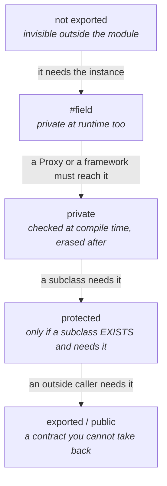

# Commencer fermé, en TypeScript

La grille du skill s'applique telle quelle : ce que le compilateur **refuse**, ce qu'il **diagnostique en
partie**, et ce qu'il **croit en silence**. En TypeScript, le troisième niveau se cache bien, parce
qu'un code plein de `as` et de `!` a l'air aussi typé qu'un code qui n'en a pas.

## Les trois niveaux, en TypeScript

| Niveau | Constructions | Ce qui se passe si on se trompe |
|---|---|---|
| **1. vérifié** | `readonly`, `#champ` et `private`, `as const`, unions littérales, types marqués, `never` exhaustif, `satisfies`, `override` sous `noImplicitOverride` | ça ne compile pas |
| **2. diagnostiqué en partie** | `x as T` : refusé quand les types ne se recouvrent pas, cru dès qu'ils se recouvrent ; `@ts-expect-error` : signale qu'il ne sert plus quand l'erreur disparaît | le cas visible est refusé, le cas plausible passe |
| **3. cru en silence** | `!` (assertion de non-nullité), `any`, `as unknown as T`, prédicats `x is T` et fonctions `asserts x is T`, `@ts-ignore`, un fichier `.d.ts` écrit à la main, `JSON.parse` et `response.json()` qui rendent `any` | ça compile, et le mensonge se paie à l'exécution, loin de sa cause |

Deux conséquences :

- **un prédicat de type est une promesse que personne ne vérifie.** Le compilateur contrôle que la
  fonction rend un booléen, pas que ce booléen dit vrai. Il se teste comme une règle métier, cas de
  refus compris. Depuis TypeScript 5.5, un prédicat simple s'infère du corps de la fonction : le
  laisser au compilateur le fait passer du niveau 3 à « dérivé », comme `noexcept(noexcept(expr))` ;
- **une donnée qui entre ne se type pas, elle se valide.** `(await res.json()) as User` est du niveau 3 :
  la forme annoncée n'a été vérifiée par personne. À une frontière de confiance, une validation à
  l'exécution (un schéma) produit le type, et c'est la seule forme qui ne ment pas (voir
  `garder-les-frontieres`).

## Les échelles

### Visibilité



Le premier cran est le plus souvent sauté : **une fonction qui n'a pas besoin de l'instance n'est pas
une méthode.** Non exportée, elle sort du contrat. Si un test doit l'appeler directement, l'exporter
depuis un module interne est un cran assumé, pas un défaut. `#champ` et `private` ne sont pas
équivalents : `private` s'efface à la compilation et se contourne par `objet['champ']`, `#champ` tient
aussi à l'exécution. D'où le passage de l'un à l'autre : un `#champ` casse un `Proxy`, et certains
frameworks ne l'atteignent pas.

### Mutabilité

| Du plus fermé au plus permissif | Ce que le premier cran interdit |
|---|---|
| `as const`, `readonly T[]`, `ReadonlyMap`, `Readonly<T>` | qu'un appelant modifie ce qu'il a reçu |
| `readonly` sur une propriété | qu'une propriété change après la construction |
| `const` sur une liaison | qu'on réaffecte le nom, **pas** qu'on modifie l'objet |
| mutable | rien |

`Readonly<T>` est superficiel : un objet imbriqué reste modifiable. `as const` fige en profondeur un
littéral, au niveau des types seulement : rien n'est gelé à l'exécution (`Object.freeze` le fait, et
superficiellement). C'est souvent le bon outil pour une table de constantes.

### Domaine de valeurs

| Du plus fermé au plus permissif | Ce que le premier cran interdit |
|---|---|
| type marqué (`type UserId = string & { readonly __brand: 'UserId' }`) | qu'on passe un identifiant de projet là où on attend un identifiant d'utilisateur |
| union littérale (`'value' \| 'percentage'`) | qu'une valeur hors de la liste compile |
| `string`, `number` | rien |
| `unknown` | l'usage sans vérification : il faut d'abord rétrécir le type |
| `any` | rien, et il contamine tout ce qu'il touche |

À une frontière, **`unknown` est le bon défaut et `any` le pire** : le premier oblige à vérifier, le
second fait disparaître la question.

### Exhaustivité

```ts
type Mode = 'value' | 'percentage';

function assertNever(value: never): never {
  throw new Error(`unexpected value: ${String(value)}`);
}

function label(mode: Mode): string {
  switch (mode) {
    case 'value': return 'Valeur';
    case 'percentage': return 'Pourcentage';
    default: return assertNever(mode);   // un troisieme mode ajoute a l'union ne compile plus ici
  }
}
```

C'est l'équivalent de l'ouvert/fermé vérifié : ajouter un cas à l'union fait rougir chaque `switch` qui
l'oublie, au lieu de tomber en silence dans un `default`.

## Le paquet de départ, dans `tsconfig.json`

```jsonc
{
  "compilerOptions": {
    "strict": true,                               // noImplicitAny, strictNullChecks, useUnknownInCatchVariables...
    "noUncheckedIndexedAccess": true,             // tableau[i] est T | undefined : le hors-borne se voit
    "exactOptionalPropertyTypes": true,           // absent et undefined ne sont plus la meme chose
    "noImplicitOverride": true,                   // override devient obligatoire, donc verifie
    "noImplicitReturns": true,
    "noFallthroughCasesInSwitch": true,
    "noPropertyAccessFromIndexSignature": true    // une cle dynamique s'ecrit obj['cle'], donc se voit
  }
}
```

`strict` ne contient pas les six options qui le suivent : chacune s'ajoute à la main. Et le vérificateur
de style prend le relais sur ce que le compilateur ne voit pas. Avec typescript-eslint, cité comme
exemple : `no-explicit-any`, `no-non-null-assertion`, `consistent-type-assertions` avec
`assertionStyle: 'never'` pour bannir `as`, puis la famille `no-unsafe-*`, `switch-exhaustiveness-check`,
`prefer-readonly` et `no-floating-promises`, qui demandent toutes l'information de type. Une
désactivation se justifie comme ailleurs : sur une ligne, avec sa raison.

## Le framework a aussi ses options au maximum

Un framework ajoute souvent sa propre couche de vérification, qu'on monte au maximum comme celle du
langage. Exemple avec Angular : `strictTemplates` vérifie les types dans les gabarits, là où une faute
de frappe passait sinon jusqu'à l'exécution. Et les mêmes échelles s'y appliquent. Un service expose un
signal modifiable en lecture seule (`asReadonly()`). Une entrée obligatoire se déclare obligatoire
(`input.required()`) plutôt que optionnelle avec un défaut qui ne veut rien dire. Un `computed` reste
pur, parce qu'un effet de bord dans un calcul dérivé est un comportement que rien n'annonce.
