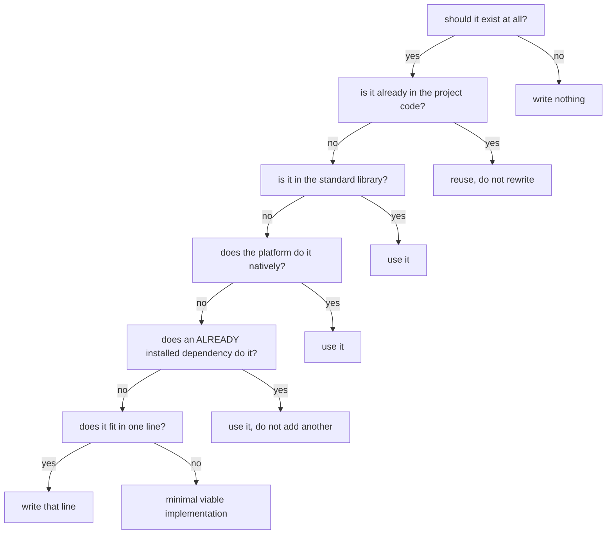
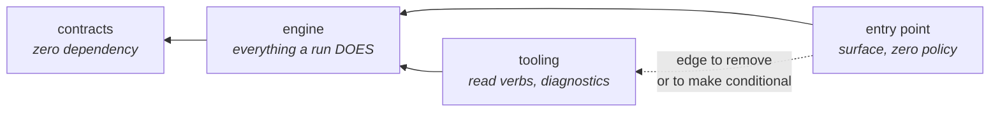
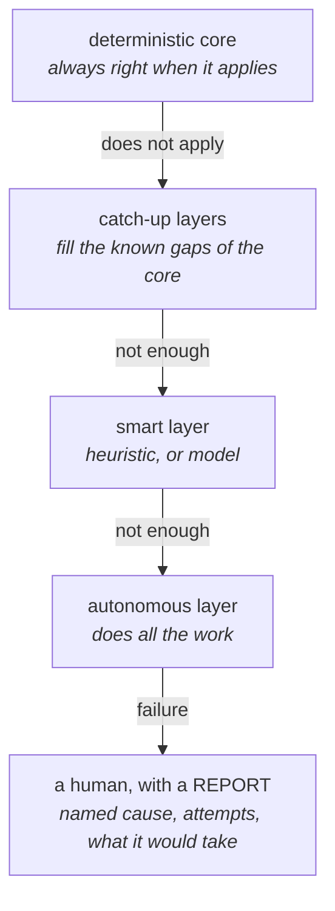

# Concevoir avant de coder

*En une phrase : répondre aux questions dont la réponse coûte cher à découvrir dans le code, et
laisser toutes les autres au code, qui les répond mieux.*

Concevoir n'est pas dessiner des boîtes.

## 1. Le besoin avant la solution

Une demande arrive presque toujours déjà habillée en solution : « il faut un cache », « fais une
fabrique », « ajoute un drapeau ». La solution proposée est une information utile, elle dit ce que le
demandeur a en tête, mais ce n'est pas le besoin.

Trois questions qui déshabillent une demande :

1. **Quel comportement observable change ?** Pas « quel code j'écris », mais qu'est-ce qu'on pourra
   constater de l'extérieur qu'on ne pouvait pas constater avant.
2. **Qu'est-ce qui est vrai aujourd'hui et ne le sera plus ?** C'est la question qui trouve les
   cassures : appelants, données persistées, contrat publié, hypothèses d'autres équipes.
3. **Combien de cas RÉELS existent aujourd'hui ?** Un, c'est un cas. Deux, c'est une variation. Trois,
   c'est une famille, et seule une famille justifie une abstraction.

> **Avant de construire une capacité, énumérer celles qui existent déjà.** Chercher dehors ce que le
> projet porte déjà est l'erreur la plus coûteuse de la conception, parce qu'elle ne produit aucun
> symptôme : on livre quelque chose qui marche, en double.

Les deux gestes de cette section ont une méthode complète ailleurs. Déshabiller une demande, c'est
challenger la question avant d'y répondre, et en particulier trouver l'hypothèse qui la porte :
« il faut un cache » suppose que l'appel est lent **parce qu'il** se répète, ce que personne n'a
peut-être mesuré (`challenger-le-sujet`, sections 1 et 5). Énumérer ce qui existe suppose de savoir
chercher dans un code qu'on n'a pas écrit, par la chaîne visible, les points d'entrée et les
références plutôt qu'en lisant de haut en bas (`explorer-le-code`), puis au-delà du dépôt : le même
problème a peut-être déjà été résolu dans un dépôt voisin de l'organisation (`challenger-le-sujet`,
section 3).

## 2. YAGNI, et sa frontière exacte

YAGNI (*you aren't gonna need it*, « tu n'en auras pas besoin ») ne dit pas « ne prévois rien ». Il
dit : **le coût d'un point d'extension se paie maintenant, son bénéfice arrive peut-être.** La
frontière est mesurable, pas philosophique.

**La règle du deuxième appelant** : une abstraction se crée quand le **deuxième cas réel** existe, pas
quand on l'imagine. Un cas imaginé se trompe presque toujours d'axe de variation, et une abstraction
posée sur le mauvais axe coûte plus cher que pas d'abstraction du tout, parce qu'il faut la démonter
avant de pouvoir faire ce qu'on voulait.

Les trois exceptions où anticiper est justifié, et elles se **prouvent** :

| Exception | Le test qui la prouve |
|---|---|
| la frontière est publique ou persistée | *puis-je changer ça plus tard sans casser un appelant que je ne contrôle pas ?* Si non, concevoir maintenant |
| le coût de rattrapage est prohibitif et connu | une migration de données, un format sur le fil, une API versionnée |
| la réversibilité est asymétrique | *combien coûte de le retirer si je me trompe ?* Peu cher à retirer, essayer ; cher à retirer, concevoir |

**Le corollaire qu'on oublie** : YAGNI s'applique aussi aux options, aux drapeaux et aux modes. Un mode
que personne n'active est du code non testé en production.

### Le deuxième axe : le diff minimal

Ce qui précède porte sur **ce qu'on construit**. Il existe une seconde lecture, qui porte sur
**l'étendue du changement** : *toucher le moins de code possible pour obtenir le résultat demandé.*
Les deux ne s'opposent pas, elles s'appliquent à des moments différents.

| Axe | La question | Quand elle se pose |
|---|---|---|
| ce qu'on construit | *ce point d'extension a-t-il un deuxième cas réel ?* | à la conception |
| l'étendue du changement | *quelle est la plus petite modification qui obtient ce résultat ?* | à l'écriture, et à la revue |

Le second axe est la discipline la plus visible en contribution externe, et il rapporte trois choses :

- **une PR qu'on peut réellement relire.** Une grosse PR n'est pas relue, elle est approuvée (voir
  `tracer-le-travail`) ;
- **il force à connaître l'existant.** On ne peut pas écrire le diff minimal sans savoir ce que le
  projet sait déjà faire, donc cette discipline attrape les doublons et les abstractions inutiles
  avant qu'ils n'existent. C'est la règle du § 1 (« énumérer ce qui existe déjà ») appliquée non plus
  à une capacité, mais à un changement ;
- **en projet ouvert, c'est aussi une politesse mesurable.** Tu es invité dans le code de quelqu'un
  d'autre : chaque ligne au-delà du nécessaire demande au mainteneur de refaire un jugement qu'il
  avait déjà rendu. Le bon critère n'est pas « combien de lignes » mais **« combien de mes préférences
  ce diff lui impose-t-il de revoir »**.

**Et il a un mode d'échec, qu'il faut nommer, parce qu'il est sournois.** Minimiser le diff peut
produire le pire code : on greffe un drapeau sur une fonction qui faisait déjà deux choses plutôt que
de la découper, précisément **parce que le découpage montrerait un plus gros diff**. C'est de la
conception dictée par le diff, et sa dette est la plus difficile à voir : chaque changement est
localement minimal et l'ensemble devient ingérable.

La résolution est celle que le reste du pack emploie partout : **séparer le refactor du changement
de comportement**, en deux commits ou deux PR. Le refactor ne change rien d'observable, donc il se
relit vite ; le changement de comportement devient alors minuscule. On obtient les deux, un petit diff
**et** une conception intacte, au lieu de choisir. Kent Beck l'a dit en une ligne : *pour chaque
changement voulu, rendre le changement facile (attention, ça peut être difficile), puis faire le
changement facile.*

Dernière précision, parce que « minimal » se mesure mal : **l'unité n'est pas la ligne, c'est le
nombre de concepts que le relecteur doit tenir en tête.** Un renommage mécanique de deux cents lignes
se relit en une minute ; vingt lignes réparties sur cinq sous-systèmes, non. Ce qu'on minimise est la
**surface de relecture**, ce qui interdit au passage la fausse victoire du « je n'ai touché que trois
lignes, en passant par une variable globale ».

### L'échelle de décision, forme opérationnelle des deux axes

Les deux axes ci-dessus sont des principes, donc ils demandent un jugement. Une **échelle ordonnée**
est actionnable : on la descend, on s'arrête au premier barreau qui répond, on écrit.



Cette échelle est empruntée à **Ponytail** (`github.com/DietrichGebert/ponytail`), un greffon qui
l'impose aux agents de codage. Deux de ses barreaux manquaient à ce document : *une dépendance déjà
installée* et *une fonctionnalité native de la plateforme*. Ils comptent double avec un agent, dont
le réflexe est d'installer un paquet et d'écrire une enveloppe autour.

**La condition qui la rend valide, et elle est dans sa source** : l'échelle se descend **après** avoir
compris le problème, jamais à la place. Une échelle parcourue trop tôt produit une réutilisation qui
ne répond pas au besoin, ce qui coûte plus cher que du code neuf. Et le barreau 1 n'a de valeur que si
on a vraiment cherché : « je n'ai rien trouvé dans le projet » et « je n'ai pas su chercher » se disent
avec les mêmes mots, et seul le premier autorise à descendre au barreau suivant (la façon de chercher
est dans `explorer-le-code`).

Et **deux gardes à ajouter**, qui viennent du reste de ce document :

- **le barreau 1 ne dispense pas des trois exceptions** du tableau ci-dessus. « Ça ne doit pas
  exister » est faux quand la frontière est publique ou persistée : sous-construire là où on ne pourra
  plus changer coûte une migration, pas un refactor ;
- **réutiliser n'est pas se contorsionner.** Le barreau 2 devient nuisible quand on plie un existant
  qui ne colle pas, en lui ajoutant un drapeau et un cas particulier. Le test qui tranche : *est-ce que
  l'existant devient plus difficile à nommer après ma modification ?* Si oui, ce n'est plus de la
  réutilisation, c'est du diff minimal payé en conception (voir le mode d'échec ci-dessus).

## 3. L'ossature en stubs : écrire l'architecture avant l'implémentation

Un *stub* est une fonction déclarée avec son nom, ses types et sa doc, mais dont le corps ne fait rien
d'autre que signaler qu'il n'est pas écrit.

Le geste : écrire **toutes les signatures** du périmètre, avec leurs noms définitifs et leur doc de
contrat, chaque corps levant une erreur « non implémenté ». Faire compiler. Faire relire. **Puis
seulement** implémenter, un stub à la fois.

Ce que ce geste achète, et c'est énorme pour son coût :

- la conception devient **relisible et critiquable** avant qu'une ligne d'implémentation ne la rende
  chère à changer ;
- le compilateur vérifie déjà la cohérence des types, donc l'ossature est **vérifiée**, pas dessinée ;
- l'ordre d'implémentation devient un choix, et non une conséquence de l'ordre où on a tapé ;
- chaque stub restant est une **unité de travail visible**.

```csharp
// C# -- l'erreur porte ce qui manque, pas juste "todo"
public decimal ComputeProratedAmount(Contract contract, DateRange period)
    => throw new NotImplementedException("proration au jour ouvre -- cf. ITEM-142");
```

```cpp
// C++ -- meme intention ; le stub doit LEVER, pas retourner une valeur neutre
double ComputeProratedAmount(const Contract& contract, const DateRange& period) {
    throw std::logic_error("proration au jour ouvre -- cf. ITEM-142");
}
```

```ts
// TypeScript
export function computeProratedAmount(contract: Contract, period: DateRange): Money {
  throw new Error('proration au jour ouvre -- cf. ITEM-142');
}
```

**Pourquoi lever et non retourner `0`, `null` ou un objet vide** : un stub muet est indiscernable d'une
implémentation correcte qui rend cette valeur. Il passera les tests, franchira la revue, et le défaut
apparaîtra loin de sa cause. Un stub qui lève est une dette **qui se signale toute seule**, la première
fois que quelqu'un l'atteint.

**Deux règles qui empêchent le stub de pourrir** :

- **tout stub porte une référence d'item**, dans le message de l'erreur plutôt que dans un commentaire :
  le message survit au refactor et apparaît dans les journaux ;
- **un stub sans item ne s'écrit pas.** Un stub sans propriétaire devient un piège dans six mois, quand
  plus personne ne sait s'il est une dette ou un mort.

## 4. SOLID, relu par ce que chaque lettre coûte quand elle est violée

Réciter SOLID ne sert à rien ; savoir **quel symptôme** chaque lettre prévient, si :

| | Le symptôme que ça prévient | Le signal qu'on est en train de la violer |
|---|---|---|
| **S**, responsabilité unique | deux raisons de changer dans un fichier, donc deux équipes qui se marchent dessus | tu ne peux pas nommer la classe sans « et », ou sans un mot vague (`Manager`, `Helper`, `Service`) |
| **O**, ouvert/fermé | rouvrir un aiguillage à chaque nouveau cas, et en oublier un | tu ajoutes un cas et le compilateur ne t'aide pas à trouver les autres endroits à mettre à jour |
| **L**, substitution | un sous-type qui casse un appelant qui ne le connaît pas | tu redéfinis une méthode **pour ne PAS faire** ce que la classe de base promet : lever, ignorer, ne rien faire |
| **I**, ségrégation d'interface | recompiler ou re-simuler le monde à cause d'une méthode qu'on n'appelle pas | tes tests implémentent des méthodes vides pour satisfaire une interface |
| **D**, inversion de dépendance | un métier qui ne peut pas être testé sans base de données | pour tester une règle, il faut un réseau, une horloge ou un disque |

**S est la plus rentable et la moins bien appliquée.** « Une seule responsabilité » ne veut pas dire
« une seule méthode » : ça veut dire **un seul axe de changement**. La question qui tranche : *qui
demande une modification de ce fichier ?* Deux commanditaires différents, deux fichiers.

**O a un piège**, exactement inverse de sa réputation : appliquer l'ouvert/fermé avant d'avoir le
deuxième cas produit un point d'extension sur le mauvais axe. C'est une **réponse à une variation
constatée**, pas une posture de départ.

## 5. Composition plutôt qu'héritage

L'héritage couple un enfant à l'**implémentation** de son parent, et ce couplage est le seul qu'on ne
peut pas défaire sans réécrire. Il se justifie quand la relation est *« est un, et le restera, et le
sous-type honore intégralement le contrat »*. Trois conditions, pas une.

Signaux qu'une hiérarchie doit devenir une composition :

- une redéfinition qui **neutralise** le comportement parent, lever, ne rien faire, ignorer un
  paramètre. C'est la substitution violée, et ça cassera chez un appelant qui ne connaît que la base ;
- un niveau 3 ou plus. Chaque niveau multiplie le nombre d'états à tenir en tête ;
- un parent qui gagne des tests sur le type de son enfant : la hiérarchie sait ce qu'elle ne devrait pas
  savoir ;
- **la réutilisation comme motif.** Hériter pour récupérer du code est le mauvais usage canonique : la
  composition donne la même réutilisation sans le couplage.

En composition, ce qui varie devient une **dépendance nommée**, ce qui la rend testable, remplaçable, et
surtout **lisible depuis le site d'appel** : on voit ce qui varie.

## 6. Injection de dépendances : quoi injecter, et surtout quoi ne pas injecter

*Injecter* une dépendance veut dire : la recevoir de l'extérieur (le plus souvent en paramètre de
constructeur) au lieu de la fabriquer soi-même.

**Injecter ce qui varie ou ce qui touche le monde.** Rien d'autre.

| Injecter | Ne pas injecter |
|---|---|
| l'horloge, l'aléatoire, les identifiants générés | les fonctions pures et stables |
| le réseau, le disque, la base | les structures de données du domaine |
| ce dont il existe **déjà** deux implémentations | ce dont on imagine une deuxième un jour |
| la configuration qui change par environnement | une constante qui n'a jamais bougé |

Les trois raisons d'injecter, par valeur réelle décroissante : **rendre testable sans le monde** (le
temps et l'aléatoire cassent le déterminisme), **rendre substituable ce qui varie vraiment**, **rendre
visible le couplage**, une dépendance dans un constructeur est un aveu lisible, la même dépendance
instanciée au fond d'une méthode est cachée.

**L'injection n'exige pas de conteneur.** Un paramètre de constructeur *est* de l'injection. Un
conteneur devient utile quand le graphe est profond et partagé, et il coûte une indirection que personne
ne peut suivre au débogueur. Ne pas commencer par lui.

**L'anti-pattern à nommer** : le localisateur de service, un objet global d'où l'on tire ses dépendances.
Il a l'air d'être de l'injection et il en est l'inverse : la dépendance redevient invisible depuis la
signature, donc plus rien ne dit ce dont ce code a besoin.

## 7. Modules et plugins : un contrat, pas un dossier

Un module se définit par **ce qu'il exporte et ce qu'il refuse**, jamais par son arborescence. Un dossier
n'est pas une frontière : tant que n'importe qui peut importer n'importe quoi dedans, il n'y a qu'un seul
module qui a des sous-dossiers.

Ce qui fait qu'une frontière existe vraiment :

- une **surface publique explicite** : un point d'entrée unique, le reste inaccessible ;
- une **direction**, et **quelque chose qui la vérifie**, un test, une règle de vérification
  automatique, une contrainte de build. Une règle d'architecture que rien ne vérifie est une intention ;
- le **sens de la dépendance suit la stabilité** : ce qui change souvent dépend de ce qui change
  rarement, jamais l'inverse.



**Le graphe ne va que dans un sens, et un test le verrouille.** C'est ce qui rend la **porte à double
sens** bon marché : si promouvoir un morceau d'outillage vers le produit se résume à déplacer un fichier
et retirer une référence, l'architecture est bonne. Si ça demande une réécriture, la frontière n'était
pas au bon endroit.

### Découper par cas d'usage plutôt que par couche

La direction du graphe dit comment les modules dépendent les uns des autres. Elle ne dit pas où
passent les coupes. Presque tous les squelettes de projet répondent par des couches : tous les points
d'entrée ensemble, tous les services ensemble, tous les accès aux données ensemble. C'est un rangement
par ce que le code **est**, alors que le S de SOLID demande un rangement par **qui demande le
changement**. La question de la section 4 s'applique telle quelle au dossier, *qui demande une
modification de ce fichier ?*, et elle ne donne pas la même réponse selon la coupe.

| | Découpage par couche | Découpage par cas d'usage |
|---|---|---|
| ce qui est regroupé | ce qui se ressemble techniquement | ce qui change ensemble |
| un ajout fonctionnel touche | un fichier dans chaque couche | un dossier |
| un dossier a | autant de commanditaires que de fonctionnalités | un seul |
| ce qui devient difficile | suivre une fonctionnalité de bout en bout | placer le code partagé |

La colonne de droite gagne sur ce critère, et elle déplace la difficulté au lieu de la supprimer : le
code partagé n'a plus de place évidente. La réponse est une **hiérarchie de proximité**, du plus local
au plus global, partagé dans la tranche, puis entre tranches voisines, puis commun à tout le projet. On
monte d'un cran quand un deuxième appelant réel apparaît, jamais avant, et **en cas de doute on
duplique** : une duplication se voit et se retire en une fois, un partage posé trop tôt se paie à
chaque changement suivant.

Le rappel qui ouvre cette section vaut ici aussi. **Un dossier par cas d'usage n'est toujours pas une
frontière** : il le devient le jour où quelque chose interdit à une tranche d'importer sa voisine.

**Une architecture à plugins se paie**, et le prix est rarement compté : un registre, une découverte, un
cycle de vie, une **version de contrat**, un mode dégradé quand un plugin est absent ou cassé, et une
histoire d'erreur qui traverse la frontière. Ne la construire qu'au **deuxième implémenteur réel**, et
jusque-là, une interface plus une implémentation suffisent, et elles se transforment en plugins le jour
venu pour presque rien.

### Les paliers de build (prod / dev / debug) : modules OUI, plugins NON

Un découpage en paliers additifs, **prod** égale le moteur et son point d'entrée ; **dev** ajoute
l'outillage ; **debug** ajoute l'instrumentation lourde, est un excellent paradigme. Mais il ne demande
pas une architecture à plugins, et confondre les deux fait payer cher pour rien :

| Ce dont un PALIER a besoin | Ce qu'un PLUGIN ajoute en plus |
|---|---|
| composition à la **liaison** : ce qui n'est pas référencé n'entre pas | résolution à l'**exécution** |
| des frontières à **sens unique**, vérifiées | une **découverte**, un registre, un cycle de vie |
| des **unités entières** retirables | un **contrat versionné** entre l'hôte et le greffon |
| un **point d'entrée unique** où le retrait se décide | un **mode dégradé** quand un greffon manque ou casse |

Un palier a besoin de la colonne de gauche. La colonne de droite achète le **liage tardif**, charger
sans recompiler, accepter un outil livré par un tiers, et **un palier n'en a jamais besoin.** C'est la
règle du deuxième implémenteur : le plugin devient justifié le jour où quelqu'un d'autre livre un outil
que tu ne compiles pas.

**Ce qui rend un palier bon marché, ce sont trois conditions, et aucune n'est un plugin :**

1. **le graphe ne va que dans un sens, et quelque chose le VÉRIFIE.** C'est la condition maîtresse : si
   l'outillage dépend du moteur et jamais l'inverse, le retirer est une référence en moins ;
2. **ce qu'on retire est une unité ENTIÈRE**, assemblage, bibliothèque, module. Si le code d'outillage
   est entrelacé dans les fichiers du moteur, aucun modèle d'architecture ne te sauvera : tu feras de la
   chirurgie à coups de compilation conditionnelle ;
3. **le retrait se décide en UN endroit**, au point d'entrée. Des conditions de compilation dispersées
   sont la version coûteuse du même résultat.

Quand ces trois tiennent, un palier coûte une **configuration de build**, une **référence
conditionnelle** et deux ou trois conditions au point d'entrée, et on peut vérifier que l'unité
d'outillage est absente de l'artefact.

**Les quatre pièges, et le premier se paie sans bruit :**

1. **N paliers égale N programmes, et celui que personne ne construit POURRIT.** Le mode de défaillance
   est silencieux : la suite reste verte parce que la commande documentée ne touche pas le palier mort.
   **Chaque palier est construit en intégration continue**, et la suite tourne au moins en prod et en
   dev. « On sait comment le construire » ne dit pas qu'il compile encore ;
2. **un palier est ADDITIF, jamais DIVERGENT.** Il ajoute de la surface, outils, observabilité,
   vérifications, il ne change **aucune décision** du moteur. Si le mode dev se comporte différemment,
   alors dev ne prouve rien sur prod, et c'est prod qu'on livre ;
3. **le palier prod est celui que personne n'exerce à la main**, puisque tout le monde travaille en dev.
   Il lui faut donc son propre test de fumée, automatique ;
4. **ce qui ne se retire JAMAIS d'un palier de production** : la télémétrie, les journaux
   d'avertissement et d'erreur, les vérifications de contrat bon marché, les symboles conservés hors
   bande. Le détail est dans `mesure-et-telemetrie` ; la mécanique des modes de build et de leur élision
   est dans `journal-et-debogueur`.

**Et un palier de plus n'est pas gratuit** : c'est un programme de plus à garder vivant. Un troisième
palier ne se justifie que si l'instrumentation est **trop chère pour rester derrière un interrupteur à
l'exécution**. Si un drapeau suffit, il bat un troisième build, une branche compilée et atteignable
vaut mieux qu'un programme qu'on oublie de construire.

## 8. Pipeline adaptatif : option, mode, télémétrie

Un pipeline qui change de comportement selon une option, un mode ou une mesure est puissant et
**dangereux pour une seule raison** : les chemins non pris ne sont pas observés, donc ils pourrissent
sans que rien ne le dise.

Quatre règles, chacune corrige un mode de panne mesuré :

1. **Un mode sans compteur est une devinette avec un drapeau.** Chaque branche doit être observable :
   qui l'a prise, combien de fois. Sans ça, on ne peut pas répondre à *« ce chemin sert-il encore ? »*,
   donc on ne peut ni le retirer ni le défendre.
2. **Un repli est BRUYANT, jamais silencieux.** Un repli qui se déclenche sans le dire transforme une
   panne en dégradation invisible : le pire état, parce que tout a l'air normal.
3. **Un chemin qui ne s'est jamais déclenché n'est pas du code mort.** Distinguer **injoignable**, sa
   condition ne *peut pas* être atteinte, plus aucun appelant, un champ que rien ne remplit ; c'est un
   défaut, on répare l'accessibilité, de **rare** : la condition est atteignable, le cas est peu
   fréquent ; c'est un filet en bon état, on le garde, avec un test qui lui fabrique son cas. Et
   **avant de conclure quoi que ce soit d'un zéro, vérifier le compteur** : un zéro dit souvent que le
   lecteur ne voit pas la branche, pas qu'elle ne tire pas. Avant de retirer un chemin qu'on croit
   injoignable, trouver aussi **pourquoi il a été ajouté** : la PR d'origine décrit souvent l'incident
   qu'il empêche, et la remonter prend une commande (`explorer-le-code`, section 6).
4. **Le défaut décrit ce qui arrive à qui ne choisit pas.** Si tout ce qui compte passe déjà une option
   explicite, le défaut est faux et il ne mord que les distraits.

Comment rendre ces branches réellement observables, compteurs, métriques, cardinalité, et ce qui reste
dans un artefact de production, est dans `mesure-et-telemetrie` ; le journal corrélé qui permet de
reconstituer le chemin pris est dans `journal-et-debogueur`.

### L'échelle d'escalade : dégrader sans mentir

Ce qui précède gouverne un pipeline qui **choisit** un mode selon une option. Une **échelle
d'escalade** fait autre chose : elle essaie des couches **ordonnées par certitude décroissante**
jusqu'à ce que l'une réponde. Les deux se ressemblent et ne se gouvernent pas pareil.



**L'invariant qui décide de tout, et sans lui l'échelle est une machine à mentir :**

> **Un barreau a le droit de baisser la PRÉTENTION du résultat, jamais de baisser la BARRE, et jamais
> en silence.**

Le noyau rend « vrai ». Un barreau plus haut rend « probablement vrai, obtenu par tel moyen ». Le
dernier rend « je ne sais pas, voilà ce que j'ai vu ». Ce qui est interdit est de rendre **« vrai »
quand on a obtenu « probablement »**, parce qu'alors plus personne en aval ne peut distinguer les deux.

Quatre règles en découlent :

1. **chaque barreau nomme sa confiance et son moyen.** Un résultat sans provenance ne s'audite pas, et
   c'est le premier endroit où une échelle devient dangereuse ;
2. **chaque barreau est compté** (règle 1 de cette section). Sans compteur, on ne sait pas si le noyau
   couvre 95 % des cas ou 40 %, donc on ne sait pas où investir. C'est aussi la seule mesure qui dit si
   l'échelle est saine : **un noyau qui recule est un problème, pas une réussite des couches
   supérieures** ;
3. **une couche intelligente se pose AU-DESSUS des gardes, jamais à leur place.** Elle propose, les
   gardes déterministes valident. Inversé, on obtient un résultat plausible que rien ne réfute, ce qui
   est le pire état possible : la confiance sans la garantie ;
4. **le dernier barreau est un humain, et il reçoit un rapport.** La cause nommée, ce qui a été essayé,
   et ce qu'il faudrait pour débloquer. « Je n'ai pas réussi » n'est pas un livrable ; « voilà où ça
   bloque, voilà pourquoi, voilà ce qui manque » en est un.

Le patron n'a rien de particulier à un domaine :

| Domaine | noyau | rattrapage | intelligent | terminal |
|---|---|---|---|---|
| analyseur syntaxique | la grammaire | récupération d'erreur | suggestion de correction | erreur qui nomme la position exacte |
| build | le cache | incrémental | reconstruction complète | échec qui nomme l'entrée manquante |
| validation de données | le schéma | règles de coercion | classement heuristique | quarantaine plus rapport |
| réseau | l'appel primaire | réessai borné | mode dégradé | disjoncteur ouvert plus alerte |
| recherche, appariement | la correspondance exacte | normalisation | approximation | demander à l'utilisateur |

**Le mode d'échec unique, et il casse l'échelle entière** : le barreau qui répond `0`, `null` ou
« aucun résultat » au lieu de « je n'ai pas pu ». À partir de là, l'appelant ne peut plus escalader,
puisqu'il croit avoir une réponse. C'est la même règle que partout dans ce pack, et c'est ici qu'elle
coûte le plus cher.

**Et l'échelle se construit un barreau à la fois, sur mesure** (règle du deuxième appelant, section 2).
Un barreau se justifie quand un compteur montre ce que le barreau du dessous laisse passer. Construits
d'avance, on obtient cinq couches dont trois ne servent jamais et qu'on ne peut plus retirer, faute de
savoir laquelle répondait.

## 9. Design patterns : les nommer après, jamais avant

Un pattern est le **nom d'une forme qu'on constate**, pas un plan qu'on suit. Partir de *« je vais faire
une fabrique »* produit une fabrique ; partir du problème produit la solution, qui **s'appelle
peut-être** une fabrique, et si elle porte un autre nom, tant mieux, ça veut dire que le problème était
plus précis que le catalogue.

Ce que le vocabulaire des patterns achète vraiment : **la communication**. « C'est un adaptateur »
économise trois paragraphes en revue. C'est sa valeur, et elle est réelle.

Le catalogue court (problème, signal, coût) est dans `references/patterns.md`. **Le lire quand on
hésite entre deux formes**, pas pour choisir un pattern à l'avance.

## La porte de sortie

Avant d'implémenter, ces cinq réponses doivent exister :

1. le **comportement observable** qui change, et qui le constate ;
2. l'**ossature** compile, en stubs qui lèvent, avec des noms définitifs ;
3. ce qui est **injecté**, et pourquoi, ça varie, ou ça touche le monde ;
4. les **points d'extension** existants sont justifiés par un deuxième cas **réel**, ou n'existent pas ;
5. ce qu'on a **décidé de ne pas faire**, écrit : les non-objectifs, et les alternatives écartées avec
   leur raison. C'est ce qui empêche la question de revenir tous les quinze jours, et c'est la partie
   qu'on oublie toujours d'écrire. La forme d'une note de décision datée est dans
   `se-faire-comprendre`, `references/genres.md`.
