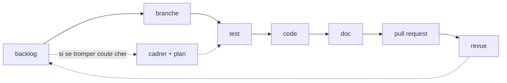

# Le cycle de développement, et la seule faute qui compte

*En une phrase : sept étapes dans cet ordre, chacune fermée par une question à laquelle on doit
pouvoir répondre par oui ou non.*

La porte en pointille est **conditionnelle**, et son critere n'est pas la taille du travail mais sa
**reversibilite** : une modification locale et annulable va directement au test, une modification qui
touche une frontiere qu'on ne pourra plus changer passe par une conception approuvee et un plan, meme
si elle fait deux lignes. C'est le skill `cadrer-et-planifier`.

L'ordre n'est pas une cérémonie, c'est une contrainte d'information : **chaque étape produit ce que
la suivante consomme.** Un test écrit après le code épouse le code au lieu de le contraindre. Une
doc écrite après la PR décrit ce qui a été fait au lieu de ce qui avait été promis.

**La seule faute qui compte : franchir une porte sans avoir répondu à sa question.** Se tromper de
conception se rattrape ; avancer en croyant qu'une porte est franchie ne se rattrape pas, parce que
plus rien en aval ne la revérifie.

> Une question est dite **falsifiable** quand on peut dire ce qui, concrètement, la rendrait fausse.
> « Le code est propre » ne l'est pas ; « la suite passe deux fois de suite sans nettoyage manuel »
> l'est. Tout ce pack repose sur cette distinction.

## Les sept portes

| Étape | Ce qui entre | Ce qui sort | La porte, une question falsifiable |
|---|---|---|---|
| backlog | une demande, en langage humain | un item avec un identifiant stable | *quel comportement observable change, et qui le constate ?* |
| branche | un item | une branche nommée d'après lui | *cette branche porte-t-elle UNE intention ?* |
| test | des critères d'acceptation | des tests qui ÉCHOUENT | *ai-je vu le test rouge, et pour la bonne raison ?* |
| code | des tests rouges | des tests verts | *tous verts, **zéro avertissement**, et aucun test affaibli pour y arriver ?* |
| doc | le contrat public livré | doc de contrat + changelog | *un appelant qui ne connaît pas ce code peut-il l'utiliser sans le lire ?* |
| PR | un ensemble cohérent | une PR petite et lisible | *un relecteur peut-il la comprendre en quinze minutes ?* |
| revue | une PR | des remarques traitées | *chaque remarque est-elle close par un changement ou par un argument écrit ?* |

Une porte sans réponse **arrête le travail** ; elle ne se remet pas à plus tard. Et si la réponse
manque parce qu'une information manque, **demander est la réponse.**

### La règle qui vaut pour les sept : on ne déclare pas, on prouve

**Tu ne peux pas dire qu'une porte est franchie si tu n'as pas lancé, à l'instant, la commande qui le
prouve.** Une exécution d'il y a vingt minutes ne compte pas, une extrapolation encore moins.

| L'affirmation | Ce qu'elle exige | Ce qui ne suffit PAS |
|---|---|---|
| les tests passent | la sortie de la commande complète, zéro échec | un tour précédent, « ça devrait passer » |
| l'analyse est propre | la sortie de l'outil, zéro erreur | une vérification partielle, une extrapolation |
| le build réussit | le code de sortie de la commande | « les logs ont l'air bons » |
| le bug est corrigé | le **symptôme d'origine** rejoué, et disparu | le code a changé, donc c'est réglé |
| le test de non-régression est valide | le cycle rouge puis vert **vu** | il passe une fois |
| le besoin est couvert | une relecture **ligne à ligne** des critères | les tests passent |

Les mots qui trahissent une affirmation non vérifiée : « ça devrait », « probablement », « a priori »,
« normalement ». Et la satisfaction exprimée **avant** la vérification est le signal le plus fiable
qu'elle n'a pas eu lieu.

*Règle reprise de superpowers (`github.com/obra/superpowers`, skill `verification-before-completion`).*

**Une seule porte est absolue : aucun avertissement ne franchit un merge.** Pas « on nettoiera »,
pas « ce n'est que du style ». Un avertissement toléré en devient mille en six mois, et le millième
cache celui qui annonçait le bug, c'est la seule règle de cette liste qui se dégrade d'elle-même si
on l'assouplit une fois. Les conditions qui la rendent tenable (avertissements en erreurs dans la
configuration **versionnée**, chaîne de compilation **épinglée**, suppressions locales et
justifiées) sont dans `tracer-le-travail`, section « la porte de merge ».

## Avant la première ligne, trois questions au demandeur

Les poser coûte une minute, les deviner coûte le cycle entier :

1. **Quel comportement observable change ?** Si personne ne peut le constater de l'extérieur, ce
   n'est pas une fonctionnalité mais une préférence d'implémentation, et elle n'a pas besoin d'un
   cycle.
2. **Qu'est-ce qui est vrai aujourd'hui et ne le sera plus ?** C'est la formulation qui trouve les
   cassures : appelants existants, données déjà en base, contrat publié, tests d'autres équipes.
3. **À quoi ressemble « fini » ?** Si la réponse n'est pas falsifiable, elle sera négociée à la fin,
   au pire moment. Voir `tests-first` pour la transformer en critères d'acceptation.

**Ne devine jamais la réponse à la troisième.** C'est celle qui coûte le plus cher à se tromper, et
c'est celle que le demandeur croit avoir donnée.

## Les trois raccourcis autorisés, et leur prix

Le cycle complet sur une faute de frappe est du théâtre. Trois cas s'en dispensent, et **aucun
autre** :

| Cas | Ce qu'on saute | Ce qu'on ne saute JAMAIS |
|---|---|---|
| correction triviale (frappe, renommage local, formatage) | backlog, test, doc | la revue, même rapide |
| **exploration** (savoir si c'est faisable) | tout | **jeter le code de l'exploration.** Ce qu'on en garde est la réponse, pas le code |
| correctif urgent en production | backlog *avant*, doc *avant* | le test qui reproduit le bug, et le backlog **après** : décalé, jamais annulé |

L'exploration est le raccourci le plus utile et le plus mal utilisé : sa valeur est la réponse à une
question. Un code d'exploration promu en production sans repasser par le cycle est la dette la plus
chère qui existe, **parce qu'elle a l'air terminée.**

> **Une objection sérieuse à ce tableau, et elle n'est pas tranchée ici.** D'autres méthodologies
> tiennent qu'**aucun travail n'est trop simple pour une conception écrite**, au motif que c'est
> justement sur les changements « évidents » que les hypothèses non examinées coûtent le plus, et
> qu'une conception peut tenir en trois phrases.
>
> Ce qui départage n'est pas la taille, c'est **la réversibilité**. La question à se poser avant de
> prendre un raccourci : *combien coûte de se tromper ici ?* Une modification locale et annulable ne
> mérite pas de cérémonie. Une modification qui touche un contrat public, des données persistées ou un
> format sur le fil mérite trois phrases écrites, **même si elle fait deux lignes**, parce qu'on ne
> pourra pas la reprendre.

## Ce que chaque étape délègue

| Sujet | Skill |
|---|---|
| backlog, branche, commits, versionnement, changelog, PR, revue | `tracer-le-travail` |
| conception, ossature en stubs, YAGNI, SOLID, injection, modules, paliers de build | `concevoir-avant-coder` |
| critères d'acceptation, tests rouges, doubles, non-régression | `tests-first` |
| nommage, clauses de garde, commentaires, doc de contrat | `code-comme-poesie` |
| qualifieurs, visibilité, typage fort, avertissements au maximum | `commencer-ferme` |
| README, `--help`, sortie machine, messages d'erreur | `doc-derivee` |
| journal, débogueur en une touche, assertions, modes de build | `journal-et-debogueur` |
| bancs de mesure, profilage, télémétrie, artefact de production | `mesure-et-telemetrie` |
| voir un état interne : chronologie, grille, graphe, distribution | `rendre-l-etat-visible` |
| spec, plan d'implémentation, critères d'acceptation, découpage en tâches | `cadrer-et-planifier` |
| un bug, un test rouge, un comportement inattendu : l'enquête avant le correctif | `trouver-la-cause` |

**Invoque-les. Ne re-dérive pas leur contenu de mémoire** : c'est exactement le mécanisme par lequel
une règle se met à diverger de sa propre définition.

Deux précisions sur la carte ci-dessus :

- **il existe une étape zéro, hors cycle, qui ne se fait qu'une fois** : au démarrage d'un projet,
  installer le journal et le débogueur **avant** le premier item. Le jour où on en a besoin, on est
  sous pression et on ne le fait pas. C'est `journal-et-debogueur` qui porte cette porte ;
- **l'étape doc est celle qu'on croit connaître.** Sa porte n'est pas « le README est à jour » mais
  « la doc peut-elle encore mentir ? », et la réponse est le plus souvent **un `--help` complet
  plutôt qu'un paragraphe**. C'est `doc-derivee`.

## Les anti-patterns du cycle, chacun avec sa signature

Ils se reconnaissent à un symptôme, ce qui permet de les nommer en revue sans discuter des
intentions :

- **le test écrit après le code.** Signature : il passe du premier coup. Un test qu'on n'a jamais vu
  échouer ne prouve rien, il prouve seulement qu'il ne détecte pas ce cas-là ;
- **la branche fourre-tout.** Signature : son nom contient « et ». Elle rend la revue impossible et
  le retour arrière impossible : on ne peut plus retirer une seule des deux intentions ;
- **la doc « quand on aura le temps ».** Signature : elle est toujours à l'étape suivante. Le moment
  où le contrat est frais est le seul où l'écrire coûte peu ;
- **la PR de quarante fichiers.** Signature : tous les commentaires de revue portent sur le nommage,
  aucun sur le fond, parce que personne ne peut tenir le fond en tête. Une grosse PR n'est pas
  relue, elle est approuvée ;
- **la revue répondue à l'oral.** Signature : la remarque revient à la PR suivante. Une remarque se
  clôt par un changement ou par un argument **écrit dans le fil**, jamais par un accord verbal.

## Quand une étape révèle que la précédente était fausse

Ça arrive, et c'est un succès du cycle plutôt qu'un échec : **remonter est la réponse correcte.** Le
code révèle que le test était mal posé, le test révèle que le critère d'acceptation était ambigu, la
revue révèle que le découpage était mauvais.

Ce qu'il ne faut pas faire : **plier l'étape amont pour sauver l'aval.** Affaiblir un test pour
faire passer le code en est la version la plus courante et la plus destructrice, le test reste
vert, donc plus rien ne signale que la garantie a disparu.
