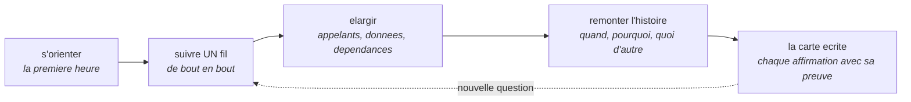
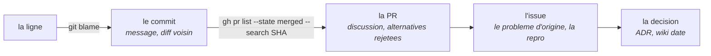

# Explorer le code

*En une phrase : on n'explore pas un dépôt en le lisant, on l'interroge ; une question précise, la
source qui y répond le mieux, et une trace écrite de ce qu'on a vérifié.*

Comprendre du code est la plus grosse part du métier, loin devant l'écriture : une étude de terrain sur
78 développeurs professionnels, soit 3 148 heures de travail observées, mesure environ **58 % de leur
temps** passé à comprendre des programmes, et davantage chez les juniors (Xia et al., *IEEE TSE*,
2018). C'est pourtant le geste qu'on apprend le moins, et on le fait spontanément de la pire façon :
ouvrir le premier fichier et lire de haut en bas.

Les programmeurs expérimentés font autre chose, et c'est documenté depuis longtemps : ils partent d'une
**hypothèse** sur ce que fait le programme et la vérifient en cherchant des **indices** reconnaissables,
des noms, des motifs, des signatures (Brooks, 1983, parle de *beacons*). La lecture est pilotée par une
question, jamais par l'ordre des fichiers.

**La règle de fiabilité qui traverse tout le skill** : le code qui s'exécute et la commande qui tourne
en intégration continue sont des **faits** ; les commentaires, le README et la doc sont des
**hypothèses** sur ces faits. C'est l'échelle de `doc-derivee` lue à l'envers, par celui qui arrive.
Les noms sont entre les deux : ils dérivent moins qu'un commentaire, parce qu'on les relit à chaque
usage, mais ils ne s'exécutent pas (section 2).

## 1. La première heure : dans quel ordre, et pourquoi cet ordre

L'ordre suit la fiabilité et le rendement : ce qui dit le plus en le moins de temps, et ce qui peut le
moins mentir.

| Ordre | Source | Ce qu'elle répond | Peut-elle mentir ? |
|---|---|---|---|
| 1 | README, CONTRIBUTING | à quoi sert le projet, comment démarrer, les conventions | oui, en silence |
| 2 | les manifestes de build : `package.json`, `*.csproj` et `*.sln`, `Cargo.toml`, `pyproject.toml`, `CMakeLists.txt`, `Makefile` | les langages, les dépendances et leurs versions, les points d'entrée, les **scripts réels** | peu : ils s'exécutent |
| 3 | la CI : `.github/workflows/`, `azure-pipelines.yml`, `Jenkinsfile`, `.gitlab-ci.yml` | **les commandes qui construisent et testent vraiment**, la matrice des plateformes | peu : seulement par ce qu'elle ne lance pas (un job autorisé à échouer, un projet de test hors de la commande) |
| 4 | la structure : `git ls-files`, un arbre limité en profondeur, un compteur de lignes par langage | où est la masse, ce qui est du code et ce qui est de la donnée ou du généré | non |
| 5 | les points d'entrée : `main`, `Program.cs`, enregistrement des routes ou des commandes, consommateurs de messages, tâches planifiées | par où le monde entre dans le programme | non |
| 6 | les tests | la spécification exécutable : leurs noms sont des comportements, et ils fournissent un harnais qui tourne | un test qui passe dit vrai sur ce qu'il vérifie, et rien sur le reste |
| 7 | l'historique récent : `git log --oneline -30`, `git shortlog -sn HEAD` | ce qui bouge en ce moment, et qui connaît quoi | non |

La CI est la source la plus sous-estimée de la liste. **Le README dit comment on devrait construire ;
la CI dit comment on construit**, et quand les deux divergent, c'est la CI qui a raison.

Un fichier écrit pour un agent (`AGENTS.md`, `CLAUDE.md`) se lit aussi, mais comme un README : c'est de
la prose sans relecteur (voir `doc-derivee`), donc une piste à vérifier et non une vérité.

### Construire et lancer les tests AVANT de lire plus

C'est la décision la plus rentable de la première heure : **une boucle de retour vaut une heure de
lecture.** Un programme qu'on sait lancer, arrêter sur un point d'arrêt et tester se comprend bien plus
vite qu'un programme qu'on lit.

Et si le projet ne se construit pas en suivant le README, **c'est la première trouvaille**, pas un
contretemps : on la note, avec la commande qui a marché à la place. Le prochain arrivant la paiera
sinon.

Il arrive aussi que ce soit **ton environnement** qui empêche de construire, et pas le projet : un
registre privé inaccessible, un jeton expiré, une chaîne de compilation absente. Alors le **journal de
la CI** sur le même commit devient la preuve, de second rang : il dit ce qui a tourné, avec quel
résultat, et surtout ce qui n'a pas tourné du tout. On écrit qu'on s'en est servi, et pourquoi. Une
affirmation fondée sur le journal de quelqu'un d'autre n'a pas le même poids qu'une commande lancée à
l'instant, et le lecteur doit pouvoir le savoir.

Une précaution : **construire exécute du code du dépôt** (scripts d'installation, tâches de build).
Pour un dépôt dont on ne connaît pas la provenance, le faire dans un conteneur ou un environnement
isolé ; les options sont dans `references/commandes.md`.

## 2. Lire avec une question, jamais de haut en bas

Une étude qui a observé des développeurs en train de modifier du code qu'ils ne connaissaient pas a
relevé 44 types de questions, rangés en quatre familles qui forment une progression naturelle
(Sillito, Murphy et De Volder, FSE 2006) :

1. **trouver un point d'accroche initial** : où, dans le code, se trouve ce qui fait X ?
2. **construire à partir de ce point** : qui appelle ça, qu'est-ce que ça appelle, quelles données le
   traversent ?
3. **comprendre un sous-graphe** : comment ces morceaux réalisent-ils ensemble le comportement ?
4. **relier des groupes de sous-graphes** : comment cette fonctionnalité s'articule-t-elle avec le
   reste ?

Une autre étude compare ceux qui réussissent une modification à ceux qui échouent : les premiers
enquêtent **méthodiquement**, en suivant la structure (références, appels), les seconds survolent et
passent à côté de ce qu'ils avaient sous les yeux (Robillard, Coelho et Murphy, *IEEE TSE*, 2004).

Chaque question a son outil, et **le mauvais outil rend une réponse plausible et fausse** :

| La question | L'outil qui y répond | Le piège |
|---|---|---|
| où est le code derrière ce comportement visible ? | chercher la **chaîne littérale** que l'utilisateur voit : libellé, message d'erreur, ligne de journal, route d'URL | un zéro ne prouve rien : chaîne traduite, concaténée, venue du serveur ou générée |
| qui appelle cette fonction ? | « trouver les références » et la hiérarchie d'appels de l'éditeur (LSP) | un `grep` sur un nom commun (`Process`, `Handle`) rend 400 lignes dont trois utiles |
| d'où vient cette valeur ? | aller à la définition, puis le **débogueur** avec un point d'arrêt et une surveillance | lire le code qui **pourrait** la produire au lieu de celui qui la **produit** |
| qu'est-ce qui dépend de ce module ? | un graphe de dépendances généré | la liste tenue à la main dans un README |
| à quoi ressemble la donnée réelle ? | un point d'arrêt, une ligne de journal, un échantillon de la base | la donnée imaginée d'après le nom du type |
| pourquoi c'est écrit comme ça ? | l'historique, section 6 | la supposition, qui mène à supprimer un garde-fou |

**Chercher une chaîne littérale** est le raccourci le plus efficace pour trouver un point d'accroche :
« où, dans le code, se trouve le texte de ce message d'erreur ou de cet élément d'interface ? » est
littéralement l'une des questions relevées par Sillito. Il a deux règles :

- **avant de chercher un message de journal, le lire dans le source.** Un motif écrit de mémoire rend
  zéro quand le code imprime une autre formulation, et ce zéro ressemble exactement à « ça n'arrive
  jamais » ;
- **savoir ce que l'outil ne regarde pas.** Une recherche qui respecte le `.gitignore` saute les
  fichiers générés, cachés ou binaires, donc le code qu'on cherche peut être là et invisible. Quand la
  chaîne passe par une clé de traduction, chercher le texte dans les fichiers de traduction, puis la clé
  dans le code.

Deux techniques quand la recherche textuelle ne suffit pas. **Tester les candidats au point d'arrêt** :
poser un point d'arrêt sur chaque endroit suspect sans le lire, jouer le scénario, et ne garder que ceux
qui s'arrêtent (c'est ce que faisaient les participants de Sillito). Et la **reconnaissance par
différence** : lancer le programme sous couverture de code une fois avec la fonctionnalité, une fois
sans ; le code qui n'apparaît que dans le premier tirage est celui qui la réalise (Wilde et Scully,
1995).

### Les noms sont la carte la plus rapide, et chaque nom est une affirmation

Un bon nom dit ce que fait une fonction plus vite que son corps, c'est pour ça qu'on lit les noms en
premier, et il dérive moins qu'un commentaire parce qu'on le relit à chaque usage (voir
`code-comme-poesie`). Mais un nom est une **promesse de l'auteur**, pas une propriété du code : un
`get` qui écrit, un `validate` qui corrige en silence, un `isEnabled` qui lit une configuration
distante. Sur le chemin qui compte pour ta question, **le corps se lit**.

## 3. Suivre UN fil de bout en bout

Choisir **un seul** comportement visible et le suivre de l'entrée au stockage, puis retour : un clic
jusqu'à la base, une commande jusqu'à son fichier de sortie, un message jusqu'à son effet. C'est la
même idée que la balle traçante de *The Pragmatic Programmer*, appliquée à la lecture : un fil complet
et mince apprend plus que cinq modules lus en entier.

La façon la plus sûre de le suivre est **le débogueur** : un point d'arrêt au point d'entrée, le vrai
scénario lancé (par un test, de préférence), puis pas à pas. **La pile d'appels au point d'arrêt est la
carte exacte de ce chemin**, avec les types réels, y compris ceux qu'aucune lecture n'aurait trouvés.
Installer le débogueur en une touche est dans `journal-et-debogueur`, et c'est ici qu'il rapporte le
plus.

**Dessiner le fil pendant qu'on le suit**, en diagramme de séquence Mermaid : qui appelle qui, dans
quel ordre, avec quoi. Il sert de notes pendant l'exploration, et il devient ensuite l'illustration de
la PR ou de la doc (voir `se-faire-comprendre`).

## 4. Là où la lecture statique ment : les arêtes invisibles

Certains mécanismes relient deux morceaux de code **sans qu'aucun ne nomme l'autre**. Aller à la
définition mène à une interface, chercher les appelants ne trouve personne, et on conclut à tort que
le code est mort ou que le chemin n'existe pas.

| Mécanisme | Le symptôme en lecture | Comment le voir |
|---|---|---|
| injection de dépendances | aller à la définition mène à une interface | trouver l'**enregistrement** dans le conteneur, ou lire le type réel au point d'arrêt |
| réflexion, conventions par nom, découverte automatique | une classe qu'aucun code n'instancie | chercher la **convention** (suffixe, attribut, dossier), pas le nom |
| événements, bus de messages, files | l'émetteur et le récepteur ne se citent pas | chercher le **type du message** ou le nom du sujet |
| configuration et drapeaux de fonctionnalité | le même code se comporte autrement selon l'environnement | lire l'**ordre de superposition** des sources de configuration, et la valeur effective à l'exécution |
| code généré (client d'API, ORM, protobuf, générateurs de source) | un fichier énorme, ou absent du dépôt | ne pas le lire : lire **sa source** (schéma, spécification) et la commande qui le génère |
| frontières de processus (HTTP, processus enfant, déclencheurs et procédures en base, tâches planifiées) | l'appel s'arrête à une URL ou à une chaîne SQL | **observer le trafic** : outils réseau du navigateur, journal avec identifiant de corrélation |
| intercepteurs, middlewares, aspects, macros | un comportement qui s'ajoute sans appel visible | lire la **chaîne de construction** du pipeline, ou la pile au point d'arrêt |

**La règle** : dès que la lecture tombe sur une de ces lignes, on arrête de lire et on **observe le
système qui tourne**. C'est la même conclusion que `trouver-la-cause` sur les frontières de composants :
rendre observable, puis lire.

## 5. Au-delà du dépôt : bibliothèques, bases de données, services

### Une bibliothèque se lit à la version qu'on utilise

La documentation en ligne décrit la **dernière** version ; le programme exécute celle du fichier de
verrouillage. Entre les deux, un comportement a pu changer, et on débogue alors un code qui n'est pas
celui qui tourne.

- **la version exacte** vient du fichier de verrouillage (`package-lock.json`, `Cargo.lock`,
  `poetry.lock`, `packages.lock.json`), jamais du manifeste qui accepte une plage ;
- **le source de cette version** est déjà sur le disque ou à un clic : aller à la définition dans
  `node_modules`, `site-packages`, le cache de modules ; en .NET, SourceLink ou un décompilateur ;
- **le CHANGELOG entre ta version et la dernière** répond souvent à la question avant qu'on la pose ;
- **les issues fermées de la bibliothèque**, cherchées avec le message d'erreur exact, disent si le
  défaut est connu, et dans quelle version il est corrigé ;
- **ses tests** montrent l'usage prévu mieux que ses exemples ;
- **une copie locale modifiée** (dossier vendu, correctif appliqué à l'installation, fork) se cherche
  explicitement : c'est l'endroit où la bibliothèque sur le disque diffère de la bibliothèque publiée.

Et la règle de `trouver-la-cause` s'applique telle quelle : **avant d'accuser la bibliothèque, lire son
source.** Deux recherches coûtent moins qu'une journée de contournement.

### Une base de données se lit par son schéma, puis par ses données

Le schéma est la vérité la plus stable d'un système : le code change tous les jours, les tables
rarement.

- **les migrations, lues dans l'ordre, sont l'histoire du schéma**, et chaque migration a un commit qui
  dit pourquoi une colonne est apparue ;
- **le schéma réel** se lit dans la base elle-même (`INFORMATION_SCHEMA`, ou l'équivalent du moteur), ou
  se rend en diagramme par un outil qui l'introspecte ; les commandes sont dans
  `references/commandes.md` ;
- **la logique qui vit dans la base** ne se voit pas depuis le code : déclencheurs, vues, procédures
  stockées, contraintes, valeurs par défaut, suppressions en cascade ;
- **le correspondant côté code** : le mappage de l'ORM, où le nom de la table n'est pas toujours celui
  de la classe ;
- **les données ne sont pas le schéma** : une colonne nullable jamais nulle en pratique, une énumération
  dont trois valeurs sur huit existent vraiment. Un `COUNT` par valeur distincte répond en une requête.

**Et la sécurité avant la curiosité** : un compte en lecture seule, une copie hors production quand elle
existe, un `LIMIT` sur chaque échantillon, et jamais une écriture « pour voir ce qui se passe ». Piège :
`EXPLAIN ANALYZE` **exécute** la requête pour la mesurer ; sur une écriture, il écrit.

### Un service se lit par son contrat, puis par son trafic

La spécification (OpenAPI, schéma, contrat de message) dit ce qui est promis ; le trafic observé dit ce
qui est envoyé. Quand les deux divergent, le trafic a raison, et l'écart est une trouvaille.

## 6. Remonter l'histoire : quand, pourquoi, et qu'est-ce qui a été rejeté

Dans une étude qui a suivi 17 développeurs chez Microsoft, la question « **pourquoi ce code est-il
écrit comme ça ?** » restait sans réponse dans 44 % des cas où elle était posée, deuxième seulement
derrière « quel code a produit cet état ? » (Ko, DeLine et Venolia, ICSE 2007). La réponse existe
presque toujours, mais pas dans le code : dans son histoire.

Chaque maillon répond à une question différente :

| Maillon | Ce qu'il dit que les autres ne disent pas |
|---|---|
| le commit | ce qui a changé **en même temps**, donc ce qui va ensemble |
| la PR | les **alternatives rejetées**, les objections de revue, ce qui a été retiré avant la fusion |
| l'issue | le **problème d'origine**, sa reproduction, et parfois les contournements essayés |
| le CHANGELOG | **quand** le comportement a changé du point de vue de l'utilisateur |
| les commits d'annulation (`Revert`) | les **zones fragiles**, où une tentative a déjà échoué |

Les commandes utiles, et ce que chacune répond, sont dans `references/commandes.md`. Les trois qui
rapportent le plus :

- **`git log -S'<chaîne>'`** trouve le commit où une chaîne est apparue ou a disparu. C'est la réponse à
  « depuis quand ça existe ? » ;
- **`git log -L :<fonction>:<fichier>`** rend l'histoire d'**une** fonction, commit par commit. Git
  trouve les bornes de la fonction avec les règles des en-têtes de diff : une heuristique grossière
  par défaut, et les règles du langage seulement si `.gitattributes` les déclare (`*.cs diff=csharp`) ;
- **`git bisect run <commande>`** trouve le commit qui a introduit un changement de comportement, dès
  qu'un test sait dire bon ou mauvais.

**La date d'apparition change le sens d'une absence.** Sur un projet réel, un taux publié comptait comme
« réussis du premier coup » tous les fichiers dépourvus d'un certain artefact. `git log -S` sur le nom
de l'artefact a montré qu'il n'existait que depuis une date précise : les fichiers antérieurs n'en
avaient pas **parce que la fonctionnalité n'existait pas**, pas parce qu'ils avaient réussi. Le taux
annoncé, 77 %, était gonflé de près de 30 points, et une commande d'une seconde le disait.

### Avant de supprimer ce qu'on ne comprend pas

C'est la barrière de Chesterton : si tu ne sais pas pourquoi une barrière est là, tu n'as pas le droit
de l'enlever tant que tu ne l'as pas trouvé. Un test qui semble inutile, un cas particulier bizarre, un
délai en dur ont presque toujours une PR qui les explique.

Et **un garde-fou qui ne se déclenche jamais n'est pas du code mort** : la différence entre un chemin
injoignable, qui est un défaut, et un chemin rare, qui est un filet en bon état, est dans
`concevoir-avant-coder`, section 8.

## 7. Tenir sa carte, et ne pas tout porter de tête

Une exploration qui ne laisse pas de trace se refait : on recherche deux fois la même chose, et la
deuxième fois on se trompe différemment. La carte est un fichier de travail, **pour soi**, qui porte :

- les points d'entrée trouvés, avec `fichier:ligne` ;
- le glossaire du domaine : le mot du métier, et le nom qu'il porte dans le code ;
- les fils suivis, en diagrammes de séquence ;
- les commandes qui marchent (construire, tester, lancer un seul test, déboguer) ;
- les hypothèses, **chacune avec son statut** : vérifiée (et comment), ou supposée ;
- les questions ouvertes.

**Une affirmation de la carte sans sa preuve est une rumeur**, y compris quand c'est toi qui l'as
écrite il y a deux jours. Et noter **le commit exploré** : une carte relevée sur une autre branche décrit
un autre programme.

### Figer le comportement avant de le changer

Trois techniques de Michael Feathers (*Working Effectively with Legacy Code*, 2004), toutes faites pour
du code qu'on ne comprend pas encore :

- **le test de caractérisation** : un test qui fige ce que le code **fait** aujourd'hui, pas ce qu'il
  devrait faire. On écrit une assertion fausse, on lit la valeur réelle dans l'échec, on la recopie. Il
  permet de modifier sans casser en silence ;
- **le refactor jetable** : restructurer librement pour comprendre, renommer, extraire, puis **tout
  annuler**. Ce qu'on garde est la compréhension, pas le code. C'est le raccourci « exploration » de
  `cycle-de-dev`, et sa règle tient : le code d'exploration se jette ;
- **le croquis d'effets** : à partir de ce qu'on veut changer, dessiner ce que ce changement peut
  affecter, pour savoir où mettre les tests.

Et pour mesurer l'étendue d'un changement avant de l'écrire, la **méthode Mikado** : tenter le
changement, noter ce qui casse comme prérequis, **annuler**, et recommencer sur chaque prérequis. On
obtient le graphe de dépendances du changement sans jamais laisser le code cassé.

### Savoir quand demander

Au-delà d'un temps borné sans progrès, demander à quelqu'un qui connaît coûte moins que continuer :
dans l'étude de Ko, les collègues étaient la source d'information la plus consultée.
`git shortlog -sn HEAD -- <chemin>` et un fichier `CODEOWNERS` disent à qui. **Une bonne question dit
ce qui a déjà été vérifié** : « j'ai lu X, lancé Y, et je ne trouve pas où Z est enregistré » obtient
une réponse en une ligne ; « comment ça marche ? » obtient une réunion.

## 8. Pour un agent : explorer sans se noyer

Un agent a les mêmes besoins et deux faiblesses de plus : il lit vite beaucoup de texte, donc il est
tenté de tout lire, et il croit volontiers ce qu'il a lu une fois.

- **déléguer les recherches larges** (balayer beaucoup de fichiers ou de conventions de nommage) et ne
  garder que la conclusion, pas le contenu des fichiers ;
- **lire autour de l'occurrence**, pas le fichier de trois mille lignes en entier ;
- **vérifier l'existence avant d'affirmer** : un nom de fonction retenu d'une session précédente, d'une
  mémoire ou d'une doc peut avoir été renommé. On cite `fichier:ligne`, relu à l'instant ;
- **relever une surface sur le binaire, jamais la recopier d'une doc** : sur un projet réel, la liste des
  commandes recopiée à la main dans un fichier de contexte en annonçait 26 quand le `--help` en listait
  30. Le `--help` répond, un paragraphe non ;
- **dire ce qui n'a pas été regardé** : « aucun appelant trouvé » et « aucun appelant trouvé dans les
  fichiers C#, les vues n'ont pas été cherchées » sont deux réponses différentes.

## Les anti-patterns, et leur signature

- **la lecture intégrale de haut en bas.** Signature : deux heures plus tard, aucune question n'a de
  réponse, parce qu'aucune n'avait été posée ;
- **croire le nom, le commentaire ou le README.** Signature : « d'après le nom, ça doit... », sans
  `fichier:ligne` du corps ;
- **le zéro de recherche pris pour une absence.** Signature : « ce message n'est jamais émis », alors que
  la chaîne est traduite, construite ou mal recopiée ;
- **la doc de la dernière version pour une dépendance épinglée.** Signature : une option « qui n'existe
  pas » ou un comportement « qui a changé », que la version installée ne connaît pas ;
- **supprimer ce qu'on ne comprend pas.** Signature : un garde-fou retiré comme « code mort » dont la PR
  d'origine décrivait l'incident qu'il empêche ;
- **explorer sans noter.** Signature : la même recherche lancée deux fois dans la journée ;
- **modifier avant de figer.** Signature : un changement « sans risque » qui casse un comportement que
  personne n'avait écrit nulle part.

## La porte de sortie

Avant de modifier du code qu'on n'a pas écrit, ces sept réponses doivent exister :

1. je sais **construire et lancer les tests** avec la commande que la CI utilise, et je l'ai fait à
   l'instant ;
2. je peux nommer les **points d'entrée** du comportement qui m'intéresse, et j'ai **suivi un fil** de
   bout en bout, de préférence au débogueur, dessiné en séquence ;
3. chaque affirmation de ma carte porte **sa preuve** (`fichier:ligne`, commande, sortie) et son
   **statut**, vérifiée ou supposée ;
4. j'ai repéré les **arêtes invisibles** sur mon chemin (injection, événements, configuration, code
   généré), et je les ai observées à l'exécution plutôt que devinées ;
5. pour les dépendances et la base, j'ai lu **la version réellement utilisée** et **le schéma réel** ;
6. pour le code que je vais changer, je sais **pourquoi il est comme il est** (commit, PR, issue), ou
   j'ai écrit que je ne le sais pas ;
7. un **test fige le comportement actuel** avant que je le change.

Si le point 6 manque et que le changement retire quelque chose, on ne retire pas : on cherche encore, ou
on demande. C'est la barrière de Chesterton, et c'est le seul point de cette liste dont l'oubli détruit
une information qu'on ne retrouvera plus.
