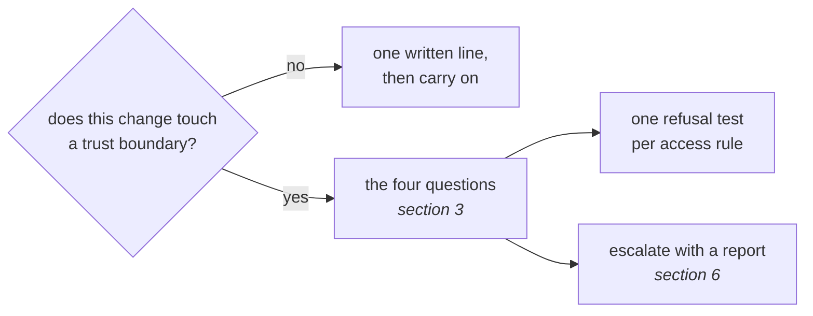

# Garder les frontières

*En une phrase : la sécurité ne s'ajoute pas en fin de cycle, elle se déclenche au moment où un
changement touche une frontière de confiance, et à ce moment-là on pose quatre questions, puis on
escalade.*

> **Statut** : ce skill n'a pas encore été relu par une équipe sécurité. Il repère et il escalade. Il
> ne remplace ni une revue de sécurité, ni un test d'intrusion, ni l'avis de l'équipe qui en a la
> charge.

## 1. Une question aux portes, pas une étape de plus

Une étape de sécurité placée en fin de cycle arrive au moment où corriger coûte le plus cher. C'est le
même défaut que le test écrit après le code : on découvre la conception quand elle est déjà faite.

Et la plupart des changements ne touchent aucune frontière. Une étape jouée sur chaque pull request
devient une case qu'on coche sans lire, et une case cochée sans lecture est pire qu'une case absente,
parce qu'elle a l'air d'une garantie.

D'où la forme de ce skill : **une question, posée à trois portes du cycle (cadrage, revue, merge) et
à un événement**, et qui laisse des tests derrière elle.

## 2. La frontière de confiance, par ses exemples

Une **frontière de confiance** est l'endroit où une donnée ou une commande entre dans ton code depuis
quelqu'un ou quelque chose que tu ne contrôles pas, ou en sort vers eux. Le test qui la repère : *si
l'autre côté ment, qui s'en apercevrait ?*

| Frontière | Exemples |
|---|---|
| une saisie | un champ de formulaire, un paramètre d'URL, un en-tête, un cookie |
| un appel entrant | une route d'API, un webhook, un message lu dans une file |
| la réponse d'un tiers | une API externe, un fichier téléchargé, un résultat de modèle |
| un fichier reçu | un envoi, un import, une archive à décompresser |
| un secret | un jeton, une clé, un mot de passe, une chaîne de connexion |
| une permission | un rôle, la portée d'un jeton, une règle d'autorisation, un droit de CI |
| une donnée personnelle ou sensible | sa lecture, son export, sa journalisation, sa durée de conservation |
| du code tiers | une dépendance, une action de CI, une image de base, une extension, un outil hébergé |
| la CI elle-même | un workflow : il a accès aux secrets, et il exécute ce qu'on lui donne |

Et le contre-exemple, qui compte autant : un graphique qui lit une API interne déjà authentifiée, sans
nouvelle saisie, sans dépendance ajoutée, sans secret et sans rendu de HTML brut, **ne touche aucune
frontière.** La réponse tient en une ligne, et elle s'écrit quand même, parce qu'une ligne écrite dit
qu'on a regardé et qu'une absence ne dit rien.

## 3. Les quatre questions, quand une frontière est touchée

Chaque réponse protège au moins une des trois propriétés que vise toute politique de sécurité : la
**disponibilité** (le service marche quand on en a besoin), l'**intégrité** (la donnée est juste et n'a
pas été modifiée à tort) et la **confidentialité** (seuls ceux qui ont le droit la voient). Nommer celle
qu'on protège fait voir celle qu'on a oubliée.

### Qu'est-ce qui entre, et qui le contrôle ?

- **valider à la frontière, une fois**, et refuser tôt avec un message qui nomme la valeur (voir
  `code-comme-poesie`, section 7). Après la frontière, le code travaille sur des valeurs déjà sûres ;
- **refuser par défaut** : une liste de ce qui est permis plutôt qu'une liste de ce qui est interdit.
  La seconde oublie toujours un cas, et c'est celui que l'attaquant choisit. La règle vaut pour tout ce
  qui s'ouvre, pas seulement pour une saisie : un flux réseau, un port, un registre d'images, une origine
  autorisée (CORS), une permission. C'est le *défaut sûr* (*fail-safe defaults*) de Saltzer et
  Schroeder ;
- **rendre l'invalide irreprésentable** quand le langage le permet : un identifiant typé, une
  énumération fermée, un constructeur qui refuse (voir `commencer-ferme`) ;
- **ne jamais construire une commande avec une entrée** : ni requête SQL, ni ligne de shell, ni chemin
  de fichier, ni HTML, par concaténation. Les requêtes paramétrées et l'échappement par le moteur de
  rendu existent pour ça.

### Qui a le droit, et où est-ce vérifié ?

- **l'autorisation se vérifie côté serveur, à chaque accès.** Masquer un bouton n'interdit rien : ça
  retire la tentation, pas la possibilité. C'est la *médiation complète* de Saltzer et Schroeder (*The
  Protection of Information in Computer Systems*, 1975) ;
- **le moindre privilège est `commencer-ferme` appliqué aux droits** : un jeton à la portée minimale,
  un compte de service en lecture seule quand il ne fait que lire, des permissions de CI déclarées au
  plus juste. Élargir un droit est un acte daté et justifié, jamais un défaut ;
- **chaque règle d'accès a son cas de refus testé.** Une règle d'accès sans son cas de refus n'est pas
  testée, elle est illustrée (voir `tests-first`) ;
- **le cloisonnement borne les dégâts.** Dans un système qui sert plusieurs clients, chaque accès aux
  données porte le client : une requête qui oublie ce filtre montre les données d'un client à un autre,
  et c'est la fuite la plus grave qu'un éditeur puisse subir. La question à poser au diff : *si ce code
  se trompe, combien de clients sont touchés ?* C'est le **rayon d'explosion** (*blast radius*) ;
- **un environnement n'ouvre pas le suivant** : la pré-production, la démonstration et la production ne
  partagent ni identifiants, ni secrets, ni réseau. Un jeton de test qui marche en production est une
  porte.

### Qu'est-ce qui peut fuir, et par où ?

- **un secret n'est jamais** dans le code, dans un journal, dans une URL, dans un message d'erreur, ni
  dans une couche d'image. Le masquage vit dans le journal lui-même (voir `journal-et-debogueur`) ;
- **un secret exposé se change, il ne se retire pas.** Le supprimer du dépôt ne le retire pas de
  l'historique, ni des clones, ni des caches : seule sa rotation le rend inutile ;
- **tout ce qui circule est chiffré**, y compris entre deux services internes : TLS dans ses versions
  récentes, jamais un protocole en clair « parce que c'est le réseau privé » ;
- **un mot de passe se hache, il ne se chiffre pas**, avec un algorithme lent conçu pour ça (Argon2id,
  bcrypt, scrypt), jamais un hachage rapide comme SHA-256. Et aucune cryptographie maison : on appelle
  les primitives de la plateforme ;
- **une donnée personnelle se lit au minimum** : ne lire, n'exporter et ne garder que ce que le besoin
  demande, et pas plus longtemps. Elle a une durée de vie écrite : combien de temps on la garde, et ce
  qui la supprime (fin de contrat, demande de la personne, rétention des sauvegardes). Une donnée que
  rien ne supprime est gardée pour toujours ;
- **une copie de données de production hors production est anonymisée par défaut**, et son accès est
  tracé. Une donnée réelle dans un environnement de test sort du périmètre où ses protections
  s'appliquent.

### Qu'est-ce qui arrive si l'autre côté ment ?

C'est STRIDE (Loren Kohnfelder et Praerit Garg, Microsoft, 1999), passé sur la frontière et non sur tout
le système : usurpation, altération, répudiation, fuite, déni de service, élévation de privilège. Les
questions types sont dans `challenger-le-sujet`, `references/grilles.md`.

Une ligne par lettre suffit. « Non applicable » est une réponse valide, **à condition d'écrire
pourquoi** : sans la raison, on ne distingue pas une menace écartée d'une menace oubliée.

La répudiation est la lettre qu'on oublie : **une action sensible laisse une trace**, qui dit qui a fait
quoi et quand, dans un journal que l'auteur de l'action ne peut pas effacer. Sans trace, on ne détecte pas
l'incident, et on ne le comprend pas après coup.

### Trois principes qui traversent les quatre questions

On les retrouve dans la politique de sécurité publique d'un éditeur SaaS certifié ISO 27001, relue pour
écrire ce skill :

- **la défense en profondeur : aucune couche ne suffit seule.** Un pare-feu applicatif, un ORM, un
  contrôle d'accès, une validation : chacun suppose que les autres peuvent céder. D'où la règle de revue :
  « une autre couche s'en charge » n'est pas une raison de retirer une vérification, c'est la raison de
  la garder ;
- **une règle de sécurité vit dans le code versionné et relu** : une permission, une règle réseau, un
  workflow de CI se changent par une pull request, comme le code, jamais par un réglage manuel qu'aucune
  revue ne voit ;
- **une protection se prouve en l'exerçant** : une sauvegarde en la restaurant, une règle d'accès par son
  test de refus, un plan de reprise par un exercice. Une protection jamais exercée est une hypothèse.

## 4. Aux portes du cycle

| Moment | Si aucune frontière n'est touchée | Si une frontière est touchée |
|---|---|---|
| backlog, cadrer | une ligne dans l'item | le changement passe par la conception écrite. Le critère de `cycle-de-dev` est la réversibilité, et une fuite est ce qu'il y a de moins réversible : on ne rappelle pas une donnée publiée |
| test, code | rien de plus | les réponses aux quatre questions deviennent des tests, dont un cas de refus par règle d'accès |
| revue | le relecteur l'écrit parmi ce qu'il a écarté, avec la raison | le relecteur repose les quatre questions sur le diff, et escalade ce qu'il ne sait pas trancher |
| merge | les outils automatiques | les outils automatiques, et chaque alerte se ferme par un correctif ou par une justification écrite |

### Les outils de la porte de merge, et ce qu'ils ne voient pas

Quatre familles, citées comme exemples d'un principe et non comme une recommandation :

| Famille | Ce qu'elle cherche |
|---|---|
| détection de secrets | un jeton, une clé ou un mot de passe committé |
| analyse statique de sécurité | des motifs de code dangereux : injection, désérialisation, chemin construit |
| analyse des dépendances | des versions aux vulnérabilités connues, et l'inventaire de ce qui est embarqué |
| analyse des workflows de CI | des permissions trop larges, une action non épinglée, une entrée injectée dans une commande |

Trois règles :

- **lire leur résultat plutôt que les refaire à la main.** Un motif recopié de mémoire trouve moins que
  l'outil qui le maintient ;
- **une alerte se ferme comme un avertissement de compilation** : par un correctif, ou par une
  justification écrite, locale, et qui dit quand elle pourra tomber (voir `tracer-le-travail`,
  section 8). Une alerte fermée sans raison est un avertissement supprimé ;
- **un outil vert prouve l'absence des motifs qu'il connaît, pas l'absence de faille.** Aucun ne sait
  qui a le droit de lire quoi dans ton métier. C'est la part qui reste à un humain.

## 5. L'événement : une dépendance ou un outil tiers

Ajouter une dépendance, adopter une action de CI, brancher un outil hébergé, c'est **importer le code
de quelqu'un d'autre avec tes droits.** Six questions, écrites avant l'ajout et pas après :

| Question | Ce qu'on regarde |
|---|---|
| **provenance** | qui publie, depuis quand, sous quel nom exact (un nom voisin d'un paquet connu est un piège classique), avec quelle signature |
| **maintenance** | la date de la dernière version, le nombre de mainteneurs, le délai de réponse aux failles signalées |
| **permissions** | ce qu'il peut lire et écrire une fois installé : réseau, fichiers, jetons, données de l'organisation |
| **données** | s'il stocke ou reçoit des données personnelles ou des données de clients : lesquelles, dans quel pays, et sous quel contrat (un accord de traitement des données, *DPA*) |
| **épinglage** | une version exacte et un fichier de verrouillage ; une action de CI épinglée par l'empreinte complète de son commit, pas par une étiquette qu'on peut déplacer |
| **sortie** | ce que coûte de le retirer, et ce qui reste chez le fournisseur une fois retiré |

Des grilles publiques existent pour la provenance et la maintenance (SLSA pour la chaîne de
fabrication, OpenSSF Scorecard pour la santé d'un projet). Elles aident à répondre, elles ne décident
pas.

**La décision appartient à l'équipe sécurité de l'organisation.** On lui apporte le lien, les réponses
aux six questions avec leur statut, et la question précise qu'on lui pose. Un rapport d'analyse, même
très détaillé, ne donne pas le feu vert : il permet à l'équipe de le donner.

## 6. Escalader : le dernier barreau

Ce skill applique l'échelle d'escalade de `concevoir-avant-coder`, section 8 : le dernier barreau est
un humain, et il reçoit un rapport. Son travail n'est pas de conclure, il est de **repérer, répondre à
ce qu'il peut vérifier, marquer le reste, et transmettre.**

Le rapport tient en cinq rubriques :

1. la frontière touchée, avec `fichier:ligne` ou le lien de l'outil ;
2. les réponses aux quatre questions, chacune avec son statut : vérifié, rapporté, supposé, inconnu (voir
   `challenger-le-sujet`, section 2) ;
3. ce que les outils automatiques ont rendu, alertes fermées comprises, avec leur justification ;
4. ce qui n'a pas été regardé ;
5. la question posée à l'équipe, en une phrase.

**Une faille découverte se signale tout de suite, et ne se corrige pas en silence.** Une fuite ou une
faille trouvée en codant, en relisant ou en testant va à l'équipe sécurité avant tout correctif. Il
faut peut-être prévenir dans un délai légal (le RGPD donne 72 heures pour notifier une violation de
données à l'autorité de contrôle), changer des secrets, ou chercher si la faille a déjà été exploitée. Un
correctif discret fait disparaître la preuve en même temps que la faille.

**Ne jamais écrire « c'est sûr ».** Un agent ou un développeur qui se décerne le feu vert produit un
faux vert, et un faux vert de sécurité ne se découvre qu'une fois exploité. La phrase juste est « voici
ce que j'ai vérifié, voici ce que je n'ai pas pu vérifier, voici ma question ».

## Les anti-patterns, et leur signature

- **l'étape de sécurité en fin de cycle.** Signature : les remarques de sécurité arrivent sur une PR
  approuvée, et chacune demande de revoir la conception ;
- **la case cochée.** Signature : « sécurité : OK » dans une description, sans la frontière nommée ;
- **l'autorisation par l'interface.** Signature : le bouton est masqué pour un rôle, et la route qu'il
  appelle ne vérifie rien ;
- **le secret temporaire.** Signature : une clé dans le code « le temps de tester », retirée plus tard
  du fichier et jamais changée ;
- **l'alerte fermée sans raison.** Signature : un outil désactivé sur un fichier entier, sans une ligne
  pour dire pourquoi ;
- **la couche d'en face.** Signature : une vérification retirée en revue « parce que le pare-feu,
  l'ORM ou le front s'en charge » ;
- **la copie de production en test.** Signature : des données réelles dans un environnement de recette,
  sans anonymisation ni trace des accès ;
- **le correctif discret.** Signature : une faille corrigée dans un commit anodin, sans que l'équipe
  sécurité l'ait su ;
- **le feu vert auto-décerné.** Signature : un rapport qui conclut « safe » sans qu'aucune équipe
  sécurité ne l'ait lu.

## La porte de sortie

Avant de conclure un changement, une revue ou une adoption, ces sept réponses doivent exister :

1. la question « ce changement touche-t-il une frontière de confiance ? » a une **réponse écrite**,
   même négative, avec sa raison ;
2. si oui, **les quatre questions** ont chacune une réponse et son statut ;
3. chaque règle d'accès a **son cas de refus testé**, y compris l'accès d'un client aux données d'un
   autre ;
4. aucun secret dans le code, les journaux, les URL ou les messages d'erreur, **vérifié par l'outil de
   détection** et pas seulement relu ; sans outil de détection dans le dépôt, écrit comme non vérifié et
   escaladé ;
5. chaque alerte d'outil est **close par un correctif ou par une justification écrite** ;
6. une dépendance ou un outil ajouté a sa **provenance, sa maintenance, ses permissions, ses données,
   son épinglage et sa sortie** écrits ;
7. quand il fallait une décision, **elle a été demandée à l'équipe sécurité avec un rapport**, et rien
   n'a été déclaré sûr sans elle.
