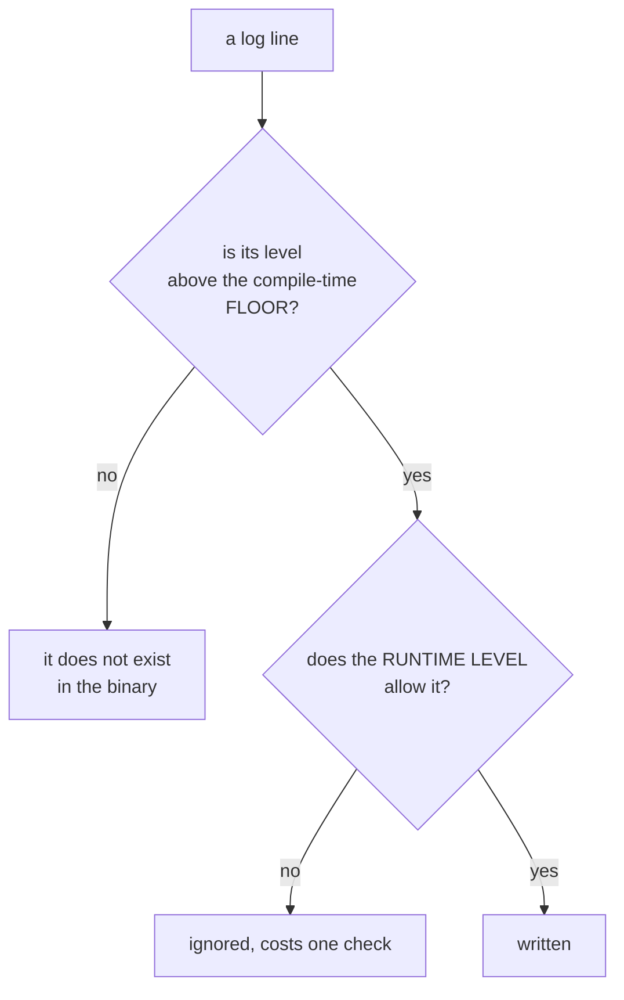

# Journal et débogueur, installés avant d'en avoir besoin

*En une phrase : les deux moitiés de ce skill répondent à la même question, quand ça cassera, avec
quoi je regarde ?*

Et elles se mettent en place au jour 1 pour une seule raison : **le jour où tu en as besoin, tu es sous
pression, et tu ne le fais pas.** Tu ajoutes un `printf`.

## Le sort du `printf` : l'arbitrage honnête

`printf` n'est pas un péché de débutant : c'est un journal **jetable et non structuré**, et il a une
vertu que le débogueur n'a pas, il montre une **séquence**, là où un débogueur montre un instant. Sur un
bug de concurrence il est même supérieur : un point d'arrêt **change le rythme d'exécution**, donc il peut
faire disparaître le défaut qu'on cherche.

Ce qui est vrai, c'est que sa durée de vie est fausse. La règle :

> **Un `printf` qui survit à un commit devient une ligne de journal au niveau DEBUG, ou il disparaît.**
> Un `printf` commité est un journal qui échappe à toute politique : pas de niveau, pas de corrélation,
> pas de masquage des secrets, pas de filtre, et il pollue la sortie machine.

## Partie 1 : un journal bien fait

### Les niveaux se décident par le DESTINATAIRE, pas par la gravité ressentie

C'est la seule règle qui rend les niveaux utilisables, parce qu'elle est falsifiable :

| Niveau | À qui la ligne s'adresse | Test |
|---|---|---|
| `ERROR` | quelqu'un doit **agir** | si personne n'agit jamais, ce n'est pas une erreur |
| `WARN` | une anomalie a été **absorbée** : repli, réessai, valeur par défaut | c'est le repli bruyant de `concevoir-avant-coder`, un repli silencieux transforme une panne en dégradation invisible |
| `INFO` | un événement qu'on relira **dans six mois** pour reconstituer ce qui s'est passé | peu nombreux, et stables |
| `DEBUG` | l'auteur du code, pendant une enquête | c'est ici que vit l'ancien `printf` |
| `TRACE` | le volume, activé à la main sur une fenêtre courte | |

**Le niveau doit se changer sans recompiler ni redéployer** : variable d'environnement, fichier de
configuration, signal. Un mode verbeux qu'il faut recompiler pour obtenir n'existe pas le jour de
l'incident.

### Structurer, sinon on retombe sur le filtre écrit à la main

Une phrase interpolée oblige le lecteur à **réécrire un motif à la main** pour en extraire quoi que ce
soit, et un motif écrit à la main n'est pas une mesure : c'est une devinette qui rend un nombre
plausible. Un champ, lui, se filtre et s'agrège.

```csharp
// Non : la valeur est fondue dans le texte, et le formatage est paye meme si DEBUG est coupe.
logger.LogDebug($"contract {id} refused because {reason}");

// Oui : gabarit + arguments. Les champs restent des champs, et rien n'est formate si DEBUG est coupe.
logger.LogDebug("contract refused {ContractId} {Reason} {Attempt}", id, reason, attempt);
```

```cpp
// C++ : tester le niveau AVANT de formater, sinon on paie le cout de la ligne qu'on jette.
#define LOG_DEBUG(logger, ...)                                                   \
    do {                                                                         \
        if ((logger).IsEnabled(LogLevel::Debug))                                 \
            (logger).Write(LogLevel::Debug, __VA_ARGS__);                        \
    } while (0)
```

**Le coût nul quand c'est désactivé n'est pas un détail de performance** : c'est ce qui permet de laisser
les lignes `DEBUG` **dans le code** au lieu de les retirer avant de commiter. Une ligne retirée est une
enquête à refaire de zéro la prochaine fois.

### La corrélation, ce qui distingue vraiment un journal d'un `printf`

Sans identifiant porté de bout en bout, un journal concurrent est **illisible** : les lignes de dix
parcours s'entrelacent et aucune ne dit à quel parcours elle appartient. Un identifiant de requête, ou
de tâche, de session, attaché au contexte et émis sur **chaque** ligne est ce qui permet de reconstituer
un parcours, et c'est la première chose qui manque quand on débogue en production.

### Ce qu'une ligne doit contenir

**Quoi, sur quel objet, dans quel contexte, et la décision prise.**

```
# inutile -- on sait qu'il y a un probleme, on ne peut rien en faire
WARN  failed to save, retrying

# utile
WARN  save refused contract_id=4821 reason=period_outside_validity
      period=2026-02-01..2026-02-28 validity_from=2026-03-01
      action=retry attempt=2 max=3 backoff_ms=2000 run_id=8f3c
```

C'est la même exigence que pour un message d'erreur, voir `doc-derivee` : **quoi, où, et quoi faire.**

### Quatre règles qui évitent des dégâts réels

1. **Les journaux surveillés ont un identifiant d'événement STABLE.** Dès qu'une alerte ou un tableau de
   bord observe une ligne, sa **phrase devient un contrat** : la reformuler casse l'alerte de quelqu'un,
   en silence. La réponse : un code d'événement stable (`BILLING_PRORATION_REFUSED`) qu'on filtre, et une
   phrase libre à côté. On filtre un code, jamais une phrase.
2. **Jamais de secret ni de donnée personnelle**, et le masquage vit **dans le journal**, pas à chaque
   site d'appel. Une règle appliquée par N appelants finit par être oubliée par un.
3. **Le journal n'est pas un mécanisme de contrôle.** Ne jamais relire ses propres journaux pour décider
   quelque chose : ça se fait par une valeur de retour. Un code qui analyse sa propre sortie est un
   couplage à un format de texte.
4. **Borner le débit.** Une ligne dans une boucle chaude remplit un disque et ajoute de la latence.
   Échantillonner, agréger (« et 4 812 occurrences similaires »), ou ne pas journaliser là.

### Où ça sort, et ce que ça ne doit jamais polluer

**Le journal va sur la sortie d'erreur ou dans son propre puits, jamais sur la sortie standard quand
celle-ci porte une réponse machine.** Une seule ligne de journal sur le flux d'un `--json` et la sortie
ne s'analyse plus : l'appelant repart au filtre manuel, et on ramène le problème par la porte de derrière
(voir `doc-derivee`).

**Et le journal est INJECTÉ**, comme l'horloge et le réseau (voir `concevoir-avant-coder`). Un journal
statique global rend les tests bavards, couplés et non déterministes. Corollaire utile : quand un
événement **est** le contrat (une piste d'audit, une notification), l'affirmer dans un test est
légitime, c'est un comportement observable et non un détail d'implémentation.

## Partie 2 : le débogueur en une touche

### Le critère, et il est falsifiable

> **Cloner le dépôt, ouvrir l'éditeur, appuyer sur une touche, s'arrêter sur un point d'arrêt**, sans
> lire de documentation, sans installer autre chose que la chaîne de compilation.

Si ça demande trois commandes à retenir, personne ne le fera sous pression, et tout le monde reviendra au
`printf`. **La friction est la seule chose qui décide** de l'outil qu'on utilise vraiment.

### Ce qui est versionné, et ce qui ne l'est pas

| Versionné, c'est une **capacité partagée** | Personnel, c'est une **préférence** |
|---|---|
| `.vscode/launch.json`, `.vscode/tasks.json` | `.vscode/settings.json` |
| `CMakePresets.json` : presets Debug, RelWithDebInfo, sanitizers | dispositions de fenêtres, thèmes |
| `.gdbinit` ou `.lldbinit` **du projet** : afficheurs, options | le `~/.gdbinit` de la machine |
| `launchSettings.json` en .NET, configuration de débogage du lanceur de tests | |

**Une configuration de débogage non versionnée est une capacité que chacun reconstruit**, donc que la
moitié de l'équipe n'a pas.

### La configuration qu'on oublie, et c'est la plus utile : déboguer LE TEST

La majorité du débogage ne porte pas sur le programme complet mais sur **un cas de test qui échoue**.
Pouvoir poser un point d'arrêt et lancer **le test sous le curseur** en une touche supprime toute la mise
en scène : pas de jeu de données à fabriquer, pas de parcours à rejouer, et le contexte est déjà minimal.
C'est la configuration à mettre **en premier**, avant celle du programme.

Et c'est cumulatif avec `tests-first` : quand un bug est d'abord reproduit par un test rouge, ce test
**est** le point d'entrée du débogueur.

### Les symboles, et le bug qui n'existe qu'en release

`-g -O0` en Debug, évidemment. Le vrai sujet est ailleurs : **garder les symboles en release**, avec
`RelWithDebInfo` et des fichiers de symboles conservés. C'est la seule façon de lire une pile d'appels d'un
plantage de production, et **une pile symbolisée vaut cent `printf`**.

Un défaut qui ne se manifeste qu'en release est presque toujours l'un de ces trois : un comportement
indéfini que l'optimiseur a exploité, une hypothèse sur l'ordre d'évaluation, ou une course que `-O0`
masquait par lenteur. Les trois se trouvent par un **sanitizer**, pas par du pas-à-pas.

> Un **sanitizer** est une instrumentation ajoutée à la compilation qui vérifie à l'exécution ce que le
> compilateur ne peut pas prouver : accès mémoire invalides (ASan), comportements indéfinis (UBSan),
> courses de données (TSan).

### Le débogueur n'est pas toujours le bon outil

| Symptôme | L'outil qui gagne | Pourquoi pas le pas-à-pas |
|---|---|---|
| corruption mémoire, débordement, usage après libération | **ASan** | le dégât est loin de sa cause : le débogueur montre la victime, pas le coupable |
| comportement indéfini : décalages, alignement, dépassement | **UBSan** | invisible tant que ça ne casse rien |
| course de données, incohérence intermittente | **TSan**, journal corrélé | un point d'arrêt **change le rythme** (défaut fantôme) |
| fuite mémoire | valgrind, heaptrack, profileur d'allocation | rien à voir à l'arrêt |
| plantage qui n'arrive que chez le client | **vidage mémoire** plus symboles de release | tu n'as pas la machine |
| bug non déterministe, une fois sur cinquante | **enregistrement-rejeu** (`rr`) | tu ne peux pas l'attraper au vol : enregistre-le, puis remonte |
| lenteur | profileur (`perf`, VTune, dotnet-trace) | un débogueur ne mesure rien |

**`rr` est celui que personne ne connaît et qui change tout** : il enregistre l'exécution puis permet de
la rejouer *à l'envers*, avec un `reverse-continue` depuis le plantage jusqu'à la cause. Sur un bug non
déterministe, il transforme une semaine en une heure.

### La hiérarchie honnête des moyens d'enquête

Du plus fiable au moins fiable :

1. **un test qui reproduit**, réutilisable, il devient la non-régression ;
2. **un sanitizer ou un enregistrement**, nomme la cause, pas le symptôme ;
3. **le débogueur**, répond à « quel est l'état ici, maintenant » ;
4. **le journal structuré**, répond à « quelle séquence a mené là » ;
5. **le `printf`**, répond à la même chose, une seule fois, et pollue.

Les niveaux 3 et 4 sont **complémentaires plutôt que concurrents** : l'un donne un instant, l'autre une
séquence. Les deux se mettent en place au jour 1.

> **Cette hiérarchie suppose que l'information est dans une VALEUR.** Quand elle est dans une **forme**
> (un entrelacement de fils d'exécution, une grille, un graphe de transitions, une distribution), une
> **vue de l'état** passe devant le débogueur, qui ne montre qu'un instant et dont le point d'arrêt change
> le rythme. C'est le skill `rendre-l-etat-visible`, et son entrée est le même instantané enregistré que
> celui dont on parle ici.

## Partie 3 : drapeaux de compilation et assertions

### `NDEBUG`, et sa polarité inversée

En C et C++, la macro standard est **`NDEBUG`**, et on la **définit pour SUPPRIMER** les assertions :
`<assert.h>` redéfinit alors `assert` en une instruction vide. Ce n'est pas `_DEBUG`, celui-là est une
convention **MSVC**, posée par le choix de la bibliothèque d'exécution de débogage, et sa polarité est
l'inverse.

| Macro | D'où elle vient | Ce qu'elle dit |
|---|---|---|
| **`NDEBUG`** | **standard C et C++** | « pas de débogage », donc `assert` ne fait plus rien |
| `_DEBUG` | MSVC, via la bibliothèque d'exécution de débogage | « on est en débogage » |
| `DEBUG`, `MON_PROJET_DEBUG` | personne, convention de projet | ce que ton build en fait |

**Le piège le plus courant, et il est silencieux** : les drapeaux de release de CMake valent `-O3
-DNDEBUG` par défaut. Donc **`Release` et `MinSizeRel` désactivent toutes tes assertions sans que
personne l'ait décidé**, et c'est justement la configuration qui part chez l'utilisateur.

### La conséquence à laquelle il faut répondre : un `assert` avec un effet de bord

```c
/* CATASTROPHE. En Debug, la pile est depilee. En Release, NDEBUG efface la ligne
   ENTIERE : pop() n'est jamais appele, et le programme se comporte differemment. */
assert(pop(&stack) == 3);

/* Correct : l'effet a lieu, l'assertion ne fait que constater. */
const int top = pop(&stack);
assert(top == 3);
```

**Règle absolue : une assertion ne contient jamais une opération qui a un effet.** C'est le seul défaut
de ce skill qui produit deux programmes différents à partir d'un seul source.

### `assert` contre traitement d'erreur : le test qui tranche

> **Cette condition peut-elle être rendue fausse par une donnée venue de l'extérieur ?**

- **oui** : ce n'est **pas** une assertion. C'est une entrée invalide, donc du traitement d'erreur, une
  valeur de retour, une exception, un refus nommé. Valider une entrée par un `assert` crée un trou de
  sécurité, parce que la validation **disparaît en release** ;
- **non** : c'est un invariant du programme, donc une erreur de programmation si elle casse, donc une
  assertion légitime.

### Faut-il garder les assertions en release ? C'est une décision, pas un défaut

La réponse par défaut de CMake (les retirer) n'est pas la bonne pour tout le monde. **Un plantage qui
nomme un invariant violé bat une corruption silencieuse**, presque toujours. La pratique qui marche est de
distinguer deux familles :

| Famille | Coût | En release |
|---|---|---|
| vérification **bon marché** d'un contrat : borne, non-nul, état cohérent | négligeable | **gardée**, et elle plante avec un message qui nomme l'invariant |
| vérification **chère** : parcourir la structure entière, revalider un cache | mesurable | retirée |

Concrètement : deux macros distinctes plutôt qu'`assert` partout, et **le choix est écrit dans le build**
plutôt que subi.

### `static_assert` est gratuit : le préférer chaque fois que c'est possible

Une assertion vérifiable à la compilation ne coûte **rien** à l'exécution, ne dépend d'aucune macro, et
échoue **avant** de livrer. C'est exactement la philosophie de `commencer-ferme` : faire remonter la
vérification le plus tôt possible.

Et son cousin dangereux : **`[[assume]]`** en C++23, ou `__builtin_assume`, ne vérifie rien. Il autorise
l'optimiseur à **supposer**, et c'est un comportement indéfini si c'est faux. C'est du **niveau 3** au sens
de `commencer-ferme` : jamais par défaut, seulement dérivé et prouvé.

### Les drapeaux qui activent des machineries, et la règle qui les empêche de pourrir

Activer sous drapeau ce qui coûte trop cher en permanence est excellent : vérifications internes,
empoisonnement de la mémoire libérée, suivi des allocations, couches de validation, journal `TRACE`,
compteurs.

**Mais du code qui ne compile que dans un mode est du code qui n'est pas compilé dans l'autre, donc il
pourrit sans que rien ne le dise.** C'est la même famille que « un garde qu'aucun compteur ne suit », voir
`concevoir-avant-coder`, et la réponse est du même ordre :

1. **préférer un interrupteur à l'exécution à une compilation conditionnelle** quand le coût le permet :
   la branche reste compilée, donc vérifiée par le compilateur et atteignable par un test ;
2. **si la compilation conditionnelle est nécessaire, construire LES DEUX configurations en intégration
   continue.** Sans ça, `Debug` et `Release` sont deux programmes différents dont un seul est vérifié, et
   c'est celui qui ne part pas chez l'utilisateur ;
3. **jouer la suite de tests dans les deux**, au moins périodiquement. Un test qui ne passe qu'en Debug ne
   prouve rien sur ce qu'on livre.

### Faire DISPARAÎTRE des lignes de journal selon le mode de build

C'est le point où les parties 1 et 3 se contredisent, et l'arbitrage vaut la peine d'être posé une fois
pour toutes.

| | Filtrage à l'**exécution** | Élision à la **compilation** |
|---|---|---|
| coût quand c'est coupé | un test de niveau, négligeable | **zéro** : il n'y a plus de code |
| la chaîne reste dans le binaire | oui, elle grossit le binaire et **divulgue des internes** | non |
| le site d'appel reste vérifié par le compilateur | oui | **seulement si on s'y prend bien**, ci-dessous |
| activable le jour de l'incident | **oui** | non, il faut recompiler et redéployer |

**La réponse est un plancher, pas un choix** : deux étages.



Et la règle qui protège du pire : **le plancher ne retire jamais `WARN`, `ERROR` ni `INFO`.** Retirer
`DEBUG` en release est une décision défendable ; retirer `WARN` est de la cécité volontaire, et c'est
précisément ce dont on a besoin le jour de l'incident.

### La technique qui évite le pourrissement : `if constexpr`, pas `#ifdef`

Une compilation conditionnelle retire le code **du compilateur**, donc plus rien ne le vérifie : il
pourrit, et on le découvre le jour où on remonte le plancher. `if constexpr` retire le code **de la
sortie** en le laissant **vérifié** :

```cpp
constexpr LogLevel kCompileFloor = LogLevel::Info;   // -DLOG_FLOOR=... en release

#define LOG_TRACE(logger, ...)                                                    \
    do {                                                                          \
        if constexpr (LogLevel::Trace >= kCompileFloor) {                         \
            if ((logger).IsEnabled(LogLevel::Trace))                              \
                (logger).Write(LogLevel::Trace, __VA_ARGS__);                     \
        }                                                                         \
    } while (0)
```

La branche écartée reste **analysée et typée**, un argument renommé ou mal typé casse la compilation même
en release, mais elle n'émet aucun code, et la chaîne littérale n'étant plus référencée, l'optimiseur ne
l'embarque pas. On obtient les deux : coût nul, et impossible à laisser pourrir.

> **Le piège qui va mordre une politique zéro-avertissement** : une variable qui ne sert QU'À une ligne
> `LOG_DEBUG` devient **inutilisée** quand la ligne disparaît, donc `-Wunused-variable`, donc sous
> `-Werror` **le build release casse alors que le debug passe**. C'est le cas d'école du « Debug et Release
> sont deux programmes différents ». Deux réponses : `[[maybe_unused]]` sur la variable, ou la construction
> `if constexpr` ci-dessus, qui **consomme** ses arguments et les garde donc utilisés. La seconde est
> meilleure : elle règle la cause au lieu du symptôme.

### Les équivalents ailleurs

```csharp
// C# : l'attribut retire les SITES D'APPEL a la compilation, pas la methode.
// Les arguments ne sont meme pas evalues. C'est l'analogue exact du plancher C++.
[Conditional("DEBUG")]
public static void TraceState(string label, object payload) { ... }
```

```ts
// TypeScript : l'empaqueteur elimine le bloc mort quand la condition est statiquement fausse.
if (process.env.NODE_ENV !== 'production') logger.trace('state', snapshot);
// ou, cote outil : esbuild --drop:console, ou define: { 'process.env.NODE_ENV': '"production"' }
```

En Rust, les niveaux de `log` et `tracing` s'élident par options de compilation
(`release_max_level_warn`) : même modèle à deux étages, déjà fourni.

## La porte de sortie

Un projet neuf n'est pas démarré avant que ces quatre réponses soient **oui** :

1. **une touche** lance le programme sous le débogueur et s'arrête sur un point d'arrêt ;
2. **une touche** lance le **test sous le curseur** sous le débogueur ;
3. le journal émet une ligne **structurée, corrélée**, dont le niveau se change sans recompiler, et son
   **plancher de compilation** ne retire jamais `WARN` ni au-dessus ;
4. il existe un preset **sanitizer** et un preset **release avec symboles**, tous deux versionnés.

Les configurations concrètes par écosystème, `launch.json` C++, .NET et Node, presets CMake, drapeaux de
sanitizers, activation des vidages mémoire, `rr`, `dotnet-dump`, sont dans
`references/mise-en-place.md`.
