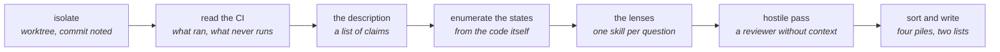

# Relire une pull request

*En une phrase : une revue dit ce qui est faux et comment on le sait, dans l'ordre de ce que ça coûte,
et elle dit aussi ce qu'elle a écarté et ce qu'elle n'a pas regardé.*

Une revue a deux rôles, et ils ne se jouent pas pareil. **Recevoir** une revue est le travail de
l'auteur : découper chaque remarque, la vérifier, la clore par un changement ou par un argument écrit
(`challenger-le-sujet`, section 5, puis `tracer-le-travail`, section 7). **Donner** une revue est le
sujet de ce skill.

**Le relecteur n'est pas l'auteur.** L'auteur relit avec la mélodie en tête
(la malédiction du savoir, voir `se-faire-comprendre`) : il ne voit pas ce qu'il ne sait pas qu'il
ignore. Sur une revue réelle d'un diff de 275 lignes, un relecteur lancé sans le contexte de la
première passe a confirmé trois constats sur six, en a nuancé deux, a infirmé une partie du dernier, et
a trouvé deux défauts que la première passe avait ratés. D'où la règle qui ouvre le skill : **on ne se relit pas soi-même, on se
fait relire**, par un collègue ou par l'agent `essayeur`, lancé sans la conversation de l'auteur.

## 1. Ne rien publier, ne rien casser

Une revue reste **locale** jusqu'à ce qu'un humain décide de la publier. Un commentaire posté ne se
rattrape pas : la notification est partie, et il engage celui qui a demandé la revue autant que celui
qui l'a écrite.

- **lire la forge, jamais y écrire** : consulter la PR, son diff, ses vérifications et ses journaux ;
  ne jamais commenter, approuver, demander des changements ni fusionner ;
- **isoler la tête de la PR dans un worktree détaché**, jamais dans la copie de travail de quelqu'un.
  Un changement de branche sur une copie qui porte du travail non commité peut le détruire
  (`tracer-le-travail`, section 2, pour `git worktree`). Détaché, parce qu'une branche locale créée
  pour la relecture empêche de refaire la même commande à la relecture suivante ;
- **noter le commit relu**. Une revue relevée sur une autre tête décrit un autre programme ;
- **un changement non commité se relit en place**, en lecture seule, puisqu'un worktree ne le porte
  pas, et le rapport le dit.

```bash
git fetch origin pull/<N>/head        # GitHub ; GitLab publie merge-requests/<N>/head
git worktree add --detach <dossier-temporaire>/relecture-<N> FETCH_HEAD
git -C <dossier-temporaire>/relecture-<N> log --oneline -1   # le commit relu, a citer dans le rapport
```

Le nettoyage du worktree revient à celui qui a demandé la revue : le rapport lui donne la commande.
L'agent `essayeur` tient ces règles par un hook : ses outils d'écriture sont refusés, et une commande
qui publie ou qui change l'état d'un dépôt est refusée avant de partir.

## 2. L'ordre de la relecture



L'ordre suit ce qui peut le moins mentir, comme la première heure d'`explorer-le-code` : la CI avant la
description, la description avant le diff, le code avant ses commentaires.

### Construire, ou dire pourquoi on ne l'a pas fait

Construire et lancer les tests de la PR reste le premier geste (`explorer-le-code`, section 1). Quand
l'environnement l'empêche (un registre privé inaccessible, un jeton expiré), le **journal de la CI de la
PR** devient la preuve, de second rang : il dit ce qui a tourné sur ce commit, et **surtout ce qui n'a
pas tourné.** Un linter absent de la CI n'a jamais vérifié ce diff, quel que soit son statut dans le
README. On écrit dans le rapport laquelle des deux preuves on a utilisée.

## 3. La description est une liste d'affirmations

Chaque phrase de la description qui porte une décision (« aucun changement côté serveur », « la CI
échouera tant que », « la donnée est déjà en base ») est une affirmation **rapportée**, même écrite par
quelqu'un de très sûr. Elle prend un statut, vérifié, rapporté, supposé ou inconnu (`challenger-le-sujet`,
section 2), et celles qui portent la revue se vérifient par une route, au mieux par deux.

Sur une revue réelle, une description affirmait qu'un contrôle de la CI échouerait tant qu'une action
manuelle n'était pas faite. Trois routes indépendantes, le script de build du dépôt, la bibliothèque de
build à la version épinglée et le journal du job, montraient que ce contrôle n'existait pas dans ce
dépôt, et le job était vert. La conséquence : un relecteur attend un échec qui ne viendra pas, et
croit gardé ce qui ne l'est pas.

Deux vérifications qui reviennent :

- **les chiffres de la description se refont** : un ratio, un compte, une date. Un chiffre juste
  renforce la PR, un chiffre faux dit qu'une autre affirmation peut l'être aussi ;
- **une dépendance ou un outil se lit à la version épinglée**, pas sur sa branche par défaut
  (`explorer-le-code`, section 5).

## 4. Les états que le diff ne montre pas

La plupart des défauts vivent dans les états que l'auteur n'a pas exercés. Le diff montre les lignes ;
il ne montre pas les combinaisons d'entrée sous lesquelles elles tournent.

**La liste des états se trouve souvent dans le code lui-même** : la doc d'une fonction qui énumère ses
dispositions, les fixtures d'un test existant, une union de types, les filtres d'un écran, les valeurs
d'une énumération. On la relève, puis on **rejoue chaque branche nouvelle du diff sur chaque état.**
Les grilles ZOMBIES et HAZOP de `challenger-le-sujet` servent quand le code ne donne pas la liste.

Sur une revue réelle, une tuile de synthèse prenait « le total du groupe, sinon le total global ». La
fonction amont ne créait le total du groupe que s'il contenait plus d'un élément. Avec un seul projet
filtré, la tuile affichait donc le total de toute l'organisation. Le cas était déjà figé par un test
existant : il suffisait de rejouer la sélection sur sa fixture pour voir le défaut, et le correctif
proposé réutilisait la même fixture.

**Une capture d'écran prouve l'état capturé, et rien d'autre.** Lister les états qu'elle ne montre pas :
c'est là qu'il faut regarder. Dans la même revue, les trois défauts n'apparaissaient qu'une fois un filtre posé,
donc aucun ne pouvait se voir sur une capture de la vue par défaut.

## 5. Les lentilles, au moment où la question se pose

Chaque skill du pack répond à une question de revue. Chacun se charge **quand sa question se pose sur
ce diff**, et aucun d'avance : un skill chargé cinquante appels avant son usage pèse moins qu'un skill
chargé juste avant.

| La question sur le diff | Le skill |
|---|---|
| la signature dit-elle la vérité ? un nom promet-il ce que le corps fait ? | `code-comme-poesie`, section 8 |
| la déclaration est-elle aussi fermée que possible ? un cast ou une assertion croit-il en silence ? | `commencer-ferme` |
| les cas limites : vide, un, plusieurs, bornes, erreurs | `challenger-le-sujet`, grilles ZOMBIES et HAZOP |
| un test couvre-t-il la branche ajoutée ? un test ment-il ? | `tests-first`, sections 5 et 6 |
| une frontière de confiance est-elle touchée ? | `garder-les-frontieres` |
| un mécanisme existant fait-il déjà ça ? le diff est-il minimal ? | `concevoir-avant-coder`, section 2 |
| pour un correctif : la cause racine est-elle nommée, le symptôme rejoué ? | `trouver-la-cause` |
| une option, un message d'erreur, une sortie machine change-t-il ? | `doc-derivee` |
| un journal, un mode de build, une assertion qui disparaît en release ? | `journal-et-debogueur` |
| une performance est-elle affirmée ? | `mesure-et-telemetrie` |
| un visuel de la PR montre-t-il ce que sa légende affirme ? | `rendre-l-etat-visible` |
| la description dit-elle quoi, pourquoi, comment vérifier, ce qui n'est pas dedans ? | `tracer-le-travail`, section 6 |
| la PR a-t-elle besoin d'une conception écrite qu'elle n'a pas eue ? | `cadrer-et-planifier` |

## 6. La convention du dépôt gagne sur la préférence du pack

Une règle de ce pack que le dépôt relu contredit par une **convention constante** (un fichier de
contribution ou de consignes aux agents, le même choix fait partout dans le fichier) ne se remonte pas.
Exemple : ce pack déconseille la doc de contrat sur les fonctions privées ; si le dépôt documente
toutes ses méthodes privées, en signaler chacune est du bruit, et ce bruit cache les remarques qui
comptent.

Deux limites à cette règle :

- **un défaut se remonte toujours**, quelle que soit la convention : un résultat faux, une donnée
  perdue, une faille, un appelant cassé ;
- **une règle écrite par la personne qui a demandé la revue** n'est pas une préférence du pack. Elle
  s'applique, et un dépôt qui la viole par habitude se signale au lieu de servir d'argument.

Ce qui est écarté pour cette raison va dans la liste des écartés, avec la raison.

## 7. La passe hostile, avant de rendre

Avant de rendre la revue, **ses constats se font attaquer** par un relecteur qui n'a pas écrit la revue
et n'en a pas le contexte : un collègue, ou un agent `essayeur` lancé avec, pour seul prompt, la PR et
la liste des constats (`challenger-le-sujet`, section 4, le relecteur hostile). Sa mission est double :
réfuter chaque constat s'il le peut, et trouver ce qui a été raté.

- **chaque verdict dit ce qui ferait changer d'avis** : confirmé, infirmé ou nuancé, avec la preuve ;
- **un constat du relecteur hostile se vérifie comme les autres.** Il peut avoir raison deux fois et
  tort la troisième, et on juge le point, pas la source (`challenger-le-sujet`, section 5) ;
- **un constat marqué supposé ne se remonte pas comme un fait.** Sur la revue réelle déjà citée, un
  constat tenu pour supposé (un écart qui dépendait de données qu'on n'avait pas) a été infirmé par la
  passe hostile. Écrit comme un fait, il serait devenu un faux positif.

**Le prix, mesuré sur cette revue** : environ 196 000 jetons et quinze minutes pour 275 lignes de diff.
On ne le paie pas sur chaque PR. On le paie quand se tromper coûte cher : le critère de `cycle-de-dev`
pour la conception (un contrat public, des données persistées, un format sur le fil), plus deux cas
propres à la revue, une frontière de confiance et une revue qui servira à décider.

## 8. Trier et écrire : quatre piles et deux listes

| Pile | Ce qu'on y met | Ce qui l'accompagne |
|---|---|---|
| **bloquant** | un défaut prouvé : un résultat faux, une perte, une faille, un appelant cassé | la preuve, le plus petit correctif, et le test qui l'aurait attrapé |
| **à corriger** | faux mais sans conséquence grave : une description inexacte, un libellé trompeur | la preuve et le correctif |
| **question** | un choix qui contredit ce que la PR annonce, ou dont l'intention n'est pas écrite | ce qui ferait changer d'avis |
| **préférence** | ce que le relecteur ferait autrement | marquée comme telle, jamais bloquante |
| *écartés* | ce qui a été jugé et n'est pas remonté | la raison : convention du dépôt, hors du périmètre, non observé |
| *pas vérifié* | ce que la revue n'a pas pu faire : construire, voir le rendu, lire les données réelles | ce que ça laisse ouvert |

Chaque remarque suit la même forme, **constat, preuve, correctif**, pour qu'une remarque sans preuve se
voie. Les règles de `tracer-le-travail`, section 7, s'appliquent : une remarque nomme un fichier et une
ligne, et propose un changement.

Trois règles pour dire le minimum :

- **le plus petit correctif qui retire la cause**, jamais une réécriture de la conception de l'auteur
  quand une ligne suffit. Un correctif se propose en esquisse dans le rapport, le relecteur ne l'applique
  pas ;
- **les écartés s'écrivent**, parce qu'ils prouvent qu'on a regardé sans noyer l'auteur sous ce qui ne
  compte pas ;
- **au-delà de cinq remarques bloquantes, le problème n'est plus dans les lignes** : la revue dit que la
  PR est à redécouper, et s'arrête là (`tracer-le-travail`, section 6).

Le gabarit du rapport est dans `references/rapport.md`.

## Ce que la revue ne fait pas

- **elle n'approuve pas.** L'approbation et la fusion appartiennent à un humain qui a lu le rapport ;
- **elle ne corrige pas le code relu.** Un relecteur qui corrige en silence efface la séparation qui
  faisait sa valeur ;
- **elle ne publie rien.** Le rapport revient à celui qui l'a demandé, qui décide de ce qui part sur la
  forge, et sous quelle forme.

## Les anti-patterns, et leur signature

- **la revue de style.** Signature : toutes les remarques portent sur les noms et le formatage, aucune
  sur le fond. Soit la PR est trop grosse, soit le relecteur n'a pas énuméré les états ;
- **la remarque sans preuve.** Signature : « ça me semble fragile », sans `fichier:ligne` ni commande ;
- **le vert pris pour une revue.** Signature : « les tests passent » comme seul argument, sans avoir
  regardé si un test couvre la branche ajoutée ;
- **la revue qui réécrit la PR.** Signature : le correctif proposé touche plus de fichiers que la PR ;
- **la revue publiée avant d'être vérifiée.** Signature : un commentaire retiré le lendemain ;
- **l'autorelecture.** Signature : l'auteur conclut « j'ai relu, c'est bon », et la première revue
  extérieure trouve ce que le contexte de l'auteur lui masquait.

## La porte de sortie

Avant de rendre une revue, ces sept réponses doivent exister :

1. **rien n'a été publié**, la revue a été faite dans un worktree (ou en place, en lecture seule, pour
   un changement non commité, et le rapport le dit), et le commit relu est noté ;
2. la CI de la PR a été lue, et **ce qu'elle ne lance pas** est écrit ; la PR a été construite, ou le
   rapport dit pourquoi et quelle preuve la remplace ;
3. chaque affirmation de la description qui porte une décision a **un statut et une preuve** ;
4. les états d'entrée ont été **énumérés depuis le code**, et chaque branche nouvelle du diff a été
   rejouée dessus ;
5. chaque remarque a **sa pile, sa preuve et son plus petit correctif**, et chaque défaut, le test qui
   l'aurait attrapé ;
6. les constats ont survécu à **une passe hostile**, ou l'absence de cette passe est écrite, avec sa
   raison ;
7. **les écartés et le non vérifié** sont écrits.
