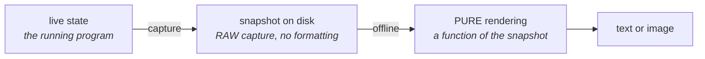

# Rendre l'état visible

*En une phrase : certains défauts ne se voient ni dans un débogueur ni dans un journal, parce que
l'information n'est pas dans une valeur mais dans une forme.*

Dix mille nombres ne te diront pas que ta grille a un trou, que deux fils d'exécution se croisent au
mauvais moment, ou que ta distribution est devenue bimodale. Une image le dit en une seconde.

**Et le sous-produit est gratuit** : la vue construite pour comprendre un bug est aussi celle qui explique
le mécanisme, à un collègue, dans une PR, dans une doc, dans une vidéo. Mais c'est une **conséquence,
jamais le motif** : construire un visualiseur pour faire une belle image est un détour ; le construire
pour trouver un défaut et obtenir l'image en prime est la bonne version.

> **Note de lecture** : ce document contient des rendus en texte, grilles, chronologies. Ce ne sont pas
> des schémas décoratifs, c'est **le sujet même** : des exemples de ce qu'un rendu texte produit. Les
> schémas d'explication, eux, sont en Mermaid.

## 1. Quand une vue bat un débogueur : le discriminant

> **L'information est-elle dans la VALEUR ou dans la FORME ?**

| La forme porte l'information, donc **une vue** | La valeur suffit, donc **un débogueur** |
|---|---|
| concurrence, ordre, entrelacement (chronologie) | un champ vaut nul |
| données spatiales : grille, arbre quaternaire, maillage, nuage de points | une condition inversée |
| distribution, queue de latence, cardinalité | un compteur décalé de un |
| machine à états, transitions, dépendances (graphe) | une exception avec sa pile |
| séquence de messages, protocole, synchronisation | une valeur hors bornes |
| disposition mémoire, fragmentation, localité | une fuite localisée |

Et **quand la forme compte, le débogueur est souvent pire qu'inutile** : un point d'arrêt **change le
rythme d'exécution**, donc il peut faire disparaître le défaut. C'est le cas de la première ligne de la
colonne de gauche.

## 2. Quand ça vaut le coût : deux conditions, pas une envie

Un visualiseur se paie **une fois** et sert **N fois** ; c'est ce rapport qui décide, et il faut l'estimer
avant plutôt qu'après.

**Le construire quand au moins une des deux tient** :

1. **la classe de défaut va revenir.** La concurrence, la géométrie, la synchronisation ne produisent
   jamais un seul bug ;
2. **le débogueur et les journaux ont déjà échoué deux fois** sur ce défaut. Deux, pas une : la première
   fois, on n'avait peut-être pas bien regardé.

**Ne pas le construire** quand le défaut est unique et localisé. Un visualiseur est un chantier agréable,
et c'est exactement ce qui le rend dangereux : **on peut y passer trois jours en se sentant productif
pendant que le bug attend.** Si tu ne peux pas nommer la deuxième utilisation, tu es en train de fuir le
bug.

## 3. La règle qui fait tout le reste : rendu PUR, sur un instantané ENREGISTRÉ



Le rendu prend un instantané et rend une sortie. **Il ne touche jamais au système vivant.** Cette
contrainte transforme un gadget en outil, et elle a quatre conséquences d'un coup :

| Conséquence | Pourquoi elle compte |
|---|---|
| **il ne peut pas perturber** ce qu'il observe | un visualiseur qui lit l'état vivant sous verrou, ou qui mute, fabrique des défauts fantômes |
| **il rejoue hors ligne** | le bug est arrivé une fois, à 3 h du matin, sur une machine que tu n'as pas. Avec l'instantané, tu débogues le PASSÉ |
| **il est testable** | une fonction pure de l'état vers du texte se couvre par des fichiers de référence, section 5 |
| **il se compare** | deux instantanés se diffent ; deux fenêtres vivantes, non |

**L'instantané est un artefact, pas une fenêtre.** C'est le point que les vues « temps réel » ratent : une
vue live exige de reproduire le bug devant soi. Un enregistrement plus un rendu hors ligne te donnent le
droit de regarder autant de fois que tu veux, exactement la même exécution, la même logique que `rr` et
les vidages mémoire, voir `journal-et-debogueur`.

## 4. Le texte AVANT les pixels

C'est l'arbitrage le plus rentable de ce skill, et celui qu'on saute par enthousiasme.

| | Rendu **texte** | Rendu **graphique** |
|---|---|---|
| coût | une heure | des jours |
| se diffe entre deux tirages | **oui**, et c'est souvent ça, l'information | non |
| se colle dans une issue, une PR, un test | **oui** | non |
| se couvre par un fichier de référence | **oui** | difficilement |
| géométrie 2D ou 3D réelle, densité forte | insuffisant | **nécessaire** |

```
# Rendu texte d'une grille -- une heure de travail, et le trou saute aux yeux
     0 1 2 3 4 5 6 7
  0  # # # . . # # #
  1  # # . . . . # #
  2  # . . X . . . #     X = cellule visitee deux fois  <- LE DEFAUT
  3  # . . . . . . #
  4  # # . . . . # #
```

**Les pixels quand la géométrie est vraiment spatiale**, ou quand la densité dépasse ce qu'un terminal
peut montrer. Pas avant. Et même alors, garder le rendu texte : c'est lui qui restera dans les tests.

## 5. Une fois le rendu pur, les fichiers de référence, et leur limite

Un rendu pur se fige : on enregistre sa sortie de référence, et **tout changement casse le test
volontairement**. Le diff **est** la revue, c'est ce qui permet de modifier un rendu sans se demander ce
qu'on a cassé ailleurs.

> **Un fichier de référence prouve la STABILITÉ, jamais la justesse.** Un rendu faux, une fois figé, reste
> vert pour toujours. D'où : les références se relisent à l'enregistrement, sur des données RÉELLES, et
> ré-enregistrer se fait délibérément, jamais pour « faire passer le test ».

Et le piège du leurre, voir `tests-first`, mord ici tout particulièrement : un instantané de test doit
avoir la **FORME** de la vraie donnée, pas seulement son contenu. Un état aplati ne peut pas exercer un
rendu qui travaille ligne par ligne.

## 6. Se greffer sur une visionneuse existante, plutôt qu'écrire un visualiseur

C'est la réponse pratique à « ça coûte trop cher » : **émettre un format qu'un outil existant sait déjà
afficher.** Trente lignes de code contre un projet entier.

| La forme de ton état | Le format à émettre | Ce qui l'affiche |
|---|---|---|
| chronologie, fils d'exécution, intervalles imbriqués | **Chrome Trace Event** (JSON) | `chrome://tracing`, Perfetto |
| graphe, machine à états, dépendances | **Graphviz `.dot`** | `dot -Tsvg`, tout éditeur |
| image 2D, grille, carte de hauteur, tampon | **PPM ou PGM** (texte, écrit au `fprintf`) | n'importe quelle visionneuse |
| nuage de points, maillage 3D | **PLY ou OBJ** (texte) | MeshLab, Blender |
| profil, où passe le temps | **piles repliées**, ou JSON speedscope | `flamegraph.pl`, speedscope |
| série numérique, distribution | **CSV** | gnuplot, tableur, n'importe quoi |
| séquence de messages, protocole | **Mermaid** `sequenceDiagram` (texte) | ton dépôt, ta PR |

Le PPM mérite une mention pour du C ou de l'embarqué : **six lignes de `fprintf`, aucune dépendance**, et
tu obtiens une image. C'est le rapport valeur/coût le plus élevé de toute la liste.

**Et le dogfooding a sa place, avec sa limite** : si le projet a déjà son moteur de rendu, ses repères de
débogage, ses structures, s'en servir est plus rapide qu'apprendre un outil externe, et ça exerce ta propre
API, c'est un vrai bonus. Mais **ne construis pas un moteur pour déboguer un bug.** Le critère est le même
que partout : ce qui existe déjà bat ce qu'on écrit.

Les émetteurs minimaux de chaque format sont dans `references/formats-et-visionneuses.md`.

## 7. Le même artefact habille la doc, les PR et l'onboarding

C'est le rendement principal de la méthode, et il est asymétrique : **l'outil se paie sur le débogage, et
la documentation l'obtient gratuitement.** L'ordre compte, construire pour illustrer donne un joli visuel
qui pourrira ; construire pour diagnostiquer donne un visuel qui reste vrai.

**Et c'est le seul schéma qui ne peut pas pourrir**, parce qu'il est **dérivé de l'état** et non dessiné à
la main. C'est `doc-derivee` appliqué à une image : un diagramme dessiné finit toujours par mentir sans que
rien ne casse ; un diagramme **généré depuis l'état** change quand l'état change, ou casse sa référence.

### Dans une PR, et le rendu texte y gagne SOUVENT, contre l'intuition

Le classement ci-dessous vaut quand la sortie du domaine **n'est pas déjà visuelle**. Quand elle l'est
(rendu, interface, shaders), l'image est la vérité terrain et le classement change, voir la sous-section
suivante.

| Support | Dans une PR | Pourquoi |
|---|---|---|
| **fichier de référence texte** qui change | **le meilleur** | il apparaît **comme un diff**, dans la PR, commentable **ligne à ligne**. La revue visuelle se fait sans quitter la PR |
| **Mermaid** | très bon | rendu nativement par la forge, et c'est **du texte** : diffable, versionné |
| **SVG** | bon | s'affiche en ligne, et reste du texte |
| **PNG** attaché | acceptable en contexte | **opaque** : pas de diff, pas de commentaire de ligne, du poids dans le dépôt |
| **GIF ou vidéo** | seulement en description | idem, plus lourd, et **il ne peut pas être régénéré** |

**Les deux usages qui changent une revue** :

1. **la paire avant/après, issue du MÊME rendu.** Le relecteur voit l'effet en cinq secondes au lieu de
   simuler le code dans sa tête. C'est ce qui fait passer une revue du nommage au fond ;
2. **le rendu de l'état FAUTIF comme rapport de bug.** La grille avec son trou, la chronologie avec ses
   40 ms d'attente : c'est la reproduction, sous forme humaine. Le test rouge et le rendu sont la **même
   preuve**, l'un pour la machine et l'autre pour le lecteur, voir `tests-first`.

Côté description de PR, ça alimente directement la section « comment vérifier », voir `tracer-le-travail`.

### Le support suit le DOMAINE, et la règle est un cran au-dessus

> **La PR porte la sortie observable du changement, dans le format NATIF du domaine**, produite par une
> commande, et présentée en **paire avant/après**.

| Domaine | Sa sortie observable | Ce que porte la PR |
|---|---|---|
| rendu, interface, shaders, génération procédurale | une **image** | captures avant/après **de la même scène, même graine, même caméra**, plus un diff perceptuel |
| analyseur, compilateur, sérialiseur | un flux de jetons, un arbre, un binaire | un **rendu texte** en fichier de référence |
| concurrence, réseau, ordonnanceur | une **chronologie** | deux traces rendues, ou un diagramme de séquence |
| performance | une **distribution** | médiane, p99, variance, sur des tirages entrelacés |
| données, transformation, requêtes | des **lignes** | un échantillon avant/après, et les compteurs |
| CLI, outil | ce que la commande **répond** | la sortie collée, telle quelle |

Ce qui est invariant est la **fonction** (le relecteur doit constater l'effet sans exécuter le code), et
non le support. Le domaine choisit le support.

### Quand le format natif est le pixel

Une capture perd la diffabilité, et c'est son seul vrai défaut. On la récupère par de l'**outillage**,
pas par du texte :

- **des images de référence versionnées**, et une comparaison **perceptuelle** automatique. La capture de
  la PR devient alors la simple remontée d'une référence, même mécanique que partout ailleurs dans cette
  skill ;
- **la convention en trois panneaux : avant, après, diff.** C'est la forme générale, tous domaines
  confondus : le diff est ce qui transforme deux images en une information ;
- **le déterminisme d'abord, sinon rien ne tient** : scène fixe, graine fixe, caméra fixe, résolution
  fixe, animations gelées, horloge injectée. Un rendu non déterministe ne peut pas avoir de référence, il
  n'aura que des faux positifs, donc la comparaison sera désactivée ;
- **une tolérance serrée et justifiée.** C'est par là que les références d'image pourrissent : une
  tolérance large pour absorber le bruit du pilote finit par absorber les vraies régressions. La régler
  avec une raison écrite, et la resserrer dès que la cause du bruit est traitée ;
- **le poids du dépôt** : images en stockage dédié ou hors dépôt, et de petites résolutions. Un dépôt
  alourdi par des captures finit par voir les captures supprimées.

### La règle qui sépare un actif de documentation d'une capture d'écran

> **Tout visuel durable porte la COMMANDE qui le régénère**, versionnée et exécutable.

Sans elle, ce n'est pas une figure, c'est une capture d'écran, et elle mentira en silence sans que rien ne
casse. Avec elle, on peut la refaire à chaque version, et la différence se voit. C'est exactement le cran 4
de l'échelle de `doc-derivee` : l'exemple exécuté.

**Le GIF et la vidéo tombent du mauvais côté de cette règle**, et c'est leur seule vraie limite : ils ne se
régénèrent pas. Donc **en description de PR, très bien**, c'est du contexte éphémère, personne ne s'y
fiera dans six mois, et **comme documentation durable d'un mécanisme, non**, sauf si un script committé les
reproduit. Ce qui est parfaitement faisable : une suite d'instantanés rendus, assemblés par une commande.

### Les chiffres aussi : la télémétrie alimente la doc

Une métrique ou un tableau de bord produit **les nombres qui vont dans la doc**. Même règle, et elle est
plus stricte qu'on ne croit : **un nombre dans un document porte son unité, sa date et la commande qui le
rend.** Mieux : le document cite ce que la **commande répond** au lieu de figer une valeur, sinon il
annoncera un taux que plus rien ne soutient, ce qui est le mode d'échec le plus courant et le plus
embarrassant d'une doc technique.

### Ce que ça coûte quand même : un rendu de débogage n'est pas de la pédagogie

Une vue optimisée pour **toi** est dense, sans légende, et suppose tout le contexte. La transformer en
explication demande des étiquettes, une légende, et **un cas réduit**, pas un tirage de production.

**La réponse n'est pas un second outil, c'est un preset** : le même générateur, avec une entrée minuscule,
les étiquettes activées et des couleurs choisies pour le contraste. Un second outil divergerait ; un preset
garde la propriété de dérivation, qui est tout l'intérêt. Ce que le preset doit changer au cadrage (un
sujet en accent, son contexte atténué, un seul niveau de zoom par vue, la légende sur l'image) est dans
`se-faire-comprendre`, section 8.

C'est la raison de fond pour laquelle ce skill appartient au pack, et pas seulement au débogage.

## La porte de sortie

1. j'ai nommé **la forme** que je cherche à voir, et pourquoi une valeur ne suffit pas ;
2. j'ai nommé **la deuxième utilisation**, sinon je ne construis rien et je retourne au bug ;
3. le rendu est **pur**, sur un **instantané enregistré**, et il ne touche pas au système vivant ;
4. il existe un rendu **texte**, diffable et couvert par un fichier de référence, avant tout pixel ;
5. j'ai vérifié qu'**aucune visionneuse existante** ne fait déjà le travail ;
6. tout visuel qui part dans une doc porte **la commande qui le régénère**, sinon c'est une capture
   d'écran, et elle mentira.
