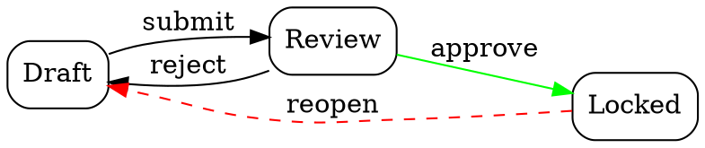
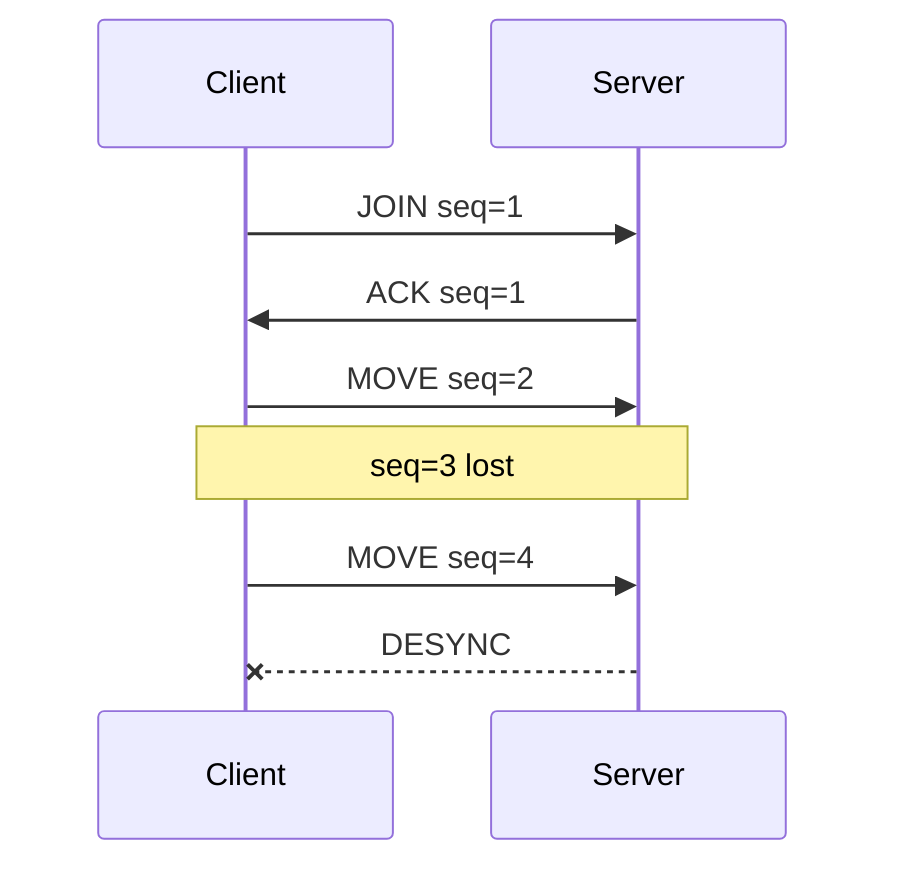

# Émetteurs minimaux : se greffer sur une visionneuse qui existe déjà

Chacun de ces formats est **du texte**, s'écrit sans dépendance, et s'ouvre dans un outil que quelqu'un
d'autre a écrit et maintient. C'est la réponse à « un visualiseur coûte trop cher ».

> Les commentaires des blocs de code restent sans accents : ils sont destinés à être copiés dans des
> sources.

## Le patron général : capturer, puis rendre à part

```c
/* La capture ecrit un instantane BRUT. Elle ne formate rien, ne juge rien. */
void DumpGridSnapshot(const Grid *grid, const char *path)
{
    FILE *out = fopen(path, "wb");
    if (out == NULL) return;                        /* echec bruyant chez l'appelant */
    fprintf(out, "grid %zu %zu\n", grid->width, grid->height);
    for (size_t y = 0; y < grid->height; ++y) {
        for (size_t x = 0; x < grid->width; ++x)
            fprintf(out, "%d ", grid->cells[y * grid->width + x]);
        fputc('\n', out);
    }
    fclose(out);
}
```

**Le rendu est un AUTRE binaire, ou un autre mode, qui lit ce fichier.** C'est ce qui le rend pur,
rejouable et testable par fichier de référence, et c'est ce qui l'empêche de perturber le programme
observé.

## PPM et PGM : une image, six lignes, zéro dépendance

Le meilleur rapport valeur/coût de la liste, surtout en C ou en embarqué.

```c
/* P5 = niveaux de gris binaire ; P6 = RVB ; P2 et P3 = les memes en ASCII (diffables). */
void WritePgm(const char *path, const unsigned char *pixels, int width, int height)
{
    FILE *out = fopen(path, "wb");
    fprintf(out, "P5\n%d %d\n255\n", width, height);
    fwrite(pixels, 1, (size_t)width * (size_t)height, out);
    fclose(out);
}
```

S'ouvre dans la plupart des visionneuses, et se convertit partout. Pour une **carte de chaleur**, mapper la
valeur sur 0 à 255 et regarder : les trous, les bandes et les dégradés inattendus sautent aux yeux.

**Variante ASCII (`P2`)** quand on veut pouvoir **diffe** deux instantanés dans l'historique de version :
plus gros, mais lisible et versionnable.

## Chrome Trace Event : une chronologie professionnelle pour trente lignes

Le format que `chrome://tracing` et Perfetto savent lire. C'est LA réponse aux bugs de concurrence et de
synchronisation.

```json
{ "traceEvents": [
  {"name":"parse",  "ph":"X", "ts":1000, "dur":250, "pid":1, "tid":7, "args":{"bytes":40960}},
  {"name":"lock:db","ph":"B", "ts":1180, "pid":1, "tid":7},
  {"name":"lock:db","ph":"E", "ts":1420, "pid":1, "tid":7},
  {"name":"parse",  "ph":"X", "ts":1100, "dur":900, "pid":1, "tid":8}
]}
```

| Champ | Ce qu'il faut savoir |
|---|---|
| `ph` | `X` égale intervalle complet, avec `dur` ; `B` et `E` égalent début et fin appairés ; `i` un instant ; `C` un compteur |
| `ts`, `dur` | **microsecondes**, entiers. Une horloge monotone, jamais l'heure murale |
| `tid` | c'est ce qui empile les voies : un par fil d'exécution, ou par entité logique, une file, un client |
| `args` | tout ce qu'on veut inspecter au clic : tailles, identifiants, décisions |

Ouvrir Perfetto puis y glisser le fichier. On voit alors ce qu'aucun journal ne montre : **les trous**, les
chevauchements, et qui attend qui.

## Graphviz `.dot` : graphes, machines à états, dépendances



```bash
dot -Tsvg state.dot -o state.svg
```

**L'usage qui trouve des bugs** : émettre le graphe des transitions **réellement observées** dans un
tirage, et le comparer à celui des transitions **autorisées**. Ce qui apparaît en trop est le défaut.

## Flamegraph : où passe le temps, ou la mémoire

Le format « piles repliées » est du texte : une pile par ligne, séparateurs `;`, poids à la fin.

```
main;ComputeAll;ComputeOne;Allocate 4821
main;ComputeAll;ComputeOne 1200
main;Serialize 310
```

```bash
flamegraph.pl folded.txt > profile.svg      # ou glisser dans speedscope
perf script | stackcollapse-perf.pl > folded.txt   # depuis un perf record
```

Marche aussi bien pour des **allocations** ou des **compteurs métier** que pour du temps : c'est un agrégat
d'arbres pondérés, rien de plus.

## PLY : nuage de points ou maillage 3D

```
ply
format ascii 1.0
element vertex 3
property float x
property float y
property float z
property uchar red
property uchar green
property uchar blue
end_header
0.0 0.0 0.0 255 0 0
1.0 0.0 0.0 0 255 0
0.5 1.0 0.0 0 0 255
```

S'ouvre dans MeshLab, Blender, CloudCompare. La couleur est le canal à exploiter : encoder l'erreur, l'âge,
le fil d'exécution ou le numéro d'itération dans le RVB fait apparaître la structure du défaut.

## CSV : séries, distributions, et le tri le plus rapide

```bash
# Une distribution, en une ligne
gnuplot -e "set terminal dumb; plot 'lat.csv' using 1 with histeps"

# Comparer deux bras d'une mesure, dans le terminal
gnuplot -e "set terminal dumb size 100,30; plot 'a.csv' with lines, 'b.csv' with lines"
```

`set terminal dumb` rend un graphe **en texte dans le terminal** : aucune fenêtre, ça se colle dans une
issue, et ça suffit dans huit cas sur dix. **Une distribution bat une moyenne**, et c'est souvent tout ce
qu'il fallait voir.

## Mermaid : la séquence, en texte, dans le dépôt



Généré depuis un journal de paquets, il rend visible l'ordre réel, et il vit dans le dépôt, se diffe, et
s'affiche directement dans une PR.

## Rendus texte maison : les deux patrons qui couvrent presque tout

Ces deux blocs sont des **exemples de sortie**, pas des schémas : c'est ce que le rendu produit.

```
# Grille : une cellule = un caractere, une legende sous le rendu
     0 1 2 3 4 5
  0  # # . . # #
  1  # . . X . #      X = visite deux fois

# Chronologie : une ligne par entite, le temps en colonnes
        0ms      50ms     100ms    150ms
  t1    [--parse--][==lock==]
  t2         [--parse--]    [=lock=]      <- 40 ms d'attente, invisible dans les logs
  t3    [-io-]                    [--write--]
```

Les deux se diffent, se collent, et se figent en fichiers de référence. Les construire **avant** tout pixel.

## Liste de contrôle avant d'écrire un visualiseur

- [ ] la **forme** que je cherche à voir est nommée
- [ ] aucun format de cette page ne la porte déjà, sinon, l'émettre et s'arrêter là
- [ ] la capture écrit un **instantané brut** sur disque ; le rendu est **ailleurs**
- [ ] il existe un rendu **texte**, diffable, avant tout pixel
- [ ] le rendu est **pur** et couvert par un **fichier de référence** sur une donnée réelle
- [ ] la **deuxième utilisation** est nommée, sinon je retourne au bug
