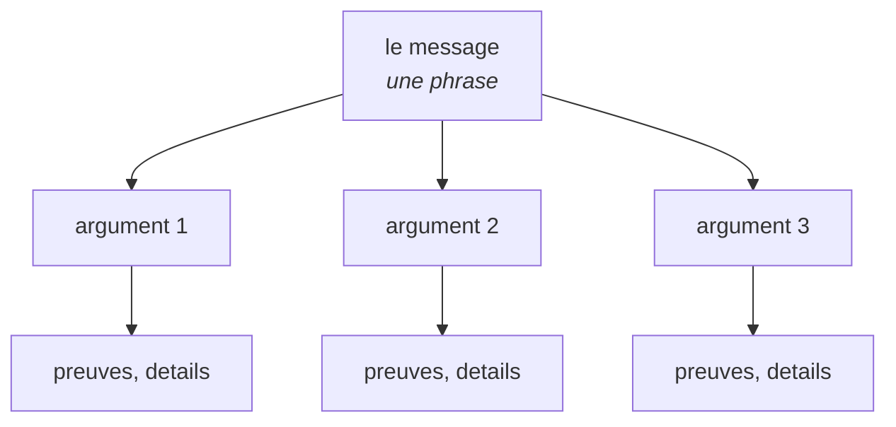

# Se faire comprendre : écrire, synthétiser, montrer

*En une phrase : un texte est réussi quand son lecteur peut redire l'essentiel et faire ce qu'il doit
faire sans l'auteur à côté ; le style, la longueur et les visuels ne sont que des moyens de passer ce
test.*

C'est un critère falsifiable, et c'est ce qui le rend utile : on peut donner le texte à quelqu'un, lui
demander ce qu'il en retient, et constater l'écart.

**La cause numéro un d'un texte incompréhensible n'est ni le vocabulaire ni la grammaire, c'est la
malédiction du savoir** : une fois qu'on sait quelque chose, on ne sait plus simuler quelqu'un qui ne
le sait pas. En 1990, Elizabeth Newton demandait à des étudiants de taper le rythme d'une chanson
connue sur une table, et d'estimer combien d'auditeurs la reconnaîtraient. Ils prévoyaient 50 % ; sur
120 chansons, les auditeurs en ont reconnu 2,5 %. Celui qui tape entend la mélodie dans sa tête, et ne
peut plus l'imaginer absente. Steven Pinker en fait « la meilleure explication que je connaisse de
pourquoi des gens bien écrivent de la mauvaise prose » (*The Sense of Style*, 2014).

**D'où la conséquence qui structure tout le skill : l'auteur ne peut pas vérifier seul qu'il est
compris.** Se relire ne marche pas, parce qu'on relit avec la mélodie en tête. Ce qui marche, ce sont
des règles de construction (lecteur, message, ordre, exemple) et une vérification par quelqu'un
d'autre (section 11).

## 1. Écrire pour comprendre, avant d'écrire pour être compris

*« Avant donc que d'écrire, apprenez à penser »*, et trois vers plus loin : *« Ce que l'on conçoit bien
s'énonce clairement »* (Boileau, *L'Art poétique*, 1674). Leslie Lamport le dit pour les ingénieurs :
*« si tu penses sans écrire, tu crois seulement que tu penses »*.

Écrire est le test le moins cher de sa propre compréhension, parce que la phrase qui ne vient pas
désigne exactement le trou. Donc, avant de rédiger pour quelqu'un :

- **écrire le message en une phrase** (section 3). Si elle ne vient pas, le problème n'est pas la
  rédaction, c'est la compréhension, et la suite est dans `challenger-le-sujet` ;
- **expliquer le mécanisme à un débutant imaginaire**, par écrit. Chaque endroit où on écrit « en gros »,
  « d'une manière ou d'une autre » ou « magiquement » est un endroit qu'on ne comprend pas ;
- **dessiner le schéma**. Une flèche qu'on ne sait pas étiqueter est une relation qu'on ne connaît pas.

### Deux documents, deux publics, jamais un seul

Les notes qu'on écrit pour comprendre sont **pour soi** : exhaustives, chronologiques, pleines
d'impasses. Le document qu'on livre est **pour le lecteur** : sélectif, ordonné par son besoin. Livrer
le premier à la place du second est l'erreur la plus fréquente d'un rapport, et elle se reconnaît au
récit : « d'abord j'ai regardé X, puis j'ai trouvé Y ».

La question qui décide où va une section : **est-ce que ça change ce que le lecteur fait, ou est-ce que
ça m'évite à moi de me tromper à nouveau ?** Sur un projet réel, un chapitre « les pièges et ce qu'ils
ont coûté » placé dans un rapport destiné à un responsable a reçu une réponse en cinq mots : « en quoi
ça m'intéresse ? ». Le récit des erreurs va dans les notes de l'auteur ; leur **conséquence** pour la
lecture (« ce chiffre ne dit pas que... ») reste dans le document.

## 2. Le lecteur d'abord : trois questions avant la première ligne

1. **Qui lit, et que sait-il déjà ?** Ce qu'il sait ne se répète pas ; ce qu'il ne sait pas se définit
   là où ça arrive ;
2. **que doit-il faire, décider ou comprendre après ?** C'est ce qui décide de ce qu'on garde ;
3. **dans quelle situation lit-il ?** Cinq minutes avant une réunion, sur un téléphone, projeté devant
   une salle, en cherchant une réponse précise, ou en lisant de bout en bout.

| Lecteur | Ce qu'il cherche | Ce qui le perd |
|---|---|---|
| un décideur | l'état, le problème, la solution, et ce qu'elle rend possible | le détail technique, et **l'effort** à la place de la solution |
| un pair technique | le mécanisme, la preuve, la reproduction | les généralités, les adjectifs sans mesure |
| un nouveau venu | la carte, un exemple, les termes définis au fil de l'eau | le jargon non défini, le contexte supposé connu |
| soi-même dans six mois | le pourquoi, ce qui a été rejeté, la date | ce qui était « évident » le jour où on l'a écrit |

Deux règles tirées de ce tableau :

- **un décideur veut la capacité, pas son coût.** « La couverture est mesurée à chaque version » se
  présente comme une solution ; « il faut une PR pour retirer une condition » décrit l'effort de celui
  qui exécute. Sur un projet réel, les cinq intitulés d'une slide de conclusion décrivaient cinq
  paliers de coût, et elle a été jugée inutile, entre autres pour cette raison ;
- **on écrit pour un niveau d'expertise.** Ce qui aide un débutant (un exemple détaillé, une explication
  pas à pas) gêne un expert, qui doit le traverser : c'est l'effet de renversement de l'expertise
  (Kalyuga et al., 2003). Deux publics très différents, deux documents, ou deux couches clairement
  séparées.

Et le **registre** se lit dans la demande, pas dans l'habitude : un document lu hors de l'équipe porte
ses accents et sa typographie, un fichier d'outillage peut rester en ASCII. Si la cible ne le dit pas,
on demande.

## 3. Le message : une phrase qui pourrait être fausse

Avant le plan, écrire **la phrase que le lecteur doit retenir**. Cole Nussbaumer Knaflic l'appelle la
*grande idée* (*Storytelling with Data*, 2015), et elle a deux propriétés :

- c'est une **phrase complète**, avec un verbe, pas un sujet. « Les tests de bout en bout » est un
  sujet ; « les tests de bout en bout coûtent plus qu'ils ne rapportent, parce que chacun casse à chaque
  changement d'interface » est un message ;
- elle **pourrait être fausse**. C'est le test qu'on a affaire à une affirmation et pas à une
  intention : « améliorer la qualité » ne peut pas être faux, donc ne dit rien.

**Chaque section a sa propre phrase**, et **le titre de la section est cette phrase**, ou sa version
courte. « Résultats » est un titre-sujet, qui oblige à lire la section pour savoir ce qu'elle dit ;
« Le cache divise la latence par trois » est un titre-message, qui se lit sans elle. Sur des slides,
c'est la structure *assertion-preuve* de Michael Alley : un titre qui est une phrase, et en dessous la
preuve visuelle, plutôt que des puces. Une étude sur 110 étudiants ingénieurs l'a comparée aux slides à
puces : meilleure compréhension, moins de contresens, et une charge ressentie plus faible (Garner et
Alley, 2013).

**La phrase « en clair »** : pour un document long, chaque chapitre peut ouvrir sur une phrase qui dit
son message **sans un seul nombre**. Les chiffres viennent ensuite, comme preuve. Un lecteur pressé lit
les phrases « en clair » et les titres, et il a le document.

## 4. L'ordre : la réponse d'abord

Le lecteur n'a pas à traverser l'enquête pour arriver à la conclusion. La règle a trois noms selon les
milieux, et c'est la même : *bottom line up front* dans la correspondance militaire américaine (le
principal au début), la **pyramide inversée** du journalisme, et le **principe de la pyramide** de
Barbara Minto (1985).

La pyramide de Minto dit deux choses. **Verticalement**, chaque niveau répond à la question que le
niveau du dessus fait naître (« pourquoi ? », « comment ? ») ; **horizontalement**, les éléments d'un
même niveau forment un groupe qui ne se recouvre pas et couvre tout (le principe MECE). Le lecteur peut
s'arrêter à n'importe quel étage et repartir avec une réponse complète à son niveau de détail.

L'introduction, elle, suit la forme **SCQ** : une **situation** que le lecteur reconnaît, une
**complication** qui la dérange, la **question** qui en découle ; puis la **réponse**, qui est le
sommet de la pyramide. Le contexte n'est là que pour faire atterrir la réponse : trois phrases, pas
trois pages.

**La même structure pour chaque unité comparable.** Quand un document traite plusieurs éléments de
même nature (des indicateurs, des constats d'audit, des points de revue), chacun suit les mêmes
questions dans le même ordre. La structure porte alors une information : elle dit sur quels critères
chaque élément se juge, et une case vide se voit. Une réponse à une revue de neuf points qui suit
pour chacun « ce que dit la revue, sa meilleure version, ce que j'ai vérifié, ce qui me ferait changer
d'avis, ma décision » se lit en diagonale, et le point où la vérification manque saute aux yeux.

**Le test du premier écran** : lire seulement ce qui tient sans défiler. Il doit dire l'état, le
problème et le prochain geste. Sinon, le document commence au mauvais endroit. Un document de plus
d'une page porte cet essentiel en tête, en quelques lignes, **et ce n'est pas un résumé du corps** :
c'est l'état, là où un résumé répète.

**Deux exceptions, et elles sont réelles** : un **tutoriel**, dont l'ordre est celui de l'exécution ; et
un lecteur **hostile** à la conclusion, qu'on perd si on la pose avant d'avoir établi les faits qu'il
accepte. Dans les deux cas, on le sait avant d'écrire, ce n'est pas un réflexe.

## 5. Synthétiser : garder ce qui change quelque chose pour ce lecteur

Blaise Pascal s'en excusait en 1656 : *« Je n'ai fait celle-ci plus longue que parce que je n'ai pas
eu le loisir de la faire plus courte »* (*Les Provinciales*, seizième lettre). Faire court coûte du
temps à l'auteur, et c'est exactement le temps qu'il économise à chaque lecteur.

C'est aussi ce qu'un lecteur reproche le plus : sur 44 reproches d'un même lecteur relevés en sept
semaines, **27** tenaient en trois mots, *trop long*, *je suis perdu*, *pas d'exemple*.

**Le test de suppression**, à toutes les échelles : on retire le mot, la phrase, le paragraphe, la
section. **S'il ne manque aucun fait, c'était du remplissage.** Il attrape en particulier :

- la **queue de phrase** qui ajoute un ton et pas un fait (« , et on sait pourquoi », « , sans rien
  demander à personne ») ;
- la **phrase-commentaire**, dont le seul travail est de dire quoi penser de la précédente (« C'est la
  surprise de l'enquête. ») ;
- la **chute** en fin de paragraphe, qui fait la morale au lieu de dire le fait ou l'action ;
- la **synthèse** d'ouverture ou de fermeture qui reprend ce que le corps dit déjà.

Quatre règles pour choisir ce qui reste :

- **la question « et alors ? »** pour chaque fait : qu'est-ce que ça change pour **ce** lecteur ? Si
  rien, il va dans les notes de l'auteur ;
- **le fusil de Tchekhov** : *« on ne pose pas un fusil chargé sur scène s'il ne doit pas tirer ; c'est
  mal de faire des promesses qu'on ne compte pas tenir »* (lettre à Lazarev, 1889). Tout ce qu'on
  introduit doit servir plus loin ; et inversement, tout ce dont la conclusion dépend doit avoir été
  posé avant ;
- **un fait écarté se dit pour quel usage, jamais dans l'absolu.** « Cette source ne porte pas de
  compteur de régression » reste utile au chapitre suivant ; « cette source sert à autre chose » la rend
  introuvable. Sur un rapport réel, une phrase de ce second type a fait passer à côté d'une source qui
  répondait exactement à un autre chapitre, cent lignes plus loin ;
- **un mécanisme s'explique une fois**, au même endroit ; les autres endroits renvoient vers lui. Deux
  explications du même mécanisme finissent par diverger, et le lecteur croit à deux mécanismes.

Pour un document long, le **plan de rédaction** rend la synthèse vérifiable avant d'écrire la
première phrase : pour chaque section, la phrase à retenir, puis un plan paragraphe par paragraphe
**avec un budget de mots**, puis les faits qu'il mobilise, chacun avec sa source. Un paragraphe qui
dépasse son budget signale un fait qui n'a pas trouvé sa place.

## 6. Montrer : l'exemple avant l'explication

Un exemple concret compris d'abord rend la règle abstraite évidente ensuite ; la règle posée d'abord
reste opaque jusqu'à l'exemple. C'est l'un des résultats les plus solides de la psychologie de
l'apprentissage : l'effet de l'exemple résolu (Sweller et Cooper, 1985), et la progression du concret
vers l'abstrait, en passant par le schéma (*concreteness fading*, Fyfe et al., 2014).

- **l'artefact réel à côté du mécanisme** : la ligne de journal, la sortie de la commande, l'extrait de
  code, la capture. L'explication se raccourcit alors jusqu'à tenir en légende de l'artefact ;
- **l'avant et l'après de chaque transformation**, sur la même donnée. Décrire une transformation
  demande un paragraphe ; la montrer demande deux blocs côte à côte ;
- **les cas contrastés** : le bon et le mauvais exemple côte à côte, ou deux cas presque identiques dont
  un seul marche. Une méta-analyse de 57 expériences montre que la comparaison marche particulièrement
  bien **avant** l'explication explicite (Alfieri, Nokes-Malach et Schunn, 2013) ;
- **la donnée réelle bat l'exemple inventé**, parce qu'elle est vérifiable et qu'elle porte les cas
  bizarres que l'invention oublie. Un exemple inventé reste meilleur que pas d'exemple, à condition de
  le dire.

**La capture doit montrer ce que sa légende affirme.** Une capture prise au mauvais moment, ou qui
montre autre chose que ce qu'on décrit, prouve au lecteur que l'auteur n'a pas regardé. Et une capture
qui doit durer porte **la commande qui la régénère** (voir `rendre-l-etat-visible`).

## 7. Choisir le visuel : une question, un visuel

Un visuel répond à **une** question. Le type de visuel se choisit par cette question, jamais par
habitude ou par esthétique :

| La question | Le visuel |
|---|---|
| qui parle à qui, dans quel ordre ? | un diagramme de **séquence** |
| quelles étapes, quelles décisions ? | un **flux** (flowchart) |
| par quels états passe cet objet, et qu'est-ce qui le fait changer ? | un diagramme d'**états** |
| qu'est-ce qui contient quoi, où sont les frontières ? | un diagramme de **contexte** ou de conteneurs (modèle C4) |
| quelles données, quelles relations ? | un diagramme **entité-relation** |
| quand, et combien de temps ? | une **chronologie** ou un Gantt |
| comparer des valeurs | des **barres**, sur une échelle commune |
| une évolution dans le temps | une **ligne** |
| une distribution | un **histogramme** ou une boîte à moustaches |
| une part d'un tout | des **barres empilées**, rarement un camembert |

Pour les graphiques de données, l'ordre de précision de la lecture humaine est mesuré : on compare le
mieux des **positions sur une échelle commune**, puis des longueurs, puis des angles, puis des surfaces
et des teintes (Cleveland et McGill, 1984). La comparaison qui porte le message va donc sur une échelle
commune, jamais dans des parts de camembert. Le catalogue complet, avec un exemple Mermaid par type,
est dans `references/visuels.md`.

**Le titre du visuel est sa réponse**, comme un titre de section : « le paiement attend la confirmation
de la banque avant d'écrire la commande », pas « Diagramme de séquence du paiement ».

**Un visuel qui a besoin d'un paragraphe pour être lu répond à deux questions, ou il est du mauvais
type.** On le coupe en deux, ou on en change.

## 8. Cadrer comme au cinéma : le sujet, son contexte, et le reste

Un visuel explicatif se compose comme un plan de film. Le vocabulaire du cinéma et de la photographie
se transpose presque mot pour mot.

### Le plan d'ensemble, puis le gros plan

Au cinéma, le **plan d'installation** montre où on est avant de s'approcher, en général en plan large ;
les échelles de plan vont ensuite du très large au très gros plan. En explication, c'est la même
séquence : **d'abord où se situe l'élément dans le système, ensuite l'élément**. Ben Shneiderman en a
fait la règle de la visualisation interactive (1996) : *vue d'ensemble d'abord, zoom et filtre, puis le
détail à la demande*. Simon Brown en a fait le modèle C4 pour l'architecture logicielle, avec la même
image d'une carte qu'on zoome : le contexte du système, ses conteneurs, leurs composants, le code.

Deux règles en découlent :

- **jamais de gros plan sans plan d'ensemble** : un schéma de composant montré seul oblige le lecteur à
  deviner où il vit ;
- **un seul niveau de zoom par visuel.** Mélanger des services entiers et des fonctions dans le même
  dessin, c'est l'équivalent visuel d'une fonction qui mélange deux altitudes d'abstraction (voir
  `code-comme-poesie`).

### Le sujet net, le contexte atténué, le reste hors champ

En photographie, la **profondeur de champ** garde le sujet net et rend l'arrière-plan flou : il est là,
il situe, il ne distrait pas. L'effet Koulechov (un même visage lu comme affamé, triste ou amoureux
selon le plan monté avant lui) dit pourquoi le contexte ne se supprime pas : **le même élément change
de sens selon ce qui l'entoure.** Mais un contexte au premier plan vole le regard.

Les visualisations d'information ont formalisé cette idée sous le nom de **focus et contexte** (George
Furnas, 1986) : le sujet en détail, l'entourage en grossier, et tout ce qui n'est ni l'un ni l'autre,
hors champ. En pratique :

| Rôle dans l'image | Traitement |
|---|---|
| **le sujet** | la couleur d'accent, le trait épais, la position où l'œil arrive d'abord |
| **le contexte nécessaire** | présent, en gris, trait fin, sans détail interne |
| **le reste** | hors champ : ni décor, ni quadrillage, ni ombre (ce qu'Edward Tufte appelle le *chartjunk*) |

L'œil va d'abord à ce qui **contraste** : une couleur, une taille, une position (les attributs dits
préattentifs, étudiés par la psychologie de la perception et popularisés en visualisation par Stephen
Few). **Un seul point focal par image** : si trois éléments sont en
couleur d'accent, aucun ne l'est, exactement comme un texte où tout est en gras.

### L'œil suit un chemin, et les éléments se groupent

- **le sens de lecture** : de gauche à droite et de haut en bas pour un lecteur occidental ; le point de
  départ du raisonnement va là où le regard commence ;
- **les principes de la Gestalt** font les groupes sans un mot : la **proximité** (ce qui est proche va
  ensemble), la **similarité** (même couleur, même famille), l'**enclos** (un cadre autour d'une
  frontière), la **connexion** (un trait relie). Une frontière de système est un cadre, pas une phrase ;
- **la légende sur l'image**, à côté de ce qu'elle désigne, pas dans un encart lointain : l'œil qui fait
  des allers-retours perd le fil (c'est le principe de contiguïté de Richard Mayer) ;
- **la figure dans la section qu'elle sert**, jamais regroupée dans une galerie en fin de document ;
- **même élément, même forme et même couleur dans toutes les figures du document.** Changer la couleur
  d'un service entre deux schémas fait croire à deux services.

**Le test du coup d'œil** (Nancy Duarte) : un visuel projeté doit se comprendre en trois secondes,
comme un panneau vu depuis la route. Si le regard ne tombe pas tout seul sur le sujet, le cadrage est
raté, quelle que soit la justesse du contenu.

## 9. La phrase : quelques règles, et le reste à une passe dédiée

Au niveau de la phrase, peu de règles font l'essentiel. Elles viennent pour la plupart de George Gopen
et Judith Swan (*The Science of Scientific Writing*, 1990), qui ont étudié ce que le lecteur **attend**
de la position des mots :

- **le sujet tout de suite suivi de son verbe.** Une incise entre les deux oblige à retenir le sujet en
  suspens ;
- **l'ancien au début, le nouveau à la fin.** Le début de phrase situe, la fin porte ce qui compte : le
  lecteur y met naturellement l'accent. Le fait important ne se cache pas au milieu ;
- **l'acteur en sujet, l'action en verbe.** « L'optimisation de la requête a été réalisée » cache qui et
  quoi ; « j'ai ajouté un index sur `customer_id` » les dit. Les noms qui remplacent des verbes
  (*optimisation, réalisation, mise en place*), Helen Sword les appelle des « noms zombies » ;
- **une idée par phrase.** Deux idées liées font deux phrases et un connecteur simple ;
- **un terme par chose.** Défini à sa **première** occurrence, en une incise, puis employé tel quel
  partout, anglicisme compris. Pas de synonyme pour varier : deux mots font croire à deux choses. Sur un
  rapport réel, 28 « contrôle » et 13 « gate » désignaient la même chose, et le lecteur y voyait deux
  mécanismes. Pas de glossaire en tête ni en fin : la définition vit là où le mot arrive ;
- **le mot de l'équipe, pas sa traduction** : si tout le monde dit *gate*, *hook* ou *release*, on écrit
  *gate*, *hook* ou *release*. Une périphrase (« l'outil qui sait unir plusieurs rapports ») se remplace
  par le nom ;
- **un chiffre porte son unité, son dénominateur, sa date et sa source.** « 58 % » ne dit rien ; « 58 %
  du temps de travail, mesuré sur 78 développeurs en 2018 » se défend. Et le chiffre est en chiffres ;
- **pas d'adjectif là où une mesure existe.** « Robuste » est une opinion ; « a refusé 8 plans sur 10 sans
  jamais laisser passer un faux positif » est un fait ;
- **la deuxième personne ne s'adresse qu'à quelqu'un de précis.** Un texte projeté ou lu par une
  équipe parle du système, pas au lecteur. Un guide qui s'adresse à un lecteur à la fois, comme ce
  pack, peut le tutoyer.

En français, la chasse aux tics d'écriture générée (tiret cadratin d'incise, copule évitée, inflation
d'importance, participes en cascade) et l'adaptation à la voix d'un auteur relèvent d'une **passe
dédiée**, après la rédaction : par exemple les skills `humaniser-fr` puis `profil-voix`, hors de ce
pack. L'ordre compte : on écrit juste d'abord, on polit ensuite.

## 10. Le format suit le genre

Chaque genre a une forme qui répond à la question de son lecteur. Ne pas la réinventer ; les squelettes
copiables sont dans `references/genres.md`.

| Genre | Le lecteur veut | La forme |
|---|---|---|
| **rapport, synthèse** | savoir où on en est et quoi faire | l'essentiel en tête (état, problème, prochain geste), puis une section par message |
| **audit** | savoir ce qui ne va pas, à quel point, et quoi faire | par constat : critère, constat, cause, effet, importance, puis la recommandation ; et le périmètre non regardé |
| **exposé, slides** | comprendre en suivant quelqu'un qui parle | un message par slide, titre-phrase, preuve visuelle ; le texte projeté n'est pas les notes de l'orateur |
| **post-mortem** | comprendre ce qui s'est passé et que ça ne se reproduise pas | résumé, impact, causes, déclencheur, résolution, détection, actions, chronologie ; sans coupable |
| **note de décision** | savoir ce qui a été choisi, pourquoi, et contre quoi | contexte, options avec ce que chacune rend, choix, conséquences, date |
| **description de PR** | relire sans deviner | voir `tracer-le-travail` |
| **README, `--help`** | se servir de l'outil | voir `doc-derivee` |
| **message, demande** | savoir ce qu'on attend de lui | la demande en première ligne, ce qu'on a déjà vérifié, le contexte après |

Pour la documentation d'un outil, le cadre **Diátaxis** (Daniele Procida) sépare quatre besoins qui ne
se mélangent pas : le **tutoriel** (apprendre en faisant), le **guide pratique** (accomplir une tâche
précise), la **référence** (chercher une information exacte) et l'**explication** (comprendre
pourquoi). Une page qui mélange un tutoriel et une référence sert mal les deux.

La norme ISO 24495-1 (2023) sur le langage clair résume les exigences en quatre verbes qui servent de
grille de relecture pour tous les genres : le lecteur **trouve ce dont il a besoin, le trouve
facilement, le comprend, et peut s'en servir**.

## 11. Vérifier qu'on est compris : le lecteur froid

Puisque l'auteur ne peut pas se tester lui-même (la malédiction du savoir), la vérification passe par
quelqu'un d'autre. Les techniques, de la plus rapide à la plus fiable :

- **le test du premier écran** (section 4), qu'on peut passer seul ;
- **le test de la phrase redite** : celui qui devra défendre le texte à l'oral doit pouvoir redire chaque
  phrase clé de mémoire. Une phrase qu'il ne peut pas reformuler le met en danger en réunion ;
- **le lecteur froid** : quelqu'un qui n'a pas le contexte lit le texte, puis dit **avec ses mots** ce
  qu'il en retient et ce qu'il ferait ensuite. On compare au message voulu ; chaque hésitation est un
  trou. C'est la méthode des tests de paraphrase du langage clair, et celle du *teach-back* en
  médecine, dont la règle vaut partout : **ne jamais demander « c'est clair ? »**, toujours faire
  réexpliquer. On teste le texte, pas le lecteur ;
- **pour un agent**, le lecteur froid est un sous-agent lancé **sans** le contexte de la conversation,
  à qui on donne le seul document et qu'on interroge ensuite ;
- **la passe adversariale sur les faits** : chaque affirmation, chaque chiffre, et la source rouverte
  pour vérifier qu'elle dit bien ça. La méthode, et ce qu'elle a trouvé sur un rapport réel que son
  auteur croyait vérifié, sont dans `challenger-le-sujet`, section 4.

Et deux exigences qui rendent la vérification possible pour n'importe quel lecteur :

- **chaque fait est cliquable à l'endroit où il est affirmé**, vers sa source : le fichier, la ligne,
  la mesure, la page. Une section « sources » en bas du document oblige le lecteur à chercher laquelle
  soutient quelle phrase, donc il ne vérifie pas ;
- **toute commande dit d'où elle se lance**, et ce qu'elle suppose (installé, construit, connecté). Une
  commande juste lancée du mauvais dossier est une commande fausse.

Quand l'enjeu le justifie, le critère peut être chiffré : les notices de médicaments européennes
doivent être testées sur au moins 20 lecteurs, et 90 % doivent trouver l'information puis 90 % d'entre
eux la comprendre, soit au moins 16 sur 20. C'est un critère d'acceptation, au sens de `tests-first`,
appliqué à un texte.

## Les anti-patterns, et leur signature

- **le journal d'enquête livré comme rapport.** Signature : « d'abord j'ai regardé X, puis... ». L'ordre
  est celui de la découverte, pas celui du besoin du lecteur ;
- **le titre-sujet.** Signature : « Contexte », « Résultats », « Analyse » ; il faut lire la section pour
  savoir ce qu'elle dit ;
- **le mur de prose.** Signature : le premier écran ne dit ni l'état ni le problème ;
- **l'explication sans artefact.** Signature : trois paragraphes pour décrire une transformation qu'un
  avant/après aurait montrée ;
- **le schéma qui répond à tout.** Signature : il faut un paragraphe pour le lire, il mélange deux
  niveaux de zoom, ou tout y est en couleur ;
- **le synonyme élégant.** Signature : le même objet porte trois noms en deux pages ;
- **la synthèse qui répète.** Signature : la dernière section reprend les chiffres de chaque section,
  sans rien ajouter ;
- **la source en bas de page.** Signature : un chiffre sans lien, et une liste de références que
  personne ne relie aux phrases ;
- **l'effort présenté comme une solution.** Signature : des intitulés qui parlent de PR, de coût, de
  clics ou de tickets à un lecteur qui voulait savoir ce qui deviendra possible.

## La porte de sortie

Avant de livrer un texte, un rapport ou des slides, ces sept réponses doivent exister :

1. le **lecteur** est nommé, avec ce qu'il sait déjà et ce qu'il doit faire après avoir lu ;
2. le **message** tient en une phrase qui pourrait être fausse, chaque section a la sienne, et **les
   titres sont ces phrases** ;
3. le **premier écran** dit l'état, le problème et le prochain geste ;
4. chaque mécanisme a son **artefact réel** à côté (exemple, sortie, avant/après), et chaque **visuel**
   répond à une question, avec son sujet mis en avant, son contexte atténué, et un seul niveau de zoom ;
5. le **test de suppression** a été passé : plus rien ne se retire sans perdre un fait ;
6. chaque **chiffre** porte son unité, son dénominateur et sa date, et chaque fait est **cliquable vers
   sa source** à l'endroit où il est affirmé ;
7. un **lecteur froid**, humain ou sous-agent sans contexte, a redit le message avec ses mots, et ses
   hésitations ont été corrigées.

Si le point 7 manque, on ne sait pas si le texte est compris : on sait seulement que son auteur le
comprend.
