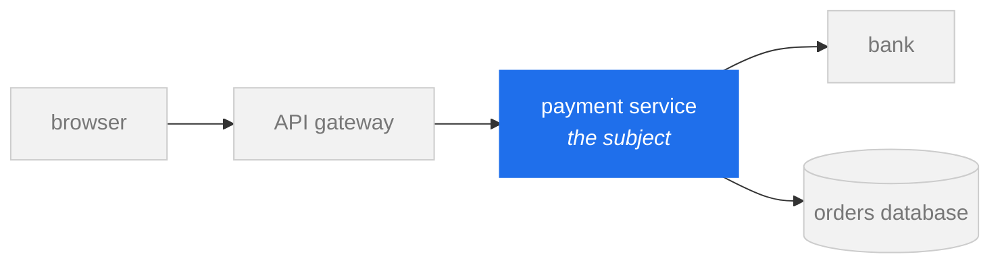
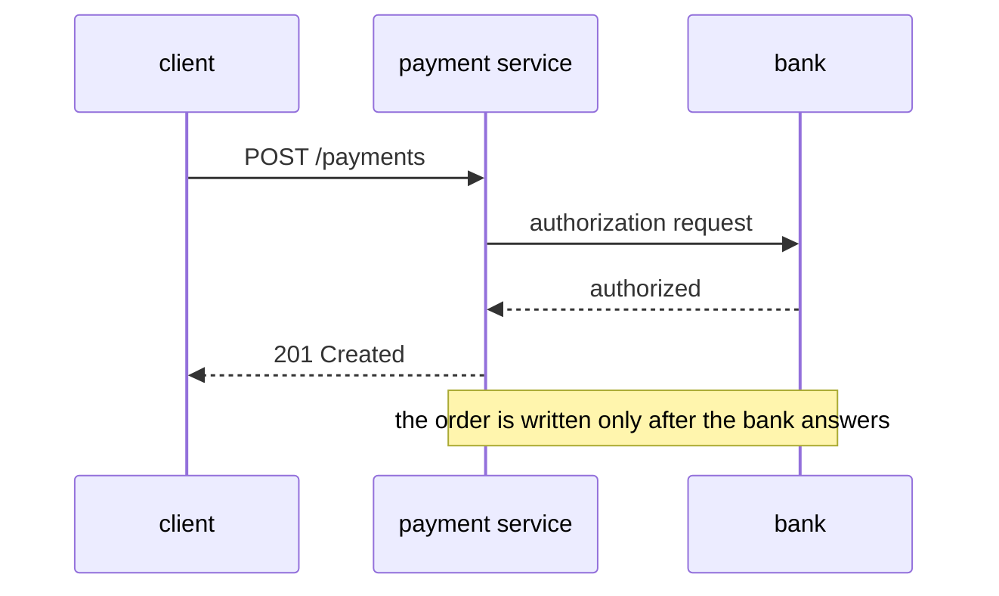
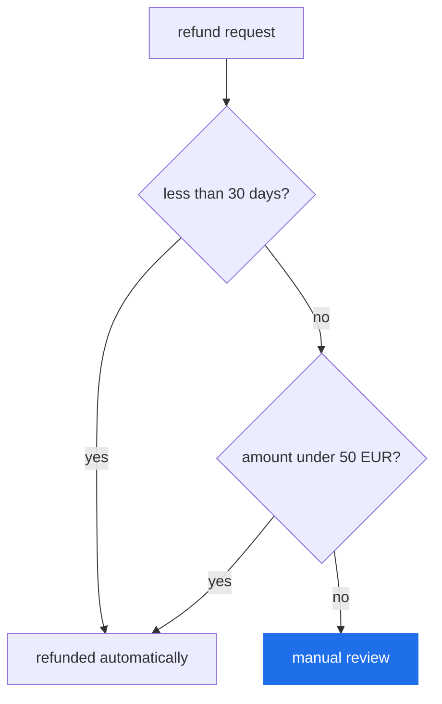
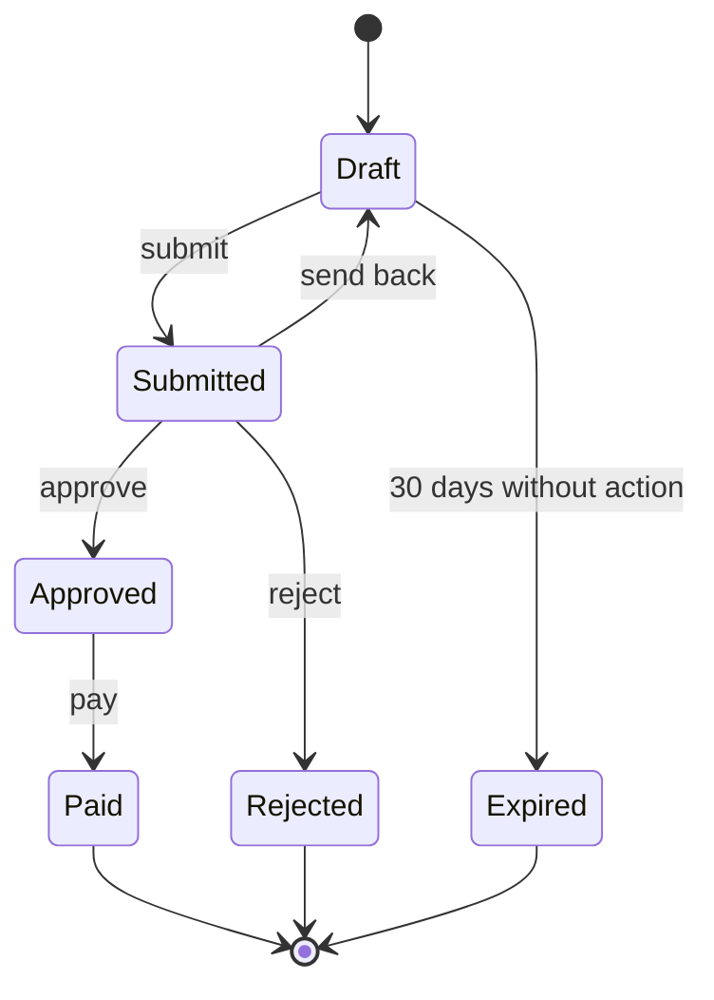
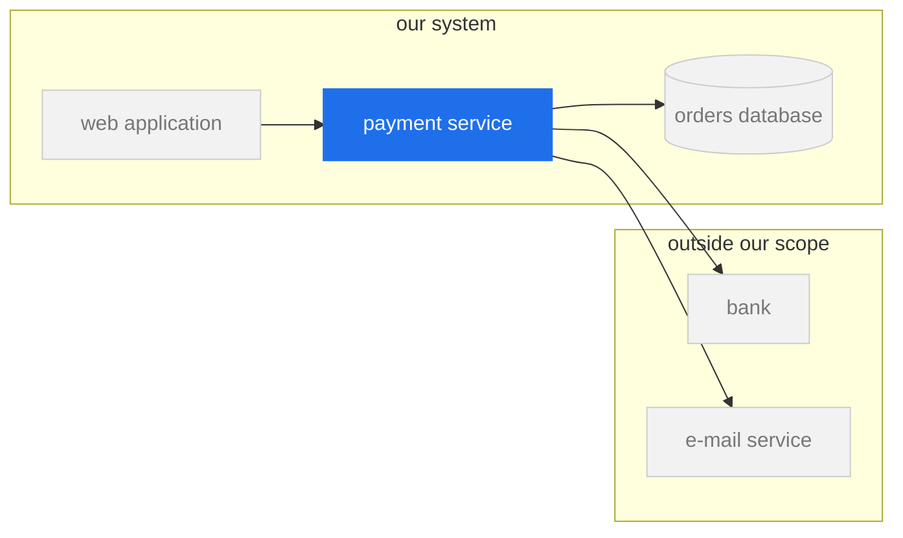
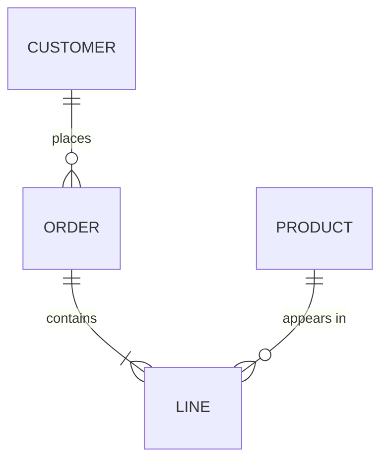

# Le catalogue des visuels : une question, une forme, un exemple

Ce fichier ne se lit pas d'affilée : on y vient avec une question à laquelle un visuel doit répondre.
Chaque type porte la question qu'il sert, un exemple Mermaid minimal, et son piège.

> Les libellés Mermaid restent sans accents, comme dans le reste du pack : ils finissent dans des
> sources et des pages où un problème d'encodage coûte plus cher que le confort de lecture. Et jamais
> de point-virgule dans un libellé : le parseur le prend pour une fin d'instruction.

## Le cadrage, en Mermaid : le sujet en accent, le contexte en gris

Le geste de la section 8 de `SKILL.md` tient en deux classes, réutilisées dans tous les exemples
ci-dessous : `focus` pour le sujet, `ctx` pour le contexte nécessaire. Tout le reste n'est pas dessiné.

Trois règles pour que ça marche :

- **un seul nœud en `focus`** par visuel. Deux sujets, deux visuels ;
- **le contexte ne porte pas de détail interne** : un nom, pas de méthodes ni de champs ;
- **la même couleur désigne la même chose dans tout le document.** Si le service de paiement est en
  accent ici, il ne devient pas vert trois figures plus loin.

## Qui parle à qui, dans quel ordre : la séquence

Pour un protocole, un appel entre services, un enchaînement asynchrone. Le temps descend.

Piège : dessiner **tous** les participants du système. Une séquence montre les acteurs du scénario, et
pour le reste une seule boîte « autres services » suffit. Et la `Note` porte le message du diagramme,
celui que le titre répète.

## Quelles étapes, quelles décisions : le flux

Pour un algorithme, un processus, une règle métier avec des branches.

Piège : un flux qui dépasse une dizaine de nœuds cache presque toujours deux flux. Le couper au point
où une étape devient elle-même un processus, et renvoyer vers le second.

## Par quels états passe cet objet : le diagramme d'états

Pour un cycle de vie (une commande, un ticket, une connexion), et surtout pour montrer les transitions
**interdites**, qui ne se voient dans aucun autre visuel.

Piège : oublier les états d'erreur et d'expiration. Un cycle de vie sans eux décrit le cas heureux, pas
l'objet.

## Qu'est-ce qui contient quoi, où sont les frontières : le contexte

Pour situer un élément avant d'en parler : c'est le plan d'ensemble. Le modèle C4 de Simon Brown
propose quatre niveaux de zoom (contexte du système, conteneurs, composants, code) ; un visuel reste
sur **un** niveau. Les frontières sont des cadres (`subgraph`), pas des phrases.

Piège : mélanger les niveaux, par exemple un conteneur entier à côté d'une classe. C'est l'équivalent
visuel d'une phrase qui change de sujet au milieu.

## Quelles données, quelles relations : le diagramme entité-relation

Pour un schéma de données. Quand il existe une base réelle, le **générer** depuis son schéma plutôt que
le dessiner (voir `explorer-le-code`, et l'échelle de `doc-derivee`).

Piège : afficher toutes les colonnes. Le diagramme montre les relations ; les colonnes qui comptent pour
le message se nomment, les autres vont dans la référence.

## Quand, et combien de temps : la chronologie

Pour un incident, un plan, une migration par étapes.

```mermaid
gantt
  dateFormat HH:mm
  axisFormat %H:%M
  section Incident
  Deploying v2.3             :done, d1, 14:02, 3m
  500 errors rising          :crit, e1, 14:05, 22m
  Alert received             :milestone, a1, 14:19, 0m
  Rollback to v2.2           :done, r1, 14:24, 3m
```

Piège : une chronologie sans les écarts qui comptent. Dans un post-mortem, l'information est souvent
l'intervalle entre le début du problème et l'alerte : il doit se voir sans calcul.

## Les graphiques de données

### Choisir par la relation qu'on veut montrer

Le *Visual Vocabulary* du Financial Times range les graphiques en neuf familles, selon la relation à
montrer : écart, corrélation, classement, distribution, évolution dans le temps, ordre de grandeur,
part d'un tout, spatial, flux. Nommer la relation d'abord, choisir la forme ensuite.

| La relation | La forme par défaut | À éviter |
|---|---|---|
| classement, ordre de grandeur | barres horizontales, **triées** | barres dans l'ordre alphabétique |
| évolution dans le temps | une ligne | des barres quand il y a beaucoup de points |
| distribution | histogramme, boîte à moustaches | une moyenne seule |
| part d'un tout | barres empilées à 100 % | le camembert au-delà de trois parts |
| écart à une référence | barres divergentes autour de la référence | deux séries brutes à comparer de tête |
| corrélation | nuage de points | deux lignes sur deux axes différents |
| plusieurs séries à comparer | petits multiples : le même graphique répété, un par série, sur les mêmes axes (Tufte) | un seul graphique à dix lignes superposées |

### Ce que l'œil lit bien, et mal

Cleveland et McGill (1984) ont mesuré la précision des lectures : une **position sur une échelle
commune** se compare le mieux, puis une longueur, puis un angle ou une pente, puis une surface, un
volume, une teinte. D'où la plupart des règles ci-dessous.

### Les règles qui font la différence

- **le titre est le message** : « les erreurs ont doublé après la v2.3 », pas « Erreurs par jour » ;
- **une couleur d'accent, le reste en gris** : la série qui porte le message est la seule en couleur ;
- **étiqueter directement** la série au bout de sa ligne, plutôt qu'une légende à déchiffrer ;
- **les barres partent de zéro.** Une barre tronquée ment sur la proportion ; une ligne peut ne pas
  partir de zéro, parce qu'on y lit une pente ;
- **pas de 3D, pas d'ombre, pas de quadrillage appuyé** : c'est l'encre qui ne porte aucune donnée,
  ce qu'Edward Tufte appelle le *chartjunk* ;
- **le chiffre porte son unité et son dénominateur** jusque dans l'axe : « % des 148 runs », pas « % » ;
- **le graphique porte la commande qui le régénère** (voir `rendre-l-etat-visible`).

## La liste de contrôle d'une figure

Avant de la livrer, chaque figure répond oui à ces huit questions :

1. elle répond à **une** question, et son **titre est la réponse** ;
2. son **type** est celui de la question (tableau en tête de fichier) ;
3. elle reste sur **un seul niveau de zoom**, et un plan d'ensemble la précède si le lecteur ne sait pas
   où elle se situe ;
4. **un seul** élément est en accent ; le contexte est présent, atténué ; le reste n'est pas dessiné ;
5. la **légende est sur la figure**, à côté de ce qu'elle désigne ;
6. elle est **dans la section qu'elle sert**, pas dans une galerie ;
7. les **couleurs et les formes** ont le même sens que dans les autres figures du document ;
8. elle se comprend **en trois secondes** projetée, et elle porte la **commande qui la régénère** si
   elle doit durer.
