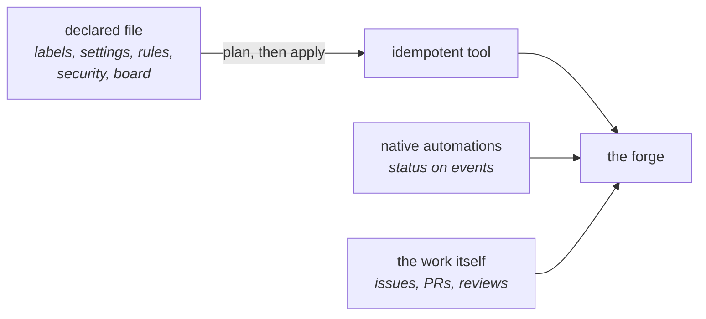
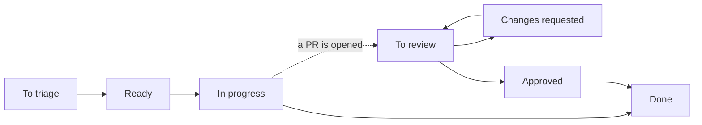

# Tenir la forge

*En une phrase : un dépôt est lu par des gens qui ne te connaissent pas, donc tout ce qui dit comment
on y travaille est déclaré dans un fichier, appliqué par un outil, et vérifiable en une commande.*

Les faits propres à GitHub (limites par offre, ce que l'API expose, ce qui est réservé aux
organisations) sont dans [`references/github.md`](references/github.md), avec leur date de
vérification et leurs sources. Ils changent plus vite que les règles de ce fichier.

## 1. Quand le charger

Ce skill ne suit pas le cycle de `cycle-de-dev` : il répond à un événement.

| Événement | Ce qu'on regarde |
|---|---|
| un dépôt est créé | les sections 2 à 8, dans l'ordre |
| un dépôt devient public | la sécurité (section 7) et les fichiers qui accueillent (section 8), avant de l'annoncer |
| un premier contributeur externe, ou un premier bot qui ouvre des PR | les règles de la branche (section 6), puis le board (section 4) |
| plusieurs dépôts forment un produit, ou on range un compte | le cycle de vie (section 9), puis le board |
| des dépôts déménagent vers une organisation | la section 9, ce qui casse au déménagement |

`tracer-le-travail` tient la trace d'**un** travail, de l'item au merge. Ce skill tient le cadre où
tous ces travaux vivent : les étiquettes que l'item porte, le board où il avance, la règle que son merge
franchit.

## 2. Trois couches, et chacune a sa place

Un dépôt mélange trois sortes de réglages. Les confondre donne soit un clic que personne ne sait
refaire, soit un script qui se bat contre la plateforme.

| Couche | Exemples | Où elle vit | Qui la change |
|---|---|---|---|
| **la config posée** | étiquettes, méthode de fusion, règles de branche, sécurité, champs et vues du board | un fichier versionné, appliqué par un outil qui montre son plan avant d'écrire | une PR sur ce fichier |
| **les automatismes de la plateforme** | le statut qui passe à « fait » quand la PR est fusionnée | les réglages de la plateforme | un humain, une fois, puis on copie |
| **le travail** | une issue, une PR, une revue, un statut qui avance | la forge | ceux qui travaillent, humains ou bots |

Trois règles :

- **un réglage a une seule source.** Un réglage changé à la main alors qu'un fichier le déclare est une
  dérive : l'outil la montre dans son plan, et on corrige soit le réglage, soit le fichier. C'est
  `doc-derivee` appliqué aux réglages, et la règle « versionné et relu » de `garder-les-frontieres` ;
- **l'outil montre avant d'écrire.** Un plan sans écriture par défaut, l'écriture sur un drapeau
  explicite, et un second passage qui ne propose plus rien. Si le second passage propose encore quelque
  chose, l'outil et la plateforme ne sont pas d'accord sur l'état, et c'est un défaut de l'outil ;
- **ce que la plateforme n'expose pas se règle à la main, une fois, et s'écrit.** Certains automatismes
  n'ont pas d'API. On règle un projet de référence, on le copie pour les suivants, et la procédure
  manuelle vit à côté du fichier, avec la date de sa dernière vérification.

## 3. Les étiquettes : un ensemble, et un vocabulaire fermé

**Une étiquette dit de quel genre est un travail, où il se passe, et quelle aide il attend.** Elle ne
dit jamais où il en est, à quel point il est urgent, ni dans quelle version il sort : ces trois-là n'ont
qu'une valeur à la fois, et une étiquette est un ensemble (`tracer-le-travail`, section 1). Le statut,
la priorité et la taille vont dans des champs à choix unique du board. La version se dérive des
commits.

| Famille | Exemples | Règle |
|---|---|---|
| le genre | `type:bug`, `type:feature`, `type:docs`, `type:chore` | une par item. Là où la plateforme offre des types d'issues natifs, ils remplacent cette famille |
| la zone | `zone:kernel`, `zone:net` | propre à chaque dépôt, déclarée avec lui |
| l'appel à l'aide | `good first issue`, `help wanted` | **le nom exact** : la plateforme les lit pour montrer le dépôt aux nouveaux venus |
| les bots | `dependencies`, `claude`, `claude:hold` | celles qu'un bot pose ou écoute, sous le nom qu'il attend |

Cinq règles :

- **le préfixe dit la famille, et la couleur aussi.** Un relecteur qui parcourt une liste voit le genre
  sans lire ;
- **chaque étiquette a une description.** C'est elle qui s'affiche au survol et dans le sélecteur. Une
  étiquette sans description se devine, et chacun la devine autrement ;
- **la liste est fermée, et l'outil la vérifie.** N'importe qui peut créer une étiquette. L'outil liste
  celles que le fichier ne déclare pas, et c'est le fichier qui décide ;
- **on renomme, on ne supprime pas.** Renommer garde l'étiquette sur toutes les issues qui la portent ;
  supprimer l'efface de partout. Une migration de vocabulaire est une table de renommage, et l'outil
  refuse par défaut de supprimer une étiquette encore portée ;
- **ce que la plateforme dit déjà n'a pas d'étiquette.** Une issue se ferme comme doublon ou comme non
  prévue, et cette raison de fermeture existe : `duplicate`, `wontfix` et `invalid` la recopient à la
  main. De même, `major`, `minor` et `patch` recopient ce que disent déjà les commits conventionnels
  (`tracer-le-travail`, section 4).

## 4. Le board : une vue par question

Un board sert à répondre à des questions. **Chaque vue porte dans son nom la question à laquelle elle
répond**, et une vue qui ne répond à aucune question se supprime.

Le statut est un champ à valeur unique, avec une seule liste pour les issues et les PR, dans l'ordre où
le travail avance :

Une issue parcourt la ligne du haut, une PR celle du bas. Les changements viennent d'événements que la
plateforme connaît : un item ajouté, une PR liée à l'issue, des changements demandés, une approbation,
une fusion, une fermeture, une réouverture.

| La question | La vue | Ce qu'elle montre |
|---|---|---|
| quoi faire ensuite ? | une table triée par priorité | les issues ouvertes à trier ou prêtes, celles sans priorité en tête |
| qu'est-ce qui attend ma relecture ? | une file, comme une boîte de réception | les PR ouvertes à relire ou en changements demandés, sans les mises à jour de dépendances |
| où en est le bot ? | des colonnes par phase du bot | les items qu'on lui a confiés |
| qu'est-ce qui attend ma réponse ? | une liste courte | les questions qu'un bot a posées, et ce qu'il a déclaré bloqué |
| où va le projet ? | une feuille de route par dépôt et par jalon | les issues ouvertes, avec leurs sous-issues en hiérarchie |
| qu'est-ce qui traîne ? | une table triée par ancienneté | ce qui est en cours ou à relire sans mouvement depuis quelques jours |
| qu'est-ce qui est sorti ? | une table des items faits récemment | la matière des notes de version et du point d'étape |
| par où commencer, pour un nouveau venu ? | une vue publique | les `good first issue` ouvertes |

Quatre règles :

- **un board par produit, pas par dépôt.** Un produit qui vit dans cinq dépôts a un seul board, avec
  une colonne pour le dépôt. Avec cinq boards, il faut les ouvrir tous pour savoir quoi faire ;
- **les statuts avancent par automatismes.** Un statut qu'on avance à la main à chaque étape est faux
  au bout d'une semaine. Le seul geste humain est le premier tri : la priorité, et le passage de « à
  trier » à « prêt » ;
- **ce que la plateforme ne voit pas, le bot l'écrit.** La phase d'un bot (cadrage, brouillon, CI, en
  revue, bloqué) n'est pas un événement de la plateforme : le bot la reporte lui-même dans un champ à
  lui, qu'aucun humain ne modifie ;
- **un board d'équipe ne se transpose pas à un mainteneur seul.** Une file de relecture sans autre
  auteur que soi ne contient que ses propres PR. Elle devient utile quand quelqu'un d'autre produit ce
  qu'il faut relire : un contributeur, ou un bot.

## 5. Les jalons pour les versions, les itérations pour le temps

| | Jalon | Itération |
|---|---|---|
| répond à | qu'est-ce qui sort ensemble dans la prochaine version de ce dépôt ? | qu'est-ce qu'on fait sur cette période, tous dépôts confondus ? |
| vit | dans un dépôt | dans le board |
| se ferme | quand la version est publiée | quand la période se termine ; ce qui reste glisse à la suivante |

Quatre règles :

- **un seul outil par question.** Des jalons mensuels et des itérations mensuelles disent deux fois la
  même chose, et divergent au premier report ;
- **pas d'itération avant que la question se pose.** Pour un mainteneur seul sans échéance, une
  itération est un rituel : le statut, la priorité et les jalons de version suffisent. On l'ajoute le
  jour où « qu'est-ce que je fais ce mois-ci ? » devient une vraie question, ou quand une échéance
  externe existe (un prix, une conférence, un client) ;
- **un jalon porte une date quand quelqu'un d'extérieur l'attend**, et pas sinon. Un jalon daté puis
  dépassé en silence apprend à tout le monde que les dates ne veulent rien dire ;
- **le numéro d'un jalon suit la question de `tracer-le-travail`, section 4.** Une bibliothèque garde
  SemVer, une application peut suivre sa cadence.

## 6. La branche principale d'un mainteneur seul

Les règles d'une équipe supposent quelqu'un pour approuver. Seul, on garde ce qu'elles protègent, et
on retire ce qui suppose un deuxième humain.

| Règle | Ce qu'elle protège | Le piège |
|---|---|---|
| une PR obligatoire | chaque changement passe par la CI et laisse une trace qu'on peut relire | un auteur ne peut pas approuver sa propre PR : seul, on garde la PR obligatoire avec zéro approbation requise, et aucun contournement pour un push direct |
| les checks de la CI requis | rien n'atterrit rouge | un job renommé bloque toutes les PR ; et sans CI, aucun check ne peut être requis, donc il faut écrire la CI d'abord |
| ni force-push ni suppression | l'histoire publiée ne se réécrit pas | aucun |
| une seule méthode de fusion | `tracer-le-travail`, section 9 | la règle et les réglages du dépôt doivent dire la même méthode |
| l'histoire linéaire | une histoire sans commits de fusion | incompatible avec le commit de fusion, que `tracer-le-travail` recommande pour des commits tenus |
| les commits signés | on sait qui a écrit | la plateforme vérifie aussi les commits de la branche : **un seul commit non signé bloque la fusion, même en squash**. Un bot sans clé ne passe donc qu'avec un contournement admin réglé « pour les PR seulement », et lui donner une clé revient à lui confier un secret (`garder-les-frontieres`) |
| des approbations requises | un deuxième regard | seul : aucune approbation requise, et une vraie relecture quand un bot est l'auteur |

Deux pièges hors des règles :

- **un workflow qui pousse sur la branche principale** (un bump de version, un changelog régénéré)
  casse le jour où la PR devient obligatoire. La forme qui survit, c'est la PR de version : le workflow
  ouvre une PR, et la fusionner publie ;
- **modifier une règle par l'API remplace toute la liste des contournements.** L'outil envoie donc la
  règle complète, et son plan montre les contournements. Sinon une mise à jour retire l'accès admin sans
  que rien ne le dise.

## 7. La sécurité qu'un dépôt public a gratuitement

À régler avant d'ouvrir un dépôt au public, et à vérifier sur ceux qui le sont déjà :

- **la détection de secrets et la protection au push**, pour qu'un jeton poussé soit refusé au lieu
  d'être découvert après coup. Un secret déjà poussé se change, il ne se retire pas (`garder-les-frontieres`,
  section 3) ;
- **les alertes de dépendances et leurs mises à jour de sécurité** ;
- **le signalement privé d'une faille**, et un `SECURITY.md` qui y renvoie. Sans lui, une faille arrive
  dans une issue publique ;
- **l'analyse statique de la plateforme** quand le langage est couvert, lue à la porte de merge
  (`garder-les-frontieres`, section 4) ;
- **des jetons à la portée minimale.** Un outil qui gère un board a besoin de la portée des projets. Un
  jeton qui ouvre tous les dépôts, rangé en secret dans chacun pour alimenter un board, donne ces droits
  à quiconque peut modifier un workflow. Mieux vaut un outil lancé avec la session de son propriétaire,
  ou une application aux permissions données dépôt par dépôt ;
- **une portée borne un jeton, pas une clé SSH.** Un bot qui pousse par SSH n'est pas limité par la
  portée de son jeton : avant de compter sur une portée absente, vérifier par quel canal le bot pousse.

## 8. Les fichiers qui accueillent

| Fichier | Ce qu'il dit | Hérité d'un dépôt `.github` du compte ? |
|---|---|---|
| `README` | ce que c'est, comment le lancer, son état (actif, naissant, legacy) | non |
| `LICENSE` | ce qu'on a le droit d'en faire. Sans licence, personne n'a le droit de le réutiliser | non, jamais |
| `CONTRIBUTING` | le flux de `tracer-le-travail` : issue, branche, commits, PR, changelog | oui, pour le flux ; les commandes de build et de test restent dans le dépôt |
| `CODE_OF_CONDUCT` | comment on se parle, et à qui signaler | oui |
| `SECURITY` | où signaler une faille, en privé | oui |
| `SUPPORT` | où poser une question qui n'est pas un défaut | oui |
| gabarits d'issue et de PR | les questions que l'auteur remplit | oui, mais par dossier entier |
| `CODEOWNERS` | qui relit quelle zone | non, chaque dépôt a le sien. Seul, il sert quand même : la plateforme demande la revue de son propriétaire sur chaque PR d'un contributeur ou d'un bot |

Six règles :

- **la racine garde ce qu'un humain ouvre en premier**, c'est-à-dire le `README`, la `LICENSE` et le `CHANGELOG`.
  Tout ce que la plateforme sait lire dans le dossier `.github/` y va : `CONTRIBUTING`,
  `CODE_OF_CONDUCT`, `SECURITY`, `SUPPORT`, `FUNDING`, `CODEOWNERS`, les gabarits, les workflows et la
  config des mises à jour de dépendances. La licence reste à la racine, parce que c'est là que la
  plateforme la détecte ;
- **`CODEOWNERS` demande la revue, il n'exige pas l'approbation tant qu'on est seul.** Exiger
  l'approbation du propriétaire d'une zone bloque toutes ses propres PR, puisqu'un auteur ne s'approuve
  pas. Chaque nom qu'il cite doit avoir le droit d'écrire sur le dépôt, sinon la ligne ne sert à rien ;
- **le générique va dans le dépôt `.github` du compte, le propre au dépôt reste dans le dépôt.** Le
  repli se fait par type de fichier : un dépôt qui a son propre dossier de gabarits d'issue n'hérite
  d'aucun des gabarits par défaut. Les commandes de build, les zones et l'état vont dans le `README` du
  dépôt, ou dans `docs/` quand ils sont longs ;
- **un gabarit d'issue pose les quatre questions de `tracer-le-travail`**, c'est-à-dire ce qui est
  demandé, ce qui est vrai aujourd'hui, ce qui manque, et comment on saura que c'est fini. Un
  gabarit de bug y ajoute la reproduction. **Un gabarit de PR porte les quatre sections** de sa section 6 : quoi, pourquoi, comment
  vérifier, et ce qui n'est pas dedans. Personne ne lit une liste de douze cases à cocher, et une case
  obligatoire du genre « j'ai lu le code de conduite » apprend à cocher sans lire ;
- **un formulaire d'issue n'interprète rien.** Il n'a pas de variable, une étiquette qui n'existe pas
  n'est pas posée et rien ne le signale, et l'ajout au board demande que l'auteur ait le droit d'écrire
  sur le board. Pour un contributeur externe, c'est l'automatisme d'ajout du board qui s'en charge ;
- **une question n'est pas une issue** quand le dépôt a un espace de discussion : le gabarit de
  question renvoie vers lui.

## 9. Le cycle de vie d'un dépôt

| État | Ce qu'il promet | Sur la forge |
|---|---|---|
| **actif** | on répond aux issues, la CI tourne, les règles de la section 6 tiennent | ouvert, sur le board du produit |
| **naissant** | ça bouge, rien n'est stable, version `0.y.z` | ouvert, et le `README` le dit en tête |
| **legacy** | fini et mis de côté, gardé pour son histoire ou comme référence | archivé : lecture seule, toujours visible, réversible |
| **essai abandonné** | rien | privé ou archivé. Supprimé seulement par son propriétaire, jamais par un outil |

Trois règles :

- **l'état affiché se dérive, il ne s'écrit pas.** Un site ou un `README` qui dit « actif » pour un
  dépôt archivé ment. L'outil vérifie les critères de chaque état : un dépôt actif a sa CI, sa règle
  de branche et sa sécurité ;
- **archiver plutôt que supprimer.** Archiver se défait en un clic et garde tous les liens. Supprimer
  casse chaque lien entrant, et les seules copies qui restent sont les forks des autres ;
- **déménager vers une organisation garde moins qu'on ne croit.** Les redirections suivent le dépôt, ses
  issues, ses PR et ses étoiles. Elles ne suivent pas l'adresse du site statique, le chemin des images
  publiées dans le registre, ni les URL écrites en dur, qui ne marchent que par redirection et cassent
  le jour où un dépôt reprend l'ancien nom. La config déclarée, elle, se rejoue telle quelle sur le
  nouveau propriétaire : c'est ce qui rend le déménagement bon marché.

## Les anti-patterns, et leur signature

- **le statut en étiquette.** Signature : une issue qui porte `in progress` et `done` en même temps ;
- **l'étiquette de version.** Signature : `major`, `minor` ou `patch` posées à la main sur des PR aux
  commits conventionnels ;
- **le vocabulaire qui dérive.** Signature : `bug`, `Bug`, `fix` et `type:bug` sur le même dépôt ;
- **la suppression d'étiquette.** Signature : un vocabulaire migré, et les anciennes issues qui ne
  portent plus rien ;
- **le réglage cliqué.** Signature : personne ne sait refaire la config d'un dépôt sur le suivant ;
- **les trois méthodes de fusion.** Signature : une histoire qui mélange squash, rebase et commits de
  fusion ;
- **le board de l'équipe d'à côté.** Signature : une file de relecture qui ne contient que ses propres
  PR ;
- **le jeton qui ouvre tout.** Signature : un jeton aux droits sur tous les dépôts, rangé en secret dans
  chacun pour alimenter un board ;
- **la case obligatoire.** Signature : un gabarit de bug qui exige d'avoir lu le code de conduite ;
- **l'état écrit à la main.** Signature : un dépôt archivé présenté comme actif sur le site du projet.

## La porte de sortie

Avant de déclarer un dépôt ou un board tenu, ces sept réponses doivent exister :

1. la config du dépôt est **déclarée dans un fichier versionné**, et l'outil qui l'applique **ne
   propose plus aucun changement** au second passage, lancé à l'instant ;
2. les étiquettes forment une **liste fermée**, chacune avec sa description, et aucune ne dit un
   statut, une priorité ou une version ;
3. le statut, la priorité et la taille sont des **champs à choix unique** du board, et **chaque vue
   porte dans son nom la question** à laquelle elle répond ;
4. **une seule méthode de fusion** est activée, et la branche principale a **une règle qu'un
   mainteneur seul franchit** sans la désactiver ;
5. la détection de secrets, la protection au push, les alertes de dépendances et le **signalement
   privé** sont actifs, et `SECURITY.md` dit où signaler ;
6. les fichiers qui accueillent sont **présents ou hérités**, et les gabarits portent les quatre
   questions de l'item et les quatre sections de la PR ;
7. ce que la plateforme ne laisse pas régler par l'API est **écrit avec sa procédure manuelle**, et a
   été vérifié à la main aujourd'hui.
