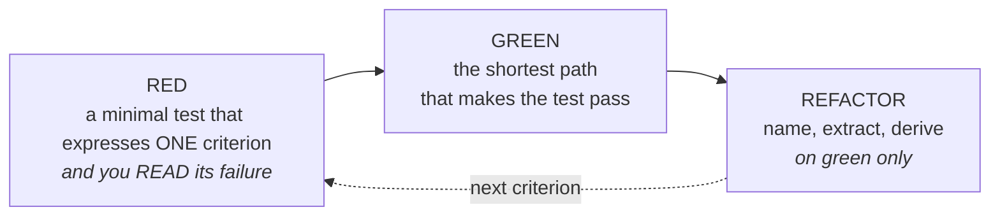

# Les tests d'abord, parce qu'un test écrit après épouse le code

*En une phrase : décrire ce qu'on veut constater, le transformer en test qui échoue, et n'écrire le
code qu'ensuite.*

Un test écrit après l'implémentation ne vérifie pas le comportement **voulu** : il vérifie le
comportement **obtenu**. Il passe du premier coup, il rassure, et il ne détectera jamais le défaut
qu'il aurait dû empêcher, puisqu'il a été écrit en le regardant.

## 1. Les critères d'acceptation, avant le premier test

Un critère d'acceptation décrit **ce qu'on pourra constater de l'extérieur**. La forme importe peu,
une propriété est non négociable : **il doit être falsifiable**, c'est-à-dire qu'on doit pouvoir dire
ce qui, concrètement, le rendrait faux.

| Pas un critère | Un critère |
|---|---|
| « le module doit être robuste » | « une entrée de plus de 10 Mo est refusée avec le code `PAYLOAD_TOO_LARGE`, sans allouer le tampon » |
| « les performances doivent être bonnes » | « 1 000 éléments traités en moins de 200 ms sur la machine d'intégration » |
| « l'utilisateur voit ses données » | « un manager voit les 3 collaborateurs de son équipe, et aucun autre » |

Deux pièges de formulation qui coûtent cher plus tard :

- **le critère qui décrit l'implémentation** (« la méthode appelle le cache ») : il interdit tout
  refactor et ne dit rien de ce que l'utilisateur obtient ;
- **le critère sans cas négatif.** Ce qui doit **échouer** est au moins aussi important que ce qui
  doit réussir, et c'est presque toujours la moitié oubliée. Une règle d'accès sans son cas de refus
  n'est pas testée, elle est illustrée.

## 2. Rouge, vert, refactor, et le rouge est l'étape qu'on saute

**Le rouge n'est pas une formalité, c'est la seule preuve que le test teste.** Un test qu'on n'a
jamais vu échouer ne prouve rien du tout.

Et il ne suffit pas qu'il soit rouge : **il doit être rouge pour la bonne raison.** Il faut lire le
message. Un test rouge sur une exception de pointeur nul dans le montage, ou sur un import qui ne se
résout pas, ne teste pas encore le comportement visé, il teste que le montage est cassé.

Trois règles pour tenir le cycle :

- **un seul critère à la fois** en phase rouge. Écrire trois tests d'un coup, c'est se priver du
  signal de chacun ;
- **le chemin le plus court** en phase verte. Généraliser « tant qu'on y est » produit du code que
  rien ne demandait, donc que rien ne teste ;
- **on ne refactore qu'à vert, et un seul axe à la fois.** Refactorer au rouge, c'est deux causes
  possibles pour un même échec et un débogage qui double de longueur.

## 3. Quel niveau de test, arbitré par le coût de diagnostic

Ni dogme ni pyramide récitée. La question utile : **quand ce test rougira, combien de temps faudra-t-il
pour savoir pourquoi ?**

| Niveau | Ce qu'il attrape | Son coût réel |
|---|---|---|
| unitaire | une règle fausse | diagnostic quasi instantané, mais aveugle au câblage |
| intégration, contrat | un câblage faux, un schéma qui a bougé | plus lent, mais nomme encore la couche |
| bout en bout | « le produit ne marche pas » | le plus lent à diagnostiquer, et **le seul qui prouve que ça marche** |

Ce qui décide : **mettre la garantie au niveau le plus bas qui puisse la porter.** Une règle métier
testée de bout en bout est une garantie chère et lente pour rien ; un câblage testé unitairement n'est
pas testé du tout.

## 4. Les doubles, du plus fiable au moins fiable

Un *double* est un faux objet qu'on met à la place d'une vraie dépendance pour tester sans elle.

- **fake** : une vraie implémentation, simplifiée (un dépôt en mémoire). Il se comporte comme le vrai,
  donc le test reste vrai après un refactor. **À préférer presque toujours ;**
- **stub** : il rend une réponse fixe. Utile pour poser un état de départ ;
- **mock** : il vérifie qu'un appel a bien eu lieu. **À réserver** aux cas où l'appel *est* le
  comportement attendu, on a bien publié l'événement, on a bien envoyé la notification.

Deux règles qui évitent les suites qui cassent sans raison :

- **ne pas simuler ce qu'on ne possède pas.** Simuler une bibliothèque tierce figerait *ta
  compréhension* de son comportement ; le jour où elle change, ton double reste vert et la production
  casse. Envelopper la bibliothèque dans une interface à toi, et simuler celle-là ;
- **un test plein de mocks teste le câblage, pas le comportement.** Signature : il casse à chaque
  refactor sans qu'aucun comportement n'ait changé. C'est un test de structure, il coûte plus qu'il
  ne rapporte.

## 5. Les tests qui mentent, le seul mode d'échec pire que pas de test

Un test rouge coûte du temps. **Un test vert qui ne vérifie rien coûte la confiance**, et il la crée
exactement là où il n'y a aucune garantie. Les formes à reconnaître :

- **l'assertion absente** : le test exécute et n'affirme rien. Vert par construction ;
- **l'assertion tautologique** : comparer une valeur à elle-même, ou à une valeur calculée par le code
  qu'on teste ;
- **l'attente qui absorbe l'échec** : un `try`/`catch` autour de l'assertion, ou un test qui sort tôt
  quand la donnée manque au lieu d'échouer. Le cas n'est pas vérifié, et rien ne le dit ;
- **le dénominateur silencieux** : le test boucle sur un ensemble qui se trouve être vide. Vert.
  **Une égalité sur zéro n'est pas une égalité** : quand un test parcourt un corpus, il doit d'abord
  **refuser un corpus vide** ;
- **le leurre mal formé** : la donnée de test a le bon contenu mais pas la bonne **forme**, un
  identifiant qui ressemble sans respecter le motif réel, une structure aplatie là où le vrai flux est
  ligne à ligne. On épingle alors sa propre erreur, ce qui est pire que rien.

> **Vérifier un leurre contre la source, comme une mesure.** Quand un test et le code sont en
> désaccord, ce n'est pas toujours le code qui a tort, et un leurre inventé de mémoire a tort plus
> souvent qu'on ne le croit.

## 6. Un bug égale un test rouge avant le correctif

Toujours dans cet ordre, et sans exception :

1. **reproduire** le bug par un test qui échoue ;
2. **vérifier** que son échec ressemble au symptôme rapporté, sinon on reproduit autre chose ;
3. **corriger** ;
4. **vérifier** que le test passe, et **que lui seul** a changé d'état.

Sans l'étape 1, on ne sait pas qu'on a corrigé le bug : on sait qu'on a changé quelque chose et que le
symptôme a disparu de la fenêtre où on regardait. Le test de non-régression est le seul livrable qui
empêche le bug de revenir, et **c'est lui qu'on garde**, pas le correctif.

## 7. Déterminisme : un test intermittent est un test faux

Un test qui échoue une fois sur dix sera désactivé, et il aura raison de l'être : il ne porte plus
d'information. Les quatre sources, toutes évitables à la conception :

| Source | Ce qu'on fait |
|---|---|
| l'horloge | injecter le temps (voir `concevoir-avant-coder`). Jamais de « maintenant » dans une règle métier |
| l'aléatoire, les identifiants générés | injecter la graine, ou le générateur |
| l'ordre, la concurrence | ne jamais dépendre de l'ordre d'un ensemble non ordonné |
| l'état partagé entre tests | chaque test crée ce qu'il consomme, et **les données créées portent un suffixe unique** : une valeur en dur passe au premier tour et entre en collision au deuxième |

**Ne jamais déclarer un test intermittent guéri sur un seul tour vert.** Le dénominateur minimal est
dix. Et quand plusieurs acteurs écrivent au même endroit, chercher **qui d'autre** touche ce chemin
avant d'exonérer son propre code sur la foi du type d'exception.

## La porte de sortie

- chaque critère d'acceptation a **au moins un test**, et les cas négatifs aussi ;
- chaque test a été **vu rouge**, pour la bonne raison ;
- aucun test n'a été affaibli, ignoré ou commenté pour atteindre le vert ;
- la suite passe **deux fois de suite** sur la même machine, sans nettoyage manuel entre les deux.
