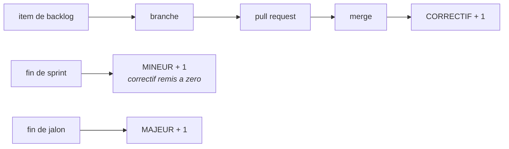

# Tracer le travail

*En une phrase : tout ce qui suit sert à ce qu'un lecteur futur, souvent toi dans trois mois, puisse
répondre « pourquoi ce code est-il comme ça ? » sans demander à personne.*

Chaque artefact ci-dessous existe parce qu'une réponse doit survivre au départ de celui qui l'avait en
tête.

## 1. Le backlog : un item, une unité, jamais un document unique

**La seule règle non négociable : un item égale une unité indépendante**, qui se crée, se modifie et se
clôt sans toucher au voisin. Un document unique qui les liste tous entre en conflit à chaque édition
parallèle et devient le goulot par lequel toute information doit passer.

Où vivent ces unités est en revanche un **vrai choix**, avec deux réponses défendables.

### Les deux réponses, et la question qui décide

| | **Fichiers dans le dépôt** | **Issues de la forge** (GitHub, GitLab) |
|---|---|---|
| lien vers branche, PR, revue | une convention de nommage, tenue par la discipline | **une relation de données**, tenue par la plateforme |
| lisible sans réseau ni jeton | **oui**, un outil local le lit directement | non, il faut l'API |
| état du backlog à un commit donné | **récupérable**, il est versionné avec le code | perdu : l'historique des issues n'est pas lié au code |
| format imposable | **oui**, un test peut refuser un item mal formé | approximable : gabarit d'issue plus contrôle automatique |
| collaboration hors développeurs | faible, il faut cloner | **forte** |
| dépendance à un fournisseur | aucune | réelle |

> **Le backlog vit là où vit son lecteur principal.**
>
> Des humains qui collaborent, et une plateforme qui porte déjà branche, PR et revue : **les issues**.
> Un outil qui doit le lire sans réseau, ou un besoin d'auditer l'état du backlog à une version donnée :
> **des fichiers**.

L'argument décisif en faveur des issues est celui qu'on formule mal d'habitude : ce n'est pas le confort,
c'est que **le lien cesse d'être une convention pour devenir une relation vérifiable**. `Closes #142`
rend la chaîne item vers PR **calculable**, donc le changelog et le compteur de correctifs de l'école B
(section 4) se dérivent au lieu de s'écrire.

### Les combiner sans créer deux backlogs

Le pire résultat, et le plus courant, est **deux backlogs modifiables** : des fichiers et des issues qui
divergent, et plus personne ne sait lequel fait autorité.

La règle qui l'évite : **une seule source de vérité, l'autre est dérivée, en lecture seule, et
régénérable par une commande versionnée.** C'est la règle de `doc-derivee` appliquée au backlog.

La direction à préférer, quand la forge est déjà là : **les issues font autorité**, et une commande rend
un instantané committé dans le dépôt au moment d'une version. On récupère l'auditabilité sans créer un
second backlog éditable.

### Ce qui ne change pas selon le stockage

**La discipline de contenu est la partie qui a de la valeur ; l'endroit où elle vit est un détail
d'implémentation.** Quatre sections, et un vocabulaire de statuts fermé, dans un en-tête de fichier ou
dans un gabarit d'issue, peu importe.

Deux pièges propres aux issues, parce que la plateforme ne les empêche pas :

- **les étiquettes sont un ENSEMBLE, un statut est une VALEUR UNIQUE.** Mettre les états en étiquettes
  laisse un item être `en cours` et `livré` en même temps. Utiliser un champ à choix unique, ou un
  préfixe (`statut:ouvert`) plus un contrôle automatique qui refuse d'en avoir deux ;
- **le vocabulaire dérive**, parce que n'importe qui peut créer une étiquette. Une liste d'étiquettes
  autorisée, vérifiée automatiquement, remplace le vocabulaire fermé que le fichier imposait par
  construction.

### La forme d'un item, dans les deux cas

```markdown
---
id: ITEM-142
titre: Proratiser le montant sur un mois partiel
statut: OUVERT
priorite: 2
---

## Ce qui a ete demande
Un contrat qui commence en cours de mois doit etre facture au prorata des jours ouvres.

## Ce qui est vrai aujourd'hui
Le calcul applique le mois plein. Verifie sur ContractService.ComputeMonthly (ligne 88).

## Ce qui manque
La convention collective impose l'arrondi au centime superieur ; la regle n'est pas ecrite.

## Comment on saura que c'est fini
Un contrat demarrant le 15 sur un mois de 20 jours ouvres est facture 6/20 du montant.
```

Quatre règles que l'expérience impose :

- **le statut appartient à un vocabulaire FERMÉ** (`OUVERT`, `EN COURS`, `LIVRÉ`, `PARTIEL`, `DÉCLINÉ`,
  `CLOS`). Un vocabulaire libre devient illisible en trente items et incomptable en cent ;
- **un statut que le corps contredit est une dette**, pas un détail. Le corps fait autorité : c'est lui
  qu'on a mis à jour en travaillant ;
- **l'item porte ce qui est vrai, pas un plan.** Un plan périmé induit en erreur ; un constat daté reste
  vrai. Ce qui a été **essayé et n'a pas marché** vaut plus cher que ce qu'on comptait faire ;
- **un item porte son rang**, et un item sans rang est **non classé**, ce qui n'est pas la même chose
  que « moins urgent ». Confondre les deux fait disparaître de la question tout ce que personne n'a
  encore regardé.

**Les dates s'écrivent en absolu.** « La semaine dernière » ne veut plus rien dire au deuxième
relecteur.

## 2. La branche : une par item, une intention

```
<type>/<id>-<slug-court>

feat/ITEM-142-proration-mois-partiel
fix/ITEM-207-fuite-handle-fichier
refactor/ITEM-090-extraire-calcul-anciennete
```

**Une branche égale une intention.** Le test : *puis-je résumer cette branche en une phrase sans
« et » ?* Si non, elle en contient deux, et elle rend impossibles les deux choses qui comptent : la
relire, et **en annuler une moitié**.

Partir de la branche d'intégration du projet, jamais d'une autre branche de fonctionnalité, sinon on
hérite de code non relu et on ne peut plus livrer indépendamment.

**Et pour travailler sur deux choses à la fois, un plan de travail lié bat un remisage.**
`git worktree add ../projet-item-142 -b feat/ITEM-142-...` donne un second répertoire sur le même
dépôt, avec sa propre branche : on garde son travail en cours intact, on ne remise rien, et les deux
états coexistent sur le disque. C'est aussi ce qui rend une comparaison A/B honnête, puisque les deux
bras vivent côte à côte au lieu de se succéder dans le même répertoire (voir `mesure-et-telemetrie`).

Deux pièges : le répertoire lié occupe la place d'une copie de travail complète, et **la détection
« suis-je déjà dans un plan de travail lié ? » se trompe dans un sous-module.** Le test usuel compare
le répertoire git au répertoire git commun, or ils diffèrent aussi dans un sous-module ;
`git rev-parse --show-superproject-working-tree` répond, et une réponse non vide veut dire sous-module,
pas plan de travail lié.

## 3. Les commits : thématiques, ordonnés, annulables seuls

Forme conventionnelle, sujet à l'impératif, sans point final :

```
feat(billing): proratiser le montant sur un mois partiel
fix(auth): refuser un jeton dont l'audience ne correspond pas
refactor(contract): extraire le calcul d'anciennete
test(billing): couvrir le mois partiel a cheval sur deux annees
docs(readme): documenter la variable d'environnement de proration
chore(ci): passer le runner en Node 20
```

**Le critère qui décide d'un découpage : un commit doit pouvoir être annulé seul sans casser la
compilation.** C'est plus exigeant que « petit », et bien plus utile.

Le **corps** du message existe pour le pourquoi, pas pour lister ce que le diff montre déjà :

```
fix(auth): refuser un jeton dont l'audience ne correspond pas

Un jeton emis pour le service A etait accepte par le service B : les deux
partagent l'emetteur, et l'audience n'etait pas verifiee. Constate en
recette le 2026-03-04.

Refs: ITEM-207
```

Ordonner les commits pour qu'ils se lisent : d'abord le refactor qui prépare, ensuite le
comportement, enfin la doc. Un relecteur qui lit commit par commit doit voir une démonstration.

## 4. Le versionnement : deux écoles, et la question qui décide

Il existe deux façons cohérentes de numéroter, et elles ne répondent pas à la même question. Les
confondre est la source de la plupart des débats.

### École A : par contrat (SemVer)

`MAJEUR.MINEUR.CORRECTIF`, et une seule question décide : **est-ce qu'un appelant existant casse ?**

| | Quand | Ce qui compte vraiment |
|---|---|---|
| **MAJEUR** | un appelant existant casse | y compris un changement de comportement à signature identique. C'est le cas oublié, et le plus violent |
| **MINEUR** | capacité ajoutée, rétrocompatible | |
| **CORRECTIF** | correction sans changement de contrat | |

Trois précisions qui évitent les erreurs classiques : `0.y.z` n'offre **aucune** garantie et tout peut
casser ; une **dépréciation** est mineure (annoncer), la **suppression** est majeure (exécuter) ; et le
contrat ne se limite pas aux signatures, un format de fichier, un schéma de base, un code de sortie,
un nom d'événement en font partie.

### École B : par cadence (item, sprint, jalon)



Chaque item fusionné incrémente le correctif ; la fin de sprint incrémente le mineur ; la fin de jalon
incrémente le majeur. `1.4.7` se lit alors **« jalon 1, sprint 4, sept items livrés »**.

Ce schéma a deux qualités que SemVer n'a pas :

- **le numéro devient une mesure du travail livré**, pas seulement une étiquette de compatibilité ;
- **il est dérivable, donc vérifiable** : le correctif doit égaler le nombre de PR fusionnées depuis la
  dernière étiquette mineure. Un contrôle automatique peut l'affirmer, au lieu de compter à la main,
  et c'est la règle « dériver plutôt qu'écrire à la main » appliquée à un numéro.

Il impose aussi une discipline saine par effet de bord : si chaque merge est une version, **chaque
merge doit être livrable.**

### La question qui décide entre les deux

> **Est-ce que quelque chose d'AUTOMATIQUE dépend de ton numéro pour savoir s'il peut mettre à jour ?**

| Réponse | École | Pourquoi |
|---|---|---|
| oui, bibliothèque, paquet, API publiée | **A, SemVer** | l'école B laisse un changement cassant atterrir dans un **correctif**, en milieu de sprint, et casser quelqu'un en silence. C'est disqualifiant |
| non, application, service, binaire interne | **B, cadence** | SemVer y dégénère : tout devient « mineur » à vie, ou le majeur se décide arbitrairement. L'école B porte une information réelle |

**Attention au piège du « non » trop rapide, surtout pour un CLI : un CLI a des consommateurs, ce
sont les scripts.** Dès que quelque chose analyse ta sortie machine ou teste tes codes de sortie, tu as
un contrat sans être une bibliothèque (voir `doc-derivee`). La question n'est pas « suis-je une
bibliothèque » mais « qu'est-ce qui casse chez quelqu'un si je change ça ».

### Les combiner, ce qui est souvent la vraie réponse

Deux numéros, deux usages, et surtout **pas un compromis sur le même numéro** :

- **version produit** sur la cadence (école B), pour communiquer l'avancement ;
- **SemVer sur chaque artefact publié**, chaque bibliothèque, chaque paquet, chaque version d'API
  (`/v2/`) porte la sienne.

Et dans les deux cas, une obligation : **écrire quelque part ce que le numéro signifie.** Un schéma de
cadence est couplé au processus ; si la durée d'un sprint change, la signification du numéro change
rétroactivement, et plus personne ne peut relire l'historique. Deux lignes dans le changelog ou un
`VERSIONNEMENT.md` suffisent.

Dernier point sur l'école B, pour lever une ambiguïté fréquente : **une annulation ou un correctif
urgent incrémente aussi le correctif.** Le numéro ne redescend jamais, et c'est la bonne propriété.

## 5. Le CHANGELOG, écrit pour celui qui met à jour

Pas pour celui qui a écrit le code : **pour celui qui va passer d'une version à la suivante et qui veut
savoir ce qui va lui arriver.**

```markdown
## [1.4.0] - 2026-03-12

### Ajoute
- Proratisation au jour ouvre pour les contrats demarrant en cours de mois.

### Modifie
- L'arrondi passe au centime superieur (convention collective). Les montants
  peuvent differer d'un centime des versions anterieures.

### Corrige
- Un jeton emis pour un autre service n'est plus accepte.

### Deprecie
- `ComputeMonthly(contract)` : utiliser `ComputeMonthly(contract, rounding)`.
  Suppression prevue en 2.0.
```

Trois règles : **une entrée par changement observable**, aucune pour les changements internes, un
refactor sans effet observable n'a rien à y faire ; le dérivé des commits est un **brouillon**, pas
le résultat, parce qu'un message de commit s'adresse à un développeur et une entrée de changelog à un
utilisateur ; et **toute cassure est dite en clair**, avec ce qu'il faut faire.

## 6. La pull request : petite, une intention, vérifiable

Trois sections, et la troisième est celle qu'on oublie :

```markdown
## Quoi
Proratisation du montant pour un contrat demarrant en cours de mois.

## Pourquoi
Les contrats de mi-mois etaient factures au mois plein (ITEM-142). Constate
en recette sur le tenant X le 2026-03-04.

## Comment verifier
1. Creer un contrat demarrant le 15 sur un mois de 20 jours ouvres.
2. Le montant facture doit valoir 6/20 du mensuel, arrondi au centime superieur.
Tests : BillingTests.ProratesPartialMonth (3 cas, dont le mois a cheval).

## Ce qui n'est PAS dedans
L'arrondi des primes variables reste au mois plein (ITEM-151).
```

**« Ce qui n'est pas dedans » évite la moitié des allers-retours de revue** : sans cette section, un
relecteur signale comme un oubli ce qui était un choix, et l'auteur répond à l'oral, donc la question
reviendra.

**Et « comment vérifier » est l'endroit où une preuve rapporte le plus** : une paire **avant/après**
issue de la même commande déterministe fait passer la revue du nommage au fond, en cinq secondes.

Le support suit le **domaine**, pas une préférence : du **texte** quand la sortie n'est pas visuelle
(un fichier de référence qui change apparaît comme un diff, commentable ligne à ligne), une **image plus
son diff perceptuel** quand la sortie EST une image, une **chronologie** pour de la concurrence, une
**distribution** pour de la performance. Ce qui est invariant est la fonction : le relecteur constate
l'effet sans exécuter le code. Détails dans `rendre-l-etat-visible`.

**Une PR trop grosse n'est pas relue, elle est approuvée.** Signature reconnaissable : tous les
commentaires portent sur le nommage et aucun sur le fond. Si elle dépasse ce qu'on peut tenir en tête,
la découper, quitte à livrer d'abord un refactor sans changement de comportement, qui se relit en
cinq minutes.

## 7. La revue : ce qu'on regarde, et comment on répond

Ordre de lecture, du plus cher au moins cher à corriger plus tard : **le contrat** (la signature dit-elle
la vérité ?), **les cas limites** (vide, nul, négatif, concurrent, en double), **le traitement des
erreurs**, **les noms**, puis **le style, en dernier, et s'il se discute, c'est qu'il manque au
formateur automatique**.

Trois règles de conduite :

- **une remarque nomme un fichier et une ligne, et propose un changement.** « Ce n'est pas clair » n'est
  pas actionnable ; « ce nom ne dit pas que la valeur peut être nulle, proposer `tryFindOwner` » l'est ;
- **séparer ce qui bloque de ce qui est une préférence**, et marquer les préférences comme telles. Sans
  ça, l'auteur ne sait pas ce qu'il doit traiter, et il traite tout ou rien ;
- **chaque remarque se clôt par un changement ou par un argument ÉCRIT dans le fil.** Une réponse orale
  ne clôt rien : la même remarque reviendra à la PR suivante, et personne ne saura qu'elle avait déjà
  été tranchée.

### Recevoir une revue, ce qui est un exercice technique et non social

Côté auteur, le réflexe coûteux est l'accord empressé. Le motif qui marche :

1. **lire tout le retour** avant de réagir à quoi que ce soit ;
2. **reformuler l'exigence dans ses propres mots**, ou demander. Si tu ne peux pas la reformuler, tu ne
   l'as pas comprise, et tu vas implémenter autre chose ;
3. **vérifier contre le code réel.** Un relecteur se trompe aussi, et il n'a pas toujours le contexte
   que tu as ;
4. **évaluer pour CE projet**, et non dans l'absolu. Une bonne pratique ailleurs peut être fausse ici ;
5. **répondre par un fait, ou par un désaccord argumenté.** « J'ai vérifié, X est appelé aussi depuis
   Y » clôt une discussion ; « je pense que ça ira » l'ouvre ;
6. **traiter un point à la fois, et tester chacun.**

**La règle non évidente, et c'est la plus utile : si un point sur six est flou, on n'implémente aucun
des cinq autres avant d'avoir demandé.** Les points d'une revue sont souvent liés, donc une
compréhension partielle produit une implémentation fausse, qu'il faudra défaire, et le relecteur devra
relire deux fois.

**L'accord performatif est un coût, pas une politesse.** « Tu as tout à fait raison » avant
vérification n'informe personne et masque un désaccord qui ressortira à la PR suivante. Reformuler,
demander, ou simplement se mettre au travail vaut mieux.

*Motif repris de superpowers (`github.com/obra/superpowers`, skill `receiving-code-review`).*

## 8. La porte de merge : zéro avertissement, et ce qu'il faut pour que ça tienne

**Aucun avertissement ne franchit un merge.** Ni du compilateur, ni du vérificateur de style, ni de
l'analyseur. C'est la règle qui se dégrade le plus vite quand on l'assouplit une seule fois : un
avertissement toléré devient mille en six mois, et le millième cache celui qui annonçait le bug. À
partir de là, plus personne ne lit la sortie de compilation, donc le canal le moins cher dont on
dispose pour attraper un défaut est mort.

> **Un terminal vert est le bon objectif, et il y a deux façons de l'obtenir** : corriger, ou faire
> taire. Les deux rendent exactement le même vert, et une seule garde la garantie. C'est pour ça que la
> règle ne peut pas s'arrêter à « plus rien ne s'affiche » : un avertissement supprimé n'a pas disparu,
> il a été déplacé là où personne ne le lira.

Les critères de merge, tous automatiques, une porte tenue par un humain n'est pas une porte :

| Critère | Pourquoi il est dans la liste |
|---|---|
| **zéro avertissement**, avertissements traités en erreurs | ci-dessus |
| suite de tests verte, **et jouée deux fois** | attrape la dépendance à l'ordre et l'état résiduel |
| aucun test ignoré ou commenté **ajouté** par la PR | c'est la façon la plus courante de faire passer un faux vert |
| formatage appliqué par l'outil | le style ne consomme pas de temps humain |

**Trois conditions rendent la règle tenable**, sans elles, elle sera contournée, et le contournement
sera pire que l'absence de règle :

1. **les drapeaux d'avertissement vivent dans la configuration de build VERSIONNÉE**, pas dans le script
   d'intégration continue. Sinon le développeur compile avec des drapeaux plus laxistes que la CI,
   découvre les avertissements à la PR, et prend l'habitude de considérer la CI comme un obstacle plutôt
   que comme sa propre chaîne ;
2. **la version de la chaîne de compilation est ÉPINGLÉE.** C'est le mode d'échec classique de la
   politique zéro-avertissement : une nouvelle version du compilateur ajoute des diagnostics, et le
   build casse sur du code que personne n'a touché. La réponse d'équipe est alors presque toujours un
   `-Wno-...` **global**, qui détruit la politique en une ligne. Épingler, puis traiter la montée de
   version comme **un item et une PR dédiés**, c'est un travail, pas un effet de bord ;
3. **une suppression est locale, nommée et justifiée** : une ligne ou un fichier, jamais un projet, avec
   la raison et de quoi savoir quand elle pourra tomber. Même critère qu'un relâchement de qualifieur,
   voir `commencer-ferme`.

> **Et une dette d'avertissements existante ne s'efface pas d'un coup.** Sur un projet qui en a déjà
> des milliers, la porte se pose **sur le delta** : zéro avertissement *nouveau*, et un compteur global
> qui ne peut que descendre. Une politique qu'on ne peut pas appliquer aujourd'hui n'est pas une
> politique, c'est un vœu, et le vœu se fera contourner dès la première urgence.

---

## 9. Fermer une pull request, et tenir une branche à jour

Deux décisions que presque personne ne prend explicitement, et qui se paient toutes les deux plus
tard : **comment le travail atterrit sur la branche d'intégration**, et **ce qu'on fait d'une branche
quand cette base bouge sous elle**.

### 9.1 Les trois façons de fermer, et ce que chacune coûte vraiment

| | ce qui atterrit | ce que tu perds | ce que ça coûte plus tard |
|---|---|---|---|
| **squash + merge** | **un** commit par PR | l'historique interne de la branche | **les branches empilées cassent**, voir 9.3 |
| **rebase + merge** | tes commits, **réécrits** | les identifiants d'origine | tes commits sont sur la base sans jamais y avoir été testés ensemble |
| **merge commit** | tes commits **et** un commit de fusion | rien | un graphe non linéaire, et `revert` demande `-m 1` |

**L'argument le plus répandu des deux côtés est faux, et c'est celui du `bisect`.**

On choisit souvent le merge commit « pour garder beaucoup de commits, c'est mieux pour `git bisect` ».
L'intuition est retournée : `bisect` explore **tout le graphe**, donc il atterrit sur les commits
intermédiaires d'une branche de fonctionnalité, ceux qui n'ont **jamais** été verts individuellement.
On passe alors son temps à marquer `skip`. Une histoire de commits squashés, eux tous verts par
construction puisque chacun est passé par la porte de merge, se bissecte plus vite et ne ment jamais.

Sauf que **`git bisect --first-parent` existe depuis Git 2.29**, et il ne suit que la ligne
principale : avec lui, une histoire à commits de fusion se bissecte **exactement** comme une histoire
squashée. Le même drapeau existe pour `git log --first-parent`, qui donne la lecture « un item par
ligne » qu'on croyait réservée au squash.

```bash
git bisect start --first-parent HEAD v1.2.0
git log --first-parent --oneline
```

Donc `bisect` **ne tranche rien**. Il faut la vraie question.

#### La question qui décide

> **Est-ce que quelqu'un aura besoin de lire l'historique INTERNE d'une branche, après qu'elle a
> atterri ?**

| réponse | stratégie | pourquoi |
|---|---|---|
| oui : les commits sont thématiques, ordonnés, annulables seuls (section 3) | **merge commit** | ils portent une information qu'on détruirait. Un `revert` d'une moitié reste possible, et `--first-parent` rend la lecture linéaire quand on la veut |
| non : les commits sont « wip », « fix », « oups, typo » | **squash** | les garder, ce n'est pas garder l'histoire, c'est garder du bruit en l'appelant histoire |

Autrement dit : **la stratégie de merge est une conséquence de la discipline de commit, pas un choix
indépendant.** Une équipe qui ne tient pas la section 3 et qui choisit le merge commit ne conserve
rien d'utile ; une équipe qui la tient et qui squashe jette ce qu'elle a payé.

Et quelle que soit la réponse : **choisis-en UNE et désactive les autres dans les réglages du dépôt.**
Un dépôt qui mélange les trois produit une histoire qu'aucun outil ne sait lire — ni `bisect
--first-parent`, qui suppose que la ligne principale a un sens, ni `log --first-parent`, ni un humain.

### 9.2 Tenir une branche à jour : la question n'est pas rebase ou merge

C'est **qui l'a déjà lue**.

Un rebase réécrit l'historique. La plateforme perd alors la base sur laquelle elle calculait « ce qui a
changé depuis ta dernière relecture » : un relecteur qui a laissé dix commentaires hier revient sur une
pull request qui a oublié ce qu'il avait déjà lu, et il doit tout relire. **Ce coût est payé par un
humain**, ce qui le met au-dessus de la propreté de l'historique.

> **Rebase tant que la branche est encore à toi, fusionne dès qu'elle est à eux.**

| état de la branche | mise à jour | raison |
|---|---|---|
| poussée, personne ne l'a relue | **rebase** | rien à perdre, et l'historique reste linéaire |
| une revue a été soumise dessus | **merge de la base dans la branche** | préserve le diff incrémental du relecteur |
| approuvée, en attente de fusion | rebase **puis** fusionner tout de suite | la fenêtre est courte, et le relecteur a fini |

Deux règles qui ne se négocient pas :

- **`--force-with-lease`, jamais `--force`.** Le bail refuse si la référence distante a bougé depuis ta
  dernière récupération : une poussée faite entre-temps par quelqu'un d'autre **arrête** la tienne au
  lieu de disparaître. Avec `--force`, elle disparaît sans un mot, et rien en aval ne montrera jamais
  qu'elle a existé ;
- **on ne rebase jamais une branche sur laquelle quelqu'un d'autre a construit.** Ses commits
  référencent des identifiants que tu viens de faire disparaître. Le symptôme, chez lui, est un conflit
  incompréhensible sur du code qu'il n'a pas touché.

**Et chacun rebase la sienne.** Un rebaseur central qui met à jour les branches de tout le monde résout
des conflits **à la place de gens qui ont écrit le code** : il choisit, sans le savoir, laquelle de deux
intentions survit. C'est une décision de conception déguisée en opération de plomberie. La bonne forme
est que chaque propriétaire — humain ou automate — soit responsable de la sienne, et que la convention
soit partagée plutôt que l'outil.

#### Résoudre un conflit, ce n'est pas choisir un côté

`git checkout --ours` et `--theirs` ne résolvent rien : ils jettent la moitié du travail de quelqu'un.
Le résultat compile, donc personne ne le voit — jusqu'à ce que la fonctionnalité perdue manque à
quelqu'un, des semaines plus tard, sans que rien ne relie les deux.

Un conflit se résout en lisant **les deux intentions** : ce que ton changement voulait faire, et ce que
l'autre voulait faire (`git log -p` sur les commits de la base qui touchent ce fichier). Si elles sont
réellement incompatibles, ce n'est plus un conflit de texte mais **une décision de conception**, et elle
se remonte au lieu de se trancher seul dans un `git rebase --continue`.

⚠ **Et une résolution de conflit n'a été relue par personne.** Elle produit du code qui n'existait ni
d'un côté ni de l'autre. Sur une pull request déjà approuvée, elle **invalide l'approbation** : c'est un
des rares cas où redemander une revue n'est pas une politesse.

### 9.3 Le piège des branches empilées, et il est réel

Branche B construite sur branche A, A fusionnée en **squash**. Le commit unique sur la base ne
ressemble à aucun des commits de A. Quand B se rebase, git rejoue les commits de A **qui sont déjà
dedans**, et B se retrouve en conflit avec elle-même sur du code qu'elle n'a pas écrit.

Trois sorties, dans cet ordre de préférence :

1. **ne pas empiler** : une branche part de la branche d'intégration, jamais d'une autre branche de
   fonctionnalité (section 2). C'est la même règle, et voici sa facture ;
2. si tu as empilé, `git rebase --onto <base> <ancien-A> B` pour rejouer **seulement** les commits
   propres à B ;
3. en dernier recours, refaire B à partir de la base et y reporter son diff.

### 9.4 Ce que la plateforme fait déjà, et qu'il est inutile de réécrire

- **mettre une branche à jour sans checkout** : GitHub sait fusionner **ou rebaser** côté serveur
  (bouton « Update branch », ou la mutation `updatePullRequestBranch` avec `updateMethod: REBASE`). Le
  cas sans conflit ne coûte donc ni copie de travail, ni poussée. Le champ `expectedHeadOid` est une
  concurrence optimiste : si la tête a bougé depuis ta lecture, l'opération est refusée **au lieu**
  d'écraser ce qui l'a bougée ;
- **« require branches to be up to date before merging »** : la protection de branche qui garantit que
  rien n'est fusionné sans avoir été testé sur la base finale. ⚠ Son coût est réel et rarement dit :
  elle **sérialise les fusions**, puisque chaque merge périme toutes les autres PR. Elle vaut le coup
  quand un merge peut casser un autre en silence, et pas avant ;
- **lier une branche à son item** : le bouton « create a branch » d'une issue crée la branche **et**
  la relation côté plateforme (la section « Development »). Il impose son propre nommage
  (`42-titre-de-l-issue`), mais la mutation qu'il utilise (`createLinkedBranch`) accepte un nom : on
  garde donc `<type>/<id>-<slug>` de la section 2 **et** le lien. Ce n'est pas un ou l'autre.

## La porte de sortie

Ces sept réponses doivent exister, du backlog jusqu'au merge :

1. l'item porte les **quatre réponses** : ce qui a été demandé, ce qui est vrai aujourd'hui, ce qui
   manque, et comment on saura que c'est fini ;
2. la branche se résume **en une phrase sans « et »**, elle est nommée `<type>/<id>-<slug>`, et elle part
   de la branche d'intégration et non d'une autre branche de fonctionnalité ;
3. chaque commit est **annulable seul**, et son message dit pourquoi plutôt que quoi ;
4. la pull request dit **quoi, pourquoi, comment vérifier**, et ce qui n'est délibérément pas dedans ;
5. la porte de merge est franchie par des **critères automatiques** : zéro avertissement nouveau, suite
   verte jouée deux fois, aucun test ignoré ajouté ;
6. la **stratégie de fermeture** est choisie une fois, pour la raison de la section 9, et les deux autres
   sont désactivées dans les réglages du dépôt ;
7. si la base a bougé, la branche a été **rebasée tant qu'elle était à nous, fusionnée dès qu'un
   relecteur était passé**, et toute résolution de conflit a redemandé une revue.

Et la règle qui les tient toutes : **on ne déclare pas une porte franchie sans avoir lancé, à l'instant,
la commande qui le prouve.** Un item qu'on croit fini, une branche qu'on croit à jour et une suite qu'on
croit verte se ressemblent beaucoup, vus de loin.
