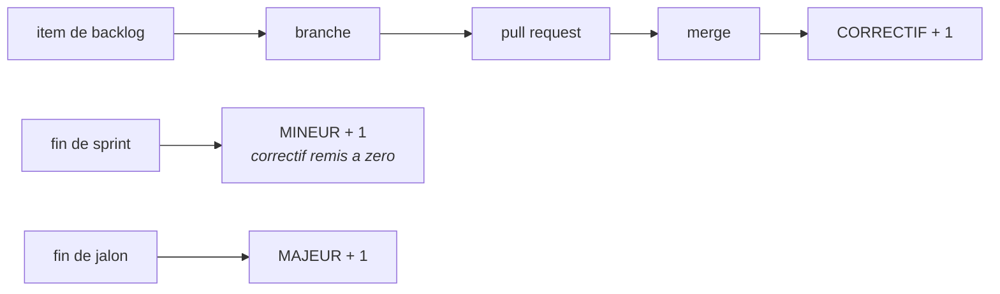

# Tracer le travail

*En une phrase : tout ce qui suit sert à ce qu'un lecteur futur, souvent toi dans trois mois, puisse
répondre « pourquoi ce code est-il comme ça ? » sans demander à personne.*

Chaque artefact ci-dessous existe parce qu'une réponse doit survivre au départ de celui qui l'avait en
tête.

## 1. Le backlog : un item, une unité, jamais un document unique

**La seule règle non négociable : un item égale une unité indépendante**, qui se crée, se modifie et se
clôt sans toucher au voisin. Un document unique qui les liste tous entre en conflit à chaque édition
parallèle et devient le goulot par lequel toute information doit passer.

Où vivent ces unités est en revanche un **vrai choix**, avec deux réponses défendables.

### Les deux réponses, et la question qui décide

| | **Fichiers dans le dépôt** | **Issues de la forge** (GitHub, GitLab) |
|---|---|---|
| lien vers branche, PR, revue | une convention de nommage, tenue par la discipline | **une relation de données**, tenue par la plateforme |
| lisible sans réseau ni jeton | **oui**, un outil local le lit directement | non, il faut l'API |
| état du backlog à un commit donné | **récupérable**, il est versionné avec le code | perdu : l'historique des issues n'est pas lié au code |
| format imposable | **oui**, un test peut refuser un item mal formé | approximable : gabarit d'issue plus contrôle automatique |
| collaboration hors développeurs | faible, il faut cloner | **forte** |
| dépendance à un fournisseur | aucune | réelle |

> **Le backlog vit là où vit son lecteur principal.**
>
> Des humains qui collaborent, et une plateforme qui porte déjà branche, PR et revue : **les issues**.
> Un outil qui doit le lire sans réseau, ou un besoin d'auditer l'état du backlog à une version donnée :
> **des fichiers**.

L'argument décisif en faveur des issues est celui qu'on formule mal d'habitude : ce n'est pas le confort,
c'est que **le lien cesse d'être une convention pour devenir une relation vérifiable**. `Closes #142`
rend la chaîne item vers PR **calculable**, donc le changelog et le compteur de correctifs de l'école B
(section 4) se dérivent au lieu de s'écrire.

### Les combiner sans créer deux backlogs

Le pire résultat, et le plus courant, est **deux backlogs modifiables** : des fichiers et des issues qui
divergent, et plus personne ne sait lequel fait autorité.

La règle qui l'évite : **une seule source de vérité, l'autre est dérivée, en lecture seule, et
régénérable par une commande versionnée.** C'est la règle de `doc-derivee` appliquée au backlog.

La direction à préférer, quand la forge est déjà là : **les issues font autorité**, et une commande rend
un instantané committé dans le dépôt au moment d'une version. On récupère l'auditabilité sans créer un
second backlog éditable.

### Ce qui ne change pas selon le stockage

**La discipline de contenu est la partie qui a de la valeur ; l'endroit où elle vit est un détail
d'implémentation.** Quatre sections, et un vocabulaire de statuts fermé, dans un en-tête de fichier ou
dans un gabarit d'issue, peu importe.

Deux pièges propres aux issues, parce que la plateforme ne les empêche pas :

- **les étiquettes sont un ENSEMBLE, un statut est une VALEUR UNIQUE.** Mettre les états en étiquettes
  laisse un item être `en cours` et `livré` en même temps. Utiliser un champ à choix unique, ou un
  préfixe (`statut:ouvert`) plus un contrôle automatique qui refuse d'en avoir deux ;
- **le vocabulaire dérive**, parce que n'importe qui peut créer une étiquette. Une liste d'étiquettes
  autorisée, vérifiée automatiquement, remplace le vocabulaire fermé que le fichier imposait par
  construction.

### La forme d'un item, dans les deux cas

```markdown
---
id: ITEM-142
titre: Proratiser le montant sur un mois partiel
statut: OUVERT
priorite: 2
---

## Ce qui a ete demande
Un contrat qui commence en cours de mois doit etre facture au prorata des jours ouvres.

## Ce qui est vrai aujourd'hui
Le calcul applique le mois plein. Verifie sur ContractService.ComputeMonthly (ligne 88).

## Ce qui manque
La convention collective impose l'arrondi au centime superieur ; la regle n'est pas ecrite.

## Comment on saura que c'est fini
Un contrat demarrant le 15 sur un mois de 20 jours ouvres est facture 6/20 du montant.
```

Quatre règles que l'expérience impose :

- **le statut appartient à un vocabulaire FERMÉ** (`OUVERT`, `EN COURS`, `LIVRÉ`, `PARTIEL`, `DÉCLINÉ`,
  `CLOS`). Un vocabulaire libre devient illisible en trente items et incomptable en cent ;
- **un statut que le corps contredit est une dette**, pas un détail. Le corps fait autorité : c'est lui
  qu'on a mis à jour en travaillant ;
- **l'item porte ce qui est vrai, pas un plan.** Un plan périmé induit en erreur ; un constat daté reste
  vrai. Ce qui a été **essayé et n'a pas marché** vaut plus cher que ce qu'on comptait faire ;
- **un item porte son rang**, et un item sans rang est **non classé**, ce qui n'est pas la même chose
  que « moins urgent ». Confondre les deux fait disparaître de la question tout ce que personne n'a
  encore regardé.

**Les dates s'écrivent en absolu.** « La semaine dernière » ne veut plus rien dire au deuxième
relecteur.

## 2. La branche : une par item, une intention

```
<type>/<id>-<slug-court>

feat/ITEM-142-proration-mois-partiel
fix/ITEM-207-fuite-handle-fichier
refactor/ITEM-090-extraire-calcul-anciennete
```

**Une branche égale une intention.** Le test : *puis-je résumer cette branche en une phrase sans
« et » ?* Si non, elle en contient deux, et elle rend impossibles les deux choses qui comptent : la
relire, et **en annuler une moitié**.

Partir de la branche d'intégration du projet, jamais d'une autre branche de fonctionnalité, sinon on
hérite de code non relu et on ne peut plus livrer indépendamment.

## 3. Les commits : thématiques, ordonnés, annulables seuls

Forme conventionnelle, sujet à l'impératif, sans point final :

```
feat(billing): proratiser le montant sur un mois partiel
fix(auth): refuser un jeton dont l'audience ne correspond pas
refactor(contract): extraire le calcul d'anciennete
test(billing): couvrir le mois partiel a cheval sur deux annees
docs(readme): documenter la variable d'environnement de proration
chore(ci): passer le runner en Node 20
```

**Le critère qui décide d'un découpage : un commit doit pouvoir être annulé seul sans casser la
compilation.** C'est plus exigeant que « petit », et bien plus utile.

Le **corps** du message existe pour le pourquoi, pas pour lister ce que le diff montre déjà :

```
fix(auth): refuser un jeton dont l'audience ne correspond pas

Un jeton emis pour le service A etait accepte par le service B : les deux
partagent l'emetteur, et l'audience n'etait pas verifiee. Constate en
recette le 2026-03-04.

Refs: ITEM-207
```

Ordonner les commits pour qu'ils se lisent : d'abord le remaniement qui prépare, ensuite le
comportement, enfin la doc. Un relecteur qui lit commit par commit doit voir une démonstration.

## 4. Le versionnement : deux écoles, et la question qui décide

Il existe deux façons cohérentes de numéroter, et elles ne répondent pas à la même question. Les
confondre est la source de la plupart des débats.

### École A : par contrat (SemVer)

`MAJEUR.MINEUR.CORRECTIF`, et une seule question décide : **est-ce qu'un appelant existant casse ?**

| | Quand | Ce qui compte vraiment |
|---|---|---|
| **MAJEUR** | un appelant existant casse | y compris un changement de comportement à signature identique. C'est le cas oublié, et le plus violent |
| **MINEUR** | capacité ajoutée, rétrocompatible | |
| **CORRECTIF** | correction sans changement de contrat | |

Trois précisions qui évitent les erreurs classiques : `0.y.z` n'offre **aucune** garantie et tout peut
casser ; une **dépréciation** est mineure (annoncer), la **suppression** est majeure (exécuter) ; et le
contrat ne se limite pas aux signatures, un format de fichier, un schéma de base, un code de sortie,
un nom d'événement en font partie.

### École B : par cadence (item, sprint, jalon)



Chaque item fusionné incrémente le correctif ; la fin de sprint incrémente le mineur ; la fin de jalon
incrémente le majeur. `1.4.7` se lit alors **« jalon 1, sprint 4, sept items livrés »**.

Ce schéma a deux qualités que SemVer n'a pas :

- **le numéro devient une mesure du travail livré**, pas seulement une étiquette de compatibilité ;
- **il est dérivable, donc vérifiable** : le correctif doit égaler le nombre de PR fusionnées depuis la
  dernière étiquette mineure. Un contrôle automatique peut l'affirmer, au lieu de compter à la main,
  et c'est la règle « dériver plutôt qu'écrire à la main » appliquée à un numéro.

Il impose aussi une discipline saine par effet de bord : si chaque merge est une version, **chaque
merge doit être livrable.**

### La question qui décide entre les deux

> **Est-ce que quelque chose d'AUTOMATIQUE dépend de ton numéro pour savoir s'il peut mettre à jour ?**

| Réponse | École | Pourquoi |
|---|---|---|
| oui, bibliothèque, paquet, API publiée | **A, SemVer** | l'école B laisse un changement cassant atterrir dans un **correctif**, en milieu de sprint, et casser quelqu'un en silence. C'est disqualifiant |
| non, application, service, binaire interne | **B, cadence** | SemVer y dégénère : tout devient « mineur » à vie, ou le majeur se décide arbitrairement. L'école B porte une information réelle |

**Attention au piège du « non » trop rapide, surtout pour une CLI : une CLI a des consommateurs, ce
sont les scripts.** Dès que quelque chose analyse ta sortie machine ou teste tes codes de sortie, tu as
un contrat sans être une bibliothèque (voir `doc-derivee`). La question n'est pas « suis-je une
bibliothèque » mais « qu'est-ce qui casse chez quelqu'un si je change ça ».

### Les combiner, ce qui est souvent la vraie réponse

Deux numéros, deux usages, et surtout **pas un compromis sur le même numéro** :

- **version produit** sur la cadence (école B), pour communiquer l'avancement ;
- **SemVer sur chaque artefact publié**, chaque bibliothèque, chaque paquet, chaque version d'API
  (`/v2/`) porte la sienne.

Et dans les deux cas, une obligation : **écrire quelque part ce que le numéro signifie.** Un schéma de
cadence est couplé au processus ; si la durée d'un sprint change, la signification du numéro change
rétroactivement, et plus personne ne peut relire l'historique. Deux lignes dans le changelog ou un
`VERSIONNEMENT.md` suffisent.

Dernier point sur l'école B, pour lever une ambiguïté fréquente : **une annulation ou un correctif
urgent incrémente aussi le correctif.** Le numéro ne redescend jamais, et c'est la bonne propriété.

## 5. Le CHANGELOG, écrit pour celui qui met à jour

Pas pour celui qui a écrit le code : **pour celui qui va passer d'une version à la suivante et qui veut
savoir ce qui va lui arriver.**

```markdown
## [1.4.0] - 2026-03-12

### Ajoute
- Proratisation au jour ouvre pour les contrats demarrant en cours de mois.

### Modifie
- L'arrondi passe au centime superieur (convention collective). Les montants
  peuvent differer d'un centime des versions anterieures.

### Corrige
- Un jeton emis pour un autre service n'est plus accepte.

### Deprecie
- `ComputeMonthly(contract)` : utiliser `ComputeMonthly(contract, rounding)`.
  Suppression prevue en 2.0.
```

Trois règles : **une entrée par changement observable**, aucune pour les changements internes, un
remaniement sans effet observable n'a rien à y faire ; le dérivé des commits est un **brouillon**, pas
le résultat, parce qu'un message de commit s'adresse à un développeur et une entrée de changelog à un
utilisateur ; et **toute cassure est dite en clair**, avec ce qu'il faut faire.

## 6. La pull request : petite, une intention, vérifiable

Trois sections, et la troisième est celle qu'on oublie :

```markdown
## Quoi
Proratisation du montant pour un contrat demarrant en cours de mois.

## Pourquoi
Les contrats de mi-mois etaient factures au mois plein (ITEM-142). Constate
en recette sur le tenant X le 2026-03-04.

## Comment verifier
1. Creer un contrat demarrant le 15 sur un mois de 20 jours ouvres.
2. Le montant facture doit valoir 6/20 du mensuel, arrondi au centime superieur.
Tests : BillingTests.ProratesPartialMonth (3 cas, dont le mois a cheval).

## Ce qui n'est PAS dedans
L'arrondi des primes variables reste au mois plein (ITEM-151).
```

**« Ce qui n'est pas dedans » évite la moitié des allers-retours de revue** : sans cette section, un
relecteur signale comme un oubli ce qui était un choix, et l'auteur répond à l'oral, donc la question
reviendra.

**Et « comment vérifier » est l'endroit où une preuve rapporte le plus** : une paire **avant/après**
issue de la même commande déterministe fait passer la revue du nommage au fond, en cinq secondes.

Le support suit le **domaine**, pas une préférence : du **texte** quand la sortie n'est pas visuelle
(un fichier de référence qui change apparaît comme un diff, commentable ligne à ligne), une **image plus
son diff perceptuel** quand la sortie EST une image, une **chronologie** pour de la concurrence, une
**distribution** pour de la performance. Ce qui est invariant est la fonction : le relecteur constate
l'effet sans exécuter le code. Détails dans `rendre-l-etat-visible`.

**Une PR trop grosse n'est pas relue, elle est approuvée.** Signature reconnaissable : tous les
commentaires portent sur le nommage et aucun sur le fond. Si elle dépasse ce qu'on peut tenir en tête,
la découper, quitte à livrer d'abord un remaniement sans changement de comportement, qui se relit en
cinq minutes.

## 7. La revue : ce qu'on regarde, et comment on répond

Ordre de lecture, du plus cher au moins cher à corriger plus tard : **le contrat** (la signature dit-elle
la vérité ?), **les cas limites** (vide, nul, négatif, concurrent, en double), **le traitement des
erreurs**, **les noms**, puis **le style, en dernier, et s'il se discute, c'est qu'il manque au
formateur automatique**.

Trois règles de conduite :

- **une remarque nomme un fichier et une ligne, et propose un changement.** « Ce n'est pas clair » n'est
  pas actionnable ; « ce nom ne dit pas que la valeur peut être nulle, proposer `tryFindOwner` » l'est ;
- **séparer ce qui bloque de ce qui est une préférence**, et marquer les préférences comme telles. Sans
  ça, l'auteur ne sait pas ce qu'il doit traiter, et il traite tout ou rien ;
- **chaque remarque se clôt par un changement ou par un argument ÉCRIT dans le fil.** Une réponse orale
  ne clôt rien : la même remarque reviendra à la PR suivante, et personne ne saura qu'elle avait déjà
  été tranchée.

Côté auteur : **répondre à un désaccord par un fait**, pas par une intention. « J'ai vérifié, X est
appelé aussi depuis Y » clôt une discussion ; « je pense que ça ira » l'ouvre.

## 8. La porte de merge : zéro avertissement, et ce qu'il faut pour que ça tienne

**Aucun avertissement ne franchit un merge.** Ni du compilateur, ni du vérificateur de style, ni de
l'analyseur. C'est la règle qui se dégrade le plus vite quand on l'assouplit une seule fois : un
avertissement toléré devient mille en six mois, et le millième cache celui qui annonçait le bug. À
partir de là, plus personne ne lit la sortie de compilation, donc le canal le moins cher dont on
dispose pour attraper un défaut est mort.

> **Un terminal vert est le bon objectif, et il y a deux façons de l'obtenir** : corriger, ou faire
> taire. Les deux rendent exactement le même vert, et une seule garde la garantie. C'est pour ça que la
> règle ne peut pas s'arrêter à « plus rien ne s'affiche » : un avertissement supprimé n'a pas disparu,
> il a été déplacé là où personne ne le lira.

Les critères de merge, tous automatiques, une porte tenue par un humain n'est pas une porte :

| Critère | Pourquoi il est dans la liste |
|---|---|
| **zéro avertissement**, avertissements traités en erreurs | ci-dessus |
| suite de tests verte, **et jouée deux fois** | attrape la dépendance à l'ordre et l'état résiduel |
| aucun test ignoré ou commenté **ajouté** par la PR | c'est la façon la plus courante de faire passer un faux vert |
| formatage appliqué par l'outil | le style ne consomme pas de temps humain |

**Trois conditions rendent la règle tenable**, sans elles, elle sera contournée, et le contournement
sera pire que l'absence de règle :

1. **les drapeaux d'avertissement vivent dans la configuration de build VERSIONNÉE**, pas dans le script
   d'intégration continue. Sinon le développeur compile avec des drapeaux plus laxistes que la CI,
   découvre les avertissements à la PR, et prend l'habitude de considérer la CI comme un obstacle plutôt
   que comme sa propre chaîne ;
2. **la version de la chaîne de compilation est ÉPINGLÉE.** C'est le mode d'échec classique de la
   politique zéro-avertissement : une nouvelle version du compilateur ajoute des diagnostics, et le
   build casse sur du code que personne n'a touché. La réponse d'équipe est alors presque toujours un
   `-Wno-...` **global**, qui détruit la politique en une ligne. Épingler, puis traiter la montée de
   version comme **un item et une PR dédiés**, c'est un travail, pas un effet de bord ;
3. **une suppression est locale, nommée et justifiée** : une ligne ou un fichier, jamais un projet, avec
   la raison et de quoi savoir quand elle pourra tomber. Même critère qu'un relâchement de qualifieur,
   voir `commencer-ferme`.

> **Et une dette d'avertissements existante ne s'efface pas d'un coup.** Sur un projet qui en a déjà
> des milliers, la porte se pose **sur le delta** : zéro avertissement *nouveau*, et un compteur global
> qui ne peut que descendre. Une politique qu'on ne peut pas appliquer aujourd'hui n'est pas une
> politique, c'est un vœu, et le vœu se fera contourner dès la première urgence.
